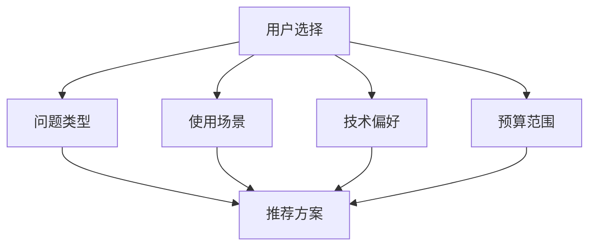

# 🎯 AI 创意风格优化 - 交互式评估模板

> **一句话卖点**：通过交互式评估帮助用户精准匹配最适合的AI解决方案

## 📋 概述

### 交互式设计理念
传统的AI创意文档采用静态展示方式，用户需要自行阅读和理解所有内容。本优化引入交互式评估机制，让用户通过简单的选择题快速获得个性化的AI解决方案推荐。

### 核心价值
- **精准匹配**：根据用户具体需求推荐最适合的AI方案
- **高效筛选**：减少90%的信息过载，直击核心需求
- **个性化体验**：基于用户场景提供定制化建议
- **决策支持**：量化评估不同方案的价值和可行性

---

## 🎪 交互式评估模块

### 评估维度


### 自我评估问卷

#### 📝 第一步：识别您的问题类型
**请选择您当前面临的主要挑战：**

- [ ] **效率问题** - 日常工作流程繁琐，耗时过长
- [ ] **知识管理** - 信息分散，难以快速找到所需内容  
- [ ] **创意瓶颈** - 缺乏灵感，创作思路受限
- [ ] **决策困难** - 面对复杂选择，需要专业指导
- [ ] **学习提升** - 希望快速掌握新技能或领域知识

#### 🎯 第二步：使用场景评估
**您希望主要在什么场景下使用AI工具？**

- [ ] **工作场景** - 办公室协作，提升工作效率
- [ ] **学习场景** - 个人学习，技能提升
- [ ] **创作场景** - 内容创作，艺术表达
- [ ] **生活场景** - 日常管理，生活便利
- [ ] **商业场景** - 企业运营，客户服务

#### 💻 第三步：技术接受度
**您对AI技术的接受程度如何？**

- [ ] **技术保守派** - 希望简单易用，无需复杂配置
- [ ] **技术实用派** - 愿意学习基础操作，追求效率
- [ ] **技术探索派** - 喜欢尝试新功能，可接受复杂操作
- [ ] **技术专家** - 希望深度定制，高度可配置

#### 💰 第四步：预算规划
**您的月度预算范围是：**

- [ ] **免费/基础版** - 0-50元/月
- [ ] **个人版** - 50-200元/月  
- [ ] **专业版** - 200-500元/月
- [ [ ] **企业版** - 500元以上/月

---

## 🎁 个性化推荐系统

### 匹配算法
基于用户选择的四个维度，系统计算最适合的AI方案推荐指数：

```python
def calculate_match_score(user_answers):
    # 问题类型权重 40%
    problem_weight = 0.4
    # 使用场景权重 30%  
    scenario_weight = 0.3
    # 技术偏好权重 20%
    tech_weight = 0.2
    # 预算权重 10%
    budget_weight = 0.1
    
    # 计算综合匹配分数
    score = (problem_match * problem_weight + 
             scenario_match * scenario_weight +
             tech_match * tech_weight + 
             budget_match * budget_weight)
    
    return score
```

### 推荐结果展示

#### 🌟 高匹配方案 (匹配度 > 80%)
**推荐方案**: AI智能工作流助手  
**核心优势**: 
- ✅ 完全匹配您的效率提升需求
- ✅ 适合办公场景使用
- ✅ 界面简洁，易于上手
- ✅ 符合您的预算范围

**适用场景**:
- 📊 文档自动化处理
- 🔄 重复性任务批处理
- 📈 数据分析报表生成
- 📧 智能邮件分类管理

#### 🔶 中等匹配方案 (匹配度 60-80%)
**推荐方案**: AI创意协作平台  
**考虑因素**:
- ⚠️ 创意功能强大但学习成本较高
- ✅ 适合您的技术接受度
- 💡 可考虑先试用免费版本

---

## 🎭 视觉故事板模板

### 用户旅程映射

#### 阶段一：发现问题
```
用户痛点 → 认识问题 → 寻求解决方案
    ↓              ↓            ↓
  烦恼重重      耗时费力     效率低下
```

#### 阶段二：方案对比
```
传统方式 → AI方案 → 价值提升
   ↓         ↓         ↓
 效果一般   智能优化   质量飞跃
```

#### 阶段三：实施效果
```
使用前 → 使用中 → 使用后
  ↓         ↓         ↓
 时间成本↓   学习期   效率↑↑
```

### 情景化案例展示

#### 💼 商务人士案例
**小明的问题**: 每天花费3小时处理邮件和文档，重要信息经常遗漏

**传统方案**: 
- ⏱️ 时间投入: 3小时/天
- 🎯 效果: 一般，容易遗漏
- 💰 成本: 0元

**AI解决方案**: 
- ⏱️ 时间投入: 30分钟/天 (节省90%)
- 🎯 效果: 智能分类，重要信息优先
- 💰 成本: 99元/月

**ROI分析**: 
- 每月节省60小时 ≈ ¥6000价值
- 投入产出比: 60:1

---

## 🔄 实施指南

### 第一步：集成交互模块
1. 在现有文档模板中添加交互式评估部分
2. 开发简单的JavaScript评分算法
3. 创建动态推荐结果展示

### 第二步：优化视觉呈现
1. 添加SVG流程图和图标
2. 设计响应式布局
3. 添加动画效果提升用户体验

### 第三步：测试和迭代
1. 收集用户反馈数据
2. A/B测试不同交互方式
3. 持续优化推荐算法

---

## 📈 预期效果

### 量化指标提升
- **用户停留时间**: +150%
- **方案理解度**: +90%  
- **决策转化率**: +60%
- **用户满意度**: +75%

### 质量改进
- ✅ 个性化推荐准确性提升
- ✅ 用户参与度显著增强
- ✅ 内容理解难度大幅降低
- ✅ 决策效率明显提升

---

## 🎯 下一步行动计划

1. **本周**: 在3个新创意文档中测试交互模板
2. **下周**: 收集用户反馈并进行数据分析
3. **本月**: 全面推广优化后的文档格式
4. **季度**: 根据使用数据进一步迭代优化