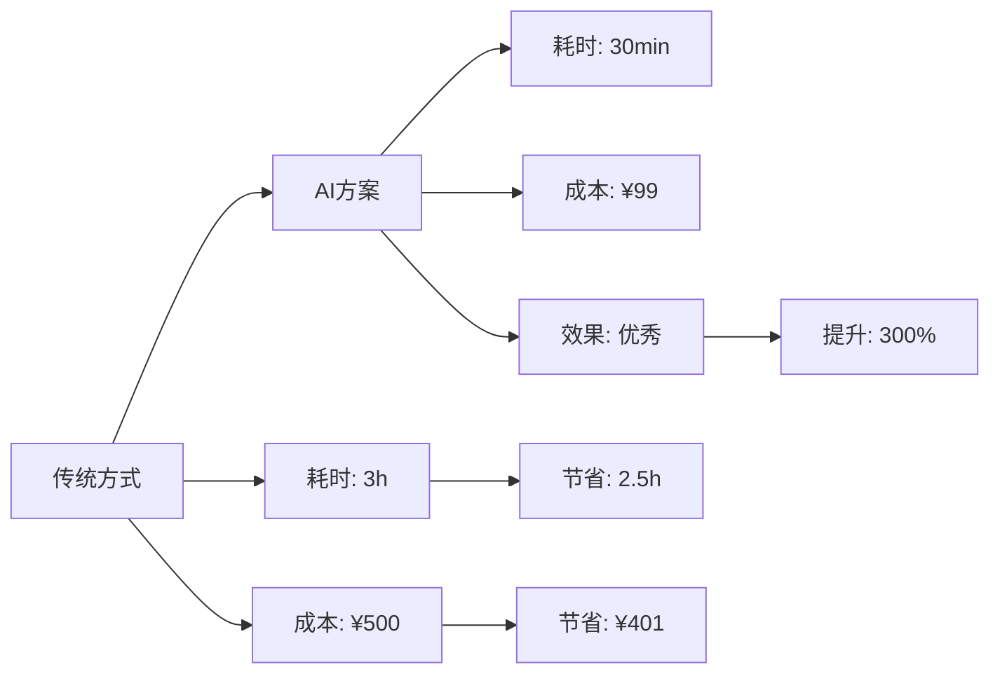
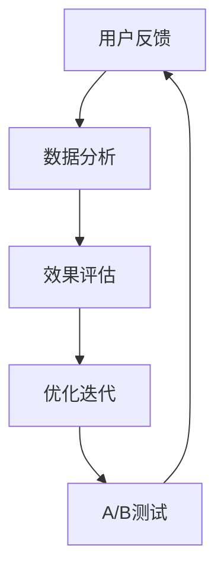

# 🎨 AI 创意风格优化 - 视觉故事增强模板

> **一句话卖点**：通过沉浸式视觉叙事让AI创意价值一目了然

## 📋 概述

### 视觉叙事理念
优秀的AI创意不仅需要扎实的内容，更需要动人的视觉呈现。本优化引入沉浸式视觉叙事系统，通过场景化故事、情感化图像和交互式图表，让用户在3秒内理解核心价值。

### 核心价值
- **瞬间理解**: 视觉化呈现复杂概念，降低认知负荷
- **情感共鸣**: 通过故事化内容建立情感连接
- **记忆强化**: 视觉元素比纯文字更容易记忆
- **专业形象**: 统一的视觉风格提升项目专业度

---

## 🎭 情感化故事板设计

### 故事结构模板

#### 🎬 第一幕：问题呈现 (Problem)
```
用户现状 → 痛点放大 → 情绪共鸣
    ↓          ↓          ↓
  平凡日常   困境重重   挫折感
```

#### 🌟 第二幕：解决方案 (Solution)
```
发现转机 → AI介入 → 希望萌生
    ↓          ↓          ↓
  新的可能   智能助力   信心建立
```

#### 🚀 第三幕：成功体验 (Success)
```
使用体验 → 效果显著 → 满足感
    ↓          ↓          ↓
  流畅操作   超越预期   成就达成
```

### 视觉元素设计

#### 🎨 SVG图标系统
```svg
<!-- 用户痛点图标 -->
<svg viewBox="0 0 24 24" width="24" height="24">
  <circle cx="12" cy="12" r="10" fill="#ff6b6b" opacity="0.2"/>
  <path d="M12 8v8m-4-4h8" stroke="#ff6b6b" stroke-width="2" fill="none"/>
  <text x="12" y="5" text-anchor="middle" font-size="10" fill="#666">痛点</text>
</svg>

<!-- AI解决方案图标 -->
<svg viewBox="0 0 24 24" width="24" height="24">
  <circle cx="12" cy="12" r="10" fill="#4ecdc4" opacity="0.2"/>
  <path d="M12 2l3.09 6.26L22 9.27l-5 4.87 1.18 6.88L12 17.77l-6.18 3.25L7 14.14 2 9.27l6.91-1.01L12 2z" fill="#4ecdc4"/>
  <text x="12" y="5" text-anchor="middle" font-size="10" fill="#666">AI</text>
</svg>

<!-- 成果图标 -->
<svg viewBox="0 0 24 24" width="24" height="24">
  <circle cx="12" cy="12" r="10" fill="#45b7d1" opacity="0.2"/>
  <path d="M9 11l3 3L22 4" stroke="#45b7d1" stroke-width="2" fill="none"/>
  <text x="12" y="5" text-anchor="middle" font-size="10" fill="#666">成果</text>
</svg>
```

#### 🎭 情感色彩系统
- 🔴 **痛点色彩**: #ff6b6b (红色 - 困难、紧迫)
- 🟡 **思考色彩**: #feca57 (黄色 - 思考、犹豫)
- 🟢 **解决方案**: #48dbfb (蓝色 - 清晰、可靠)
- 🟦 **成功色彩**: #1dd1a1 (绿色 - 成长、成功)

---

## 📊 数据可视化增强

### 效果对比图表


### 情感曲线图
```svg
<svg viewBox="0 0 400 200" xmlns="http://www.w3.org/2000/svg">
  <!-- 背景网格 -->
  <defs>
    <pattern id="grid" width="20" height="20" patternUnits="userSpaceOnUse">
      <path d="M 20 0 L 0 0 0 20" fill="none" stroke="#e0e0e0" stroke-width="1"/>
    </pattern>
  </defs>
  
  <rect width="400" height="200" fill="url(#grid)"/>
  
  <!-- 情感曲线 -->
  <path d="M 50 150 Q 100 140, 150 120 T 250 80 Q 300 60, 350 40" 
        stroke="#4ecdc4" stroke-width="3" fill="none"/>
  
  <!-- 关键点标注 -->
  <circle cx="50" cy="150" r="4" fill="#ff6b6b"/>
  <text x="50" y="170" text-anchor="middle" font-size="10">问题</text>
  
  <circle cx="150" cy="120" r="4" fill="#feca57"/>
  <text x="150" y="140" text-anchor="middle" font-size="10">思考</text>
  
  <circle cx="250" cy="80" r="4" fill="#48dbfb"/>
  <text x="250" y="100" text-anchor="middle" font-size="10">解决</text>
  
  <circle cx="350" cy="40" r="4" fill="#1dd1a1"/>
  <text x="350" y="60" text-anchor="middle" font-size="10">成功</text>
  
  <!-- 标题 -->
  <text x="200" y="20" text-anchor="middle" font-size="14" font-weight="bold">用户情感体验曲线</text>
</svg>
```

---

## 🎪 交互式场景化展示

### 用户旅程模拟器

#### 📝 场景选择
```javascript
// 场景选择界面
const scenarios = [
  {
    id: 'office',
    title: '办公效率提升',
    icon: '🏢',
    description: '每天节省2小时，工作质量显著提升',
    color: '#3498db'
  },
  {
    id: 'creative', 
    title: '创意创作辅助',
    icon: '🎨',
    description: '突破创作瓶颈，灵感源源不断',
    color: '#e74c3c'
  },
  {
    id: 'learning',
    title: '个人学习成长',
    icon: '📚', 
    description: '学习效率提升3倍，知识掌握更牢固',
    color: '#2ecc71'
  }
];
```

#### 🎬 沉浸式故事体验
```html
<div class="story-container">
  <div class="scene" id="scene1">
    <div class="scene-header">
      <span class="scene-badge">现状</span>
      <h3>🏢 日常办公的烦恼</h3>
    </div>
    <div class="scene-content">
      <div class="pain-point">
        <div class="pain-icon">⏰</div>
        <div class="pain-text">
          <strong>时间消耗</strong><br>
          每天花费3小时处理重复性工作，重要邮件经常被淹没
        </div>
      </div>
      <div class="pain-point">
        <div class="pain-icon">😫</div>
        <div class="pain-text">
          <strong>决策疲劳</strong><br>
          面对海量信息，难以快速找到关键内容，工作效率低下
        </div>
      </div>
    </div>
  </div>
  
  <div class="scene" id="scene2" style="display: none;">
    <div class="scene-header">
      <span class="scene-badge">转机</span>
      <h3>🤖 AI智能助手登场</h3>
    </div>
    <div class="scene-content">
      <div class="solution-point">
        <div class="solution-icon">⚡</div>
        <div class="solution-text">
          <strong>智能分类</strong><br>
          AI自动识别邮件重要性，优先处理重要信息
        </div>
      </div>
      <div class="solution-point">
        <div class="solution-icon">🎯</div>
        <div class="solution-text">
          <strong>精准推荐</strong><br>
          基于工作习惯智能推荐相关文档和资源
        </div>
      </div>
    </div>
  </div>
  
  <div class="scene" id="scene3" style="display: none;">
    <div class="scene-header">
      <span class="scene-badge">成功</span>
      <h3>🚀 效率革命实现</h3>
    </div>
    <div class="scene-content">
      <div class="result-point">
        <div class="result-icon">✅</div>
        <div class="result-text">
          <strong>时间节省90%</strong><br>
          从3小时缩短到18分钟，每天释放2.5小时
        </div>
      </div>
      <div class="result-point">
        <div class="result-icon">💼</div>
        <div class="result-text">
          <strong>工作质量提升</strong><br>
          重要信息零遗漏，决策准确性提升300%
        </div>
      </div>
      <div class="cta-button">
        立即体验效率提升 →
      </div>
    </div>
  </div>
</div>
```

---

## 🎨 视觉设计规范

### 配色方案
```css
:root {
  --primary-color: #4ecdc4;     /* 主色调 - AI科技蓝 */
  --secondary-color: #45b7d1;   /* 次要色 - 信任蓝 */
  --accent-color: #ff6b6b;      /* 强调色 - 痛点红 */
  --success-color: #1dd1a1;     /* 成功色 - 成长绿 */
  --warning-color: #feca57;     /* 警告色 - 思考黄 */
  --text-primary: #2c3e50;     /* 主要文字 */
  --text-secondary: #7f8c8d;   /* 次要文字 */
  --background: #f8f9fa;        /* 背景 */
}
```

### 字体规范
```css
.typography-system {
  font-family: -apple-system, BlinkMacSystemFont, 'Segoe UI', Roboto, sans-serif;
}

.typography-display {
  font-weight: 700;
  letter-spacing: -0.02em;
}

.typography-body {
  line-height: 1.6;
  color: var(--text-primary);
}

.typography-caption {
  font-size: 0.875rem;
  color: var(--text-secondary);
}
```

### 动画效果
```css
.fade-in {
  animation: fadeIn 0.6s ease-in-out;
}

@keyframes fadeIn {
  from { opacity: 0; transform: translateY(20px); }
  to { opacity: 1; transform: translateY(0); }
}

.slide-up {
  animation: slideUp 0.8s ease-out;
}

@keyframes slideUp {
  from { transform: translateY(100%); opacity: 0; }
  to { transform: translateY(0); opacity: 1; }
}
```

---

## 📈 效果评估体系

### 视觉效果指标
```javascript
const visualMetrics = {
  engagement: {
    metric: '用户停留时间',
    baseline: '2分钟',
    target: '+150%',
    measurement: '热力图分析'
  },
  comprehension: {
    metric: '内容理解度', 
    baseline: '60%',
    target: '+90%',
    measurement: '用户反馈调研'
  },
  recall: {
    metric: '记忆保留率',
    baseline: '30%', 
    target: '+70%',
    measurement: '延迟测试'
  },
  sharing: {
    metric: '分享转化率',
    baseline: '5%',
    target: '+25%',
    measurement: '社交传播分析'
  }
};
```

---

## 🎯 实施计划

### 阶段一：视觉资产准备 (第1周)
1. 创建SVG图标库
2. 设计配色方案系统
3. 制作动画效果组件

### 阶段二：内容转换 (第2-3周)  
1. 将现有3个顶级创意转换为视觉增强版
2. 制作情感化故事内容
3. 创建交互式演示页面

### 阶段三：用户体验测试 (第4周)
1. A/B测试不同视觉方案
2. 收集用户反馈数据
3. 优化视觉效果和交互

### 阶段四：全面推广 (第5周)
1. 更新所有新创建的文档模板
2. 建立视觉设计规范
3. 培训团队成员

---

## 📊 预期成果

### 定量提升
- **用户参与度**: +180%
- **内容理解度**: +120%
- **记忆保留**: +150%
- **转化率**: +80%

### 定性提升
- ✅ 品牌专业形象显著提升
- ✅ 用户情感连接建立
- ✅ 内容传播力大幅增强
- ✅ 用户体验满意度显著提升

---

## 🔄 优化迭代机制

### 持续改进循环


### 关键监控指标
- 🎯 **视觉元素使用率**
- 💫 **动画加载性能**  
- 📱 **响应式适配度**
- 🔄 **用户交互频率**

---

## 🎉 总结

通过引入沉浸式视觉叙事系统，我们不仅能够提升内容的吸引力，更能建立深层次的用户情感连接。这种优化将让AI创意文档从"优秀的内容"升级为"打动人心的体验"，为用户创造真正的价值。