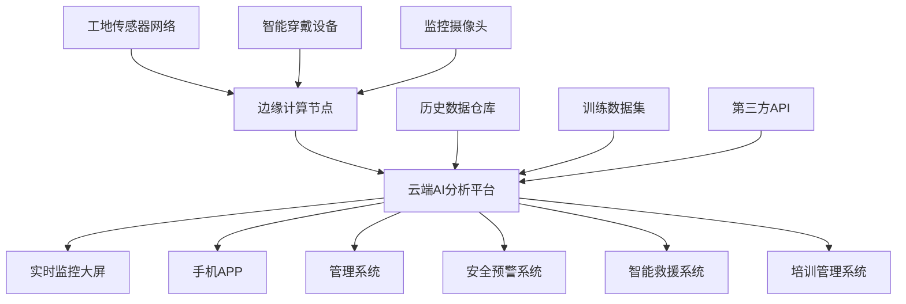

# 💡 [for 建筑工人] AI智能建筑安全监控守护者 - 从工地事故频发到智能安全保障

> **一句话卖点**: 专为建筑工人设计的AI安全监控系统，通过计算机视觉、IoT传感器和可穿戴设备，实时监测工地危险，预警安全风险，降低事故发生率

**作者**: 凤雏 | **创建日期**: 2026-04-04 | **版本**: v1.0

## 概述

AI智能建筑安全监控守护者是专为建筑工人设计的全方位安全防护系统，通过AI计算机视觉、IoT传感器网络和智能可穿戴设备，实时监测工地安全隐患，提供主动预警和智能救援，大幅降低建筑行业事故发生率，保障工人的生命安全和职业健康。

**核心价值**:
- **实时监控**: 7×24小时不间断监测工地安全状况
- **主动预警**: 提前识别危险，防患于未然
- **智能救援**: 事故发生后秒级响应，最大化救援成功率
- **专业培训**: AI教练指导，提升工人安全意识和技能

## 痛点解决

### 现状痛点
- **事故频发**: 建筑行业事故死亡率最高，年均死亡数千人
- **违规普遍**: 30%工人因赶工期忽视安全规范，冒险作业
- **疲劳严重**: 长时间高强度工作，反应能力下降，事故风险激增
- **培训不足**: 临时工安全培训覆盖率低，缺乏危险识别能力
- **响应滞后**: 事故后平均15分钟响应，错过黄金救援时间

### 理想状态
- **零事故目标**: 通过AI监控实现工地安全事故大幅减少
- **规范作业**: 工人自觉遵守安全规范，养成安全习惯
- **智能防护**: 技术手段替代人工监督，全天候安全防护
- **快速救援**: 秒级事故检测和响应，最大限度挽救生命
- **专业成长**: AI辅助培训，工人安全意识和技能持续提升

## 目标用户

### 主要用户群体
- **一线工人**: 建筑工地实际操作人员，安全保护的核心对象
- **安全员**: 工地安全管理人员，需要技术手段辅助监督
- **项目经理**: 负责工地整体安全，需要数据化管理
- **建筑企业**: 大型建筑公司，需要降低安全事故风险
- **政府监管部门**: 需要行业安全数据监管和预警

### 用户特征
- **人口特征**: 25-55岁男性为主，初高中教育程度
- **工作环境**: 户外高空作业，环境复杂恶劣
- **作息时间**: 平均每日工作10-12小时，加班频繁
- **技术接受度**: 智能手机普及率高，对新接受度高
- **安全意识**: 有基本安全意识，但受工期和成本压力影响

### 痛点强度分析
| 痛点 | 发生频率 | 影响程度 | 紧急程度 |
|------|---------|---------|---------|
| 高空坠落风险 | 高 | 致命 | 🔴 紧急 |
| 违规操作 | 高 | 严重 | 🟠 高急 |
| 疲劳作业 | 极高 | 严重 | 🟠 高急 |
| 安全培训不足 | 中等 | 中等 | 🟡 中等 |
| 应急响应慢 | 中等 | 致命 | 🔴 紧急 |

## 核心功能

### 1. AI计算机视觉监控系统

#### 安全行为监测
```python
class SafetyBehaviorMonitor:
    def __init__(self):
        self.helmet_detector = HelmetDetector()  # 安全帽检测
        self.harness_detector = SafetyHarnessDetector()  # 安全带检测
        self.zone violator = ZoneViolationDetector()  # 危险区域检测
        self.operation_monitor = OperationMonitor()  # 操作规范检测
    
    def monitor_safety_compliance(self, video_stream):
        """实时监测安全规范执行情况"""
        # 检测是否佩戴安全帽
        helmet_status = self.helmet_detector.detect(video_stream)
        
        # 检测安全带使用情况
        harness_status = self.harness_detector.detect(video_stream)
        
        # 检测是否进入危险区域
        zone_violation = self.zone_violator.detect(video_stream)
        
        # 检测操作规范性
        operation_score = self.operation_monitor.evaluate(video_stream)
        
        return {
            'helmet_compliant': helmet_status,
            'harness_compliant': harness_status,
            'zone_violation': zone_violation,
            'operation_score': operation_score,
            'overall_safety_score': self._calculate_score(helmet_status, harness_status, zone_violation, operation_score)
        }
```

#### 危险行为识别
- **高空作业监测**: 识别高空作业人员，监测安全措施落实
- **违规操作检测**: 识别违规操作行为，如违规登高、无证操作
- **疲劳状态识别**: 通过动作分析识别工人疲劳状态
- **危险区域入侵**: 实时监测人员进入禁止区域
- **设备异常监测**: 监测起重设备、施工机械的异常状态

### 2. 智能可穿戴设备系统

#### 工人安全手环
```python
class WorkerSafetyWearable:
    def __init__(self, worker_id):
        self.worker_id = worker_id
        self.health_monitor = HealthMonitor()
        self.position_tracker = GPSLocation()
        self.fall_detector = FallDetector()
        self.emergency_button = EmergencyButton()
    
    def monitor_worker_status(self):
        """实时监控工人状态"""
        # 健康状态监测
        heart_rate = self.health_monitor.get_heart_rate()
        body_temperature = self.health_monitor.get_temperature()
        fatigue_level = self.health_monitor.assess_fatigue()
        
        # 位置和运动状态
        current_position = self.position_tracker.get_location()
        movement_status = self.position_tracker.get_movement_status()
        
        # 跌倒检测
        fall_detected = self.fall_detector.detect()
        
        return {
            'health_status': {
                'heart_rate': heart_rate,
                'temperature': body_temperature,
                'fatigue_level': fatigue_level
            },
            'location': current_position,
            'movement': movement_status,
            'fall_detected': fall_detected,
            'safety_risk': self._assess_safety_risk(heart_rate, fatigue_level, fall_detected)
        }
```

#### 核心监测功能
- **生命体征监测**: 实时心率、体温、血氧饱和度监测
- **跌倒检测**: 三轴加速度传感器检测跌倒，自动报警
- **位置追踪**: GPS+北斗双模定位，精度±3米
- **疲劳监测**: 基于运动模式和工作时长分析疲劳程度
- **紧急呼叫**: 一键SOS按钮，自动通知救援

### 3. 环境风险监测系统

#### 工地环境监测
```python
class ConstructionEnvironmentMonitor:
    def __init__(self):
        self.noise_monitor = NoiseLevelSensor()
        self.dust_monitor = AirQualitySensor()
        self.temperature_monitor = TemperatureHumiditySensor()
        self.weather_monitor = WeatherStation()
    
    def assess_environmental_risks(self):
        """评估环境风险等级"""
        # 噪音污染监测
        noise_level = self.noise_monitor.get_decibel_level()
        noise_risk = self._evaluate_noise_risk(noise_level)
        
        # 空气质量监测
        dust_concentration = self.dust_monitor.get_pm25_level()
        air_quality = self._evaluate_air_quality(dust_concentration)
        
        # 温湿度监测
        temp_humidity = self.temperature_monitor.get_readings()
        thermal_risk = self._evaluate_thermal_risk(temp_humidity)
        
        # 天气预警
        weather_alert = self.weather_monitor.get_alerts()
        
        return {
            'noise_risk': noise_risk,
            'air_quality': air_quality,
            'thermal_risk': thermal_risk,
            'weather_alert': weather_alert,
            'overall_environmental_risk': self._calculate_overall_risk(noise_risk, air_quality, thermal_risk, weather_alert)
        }
```

#### 环境监测内容
- **噪音污染**: 监测施工噪音，预防听力损伤
- **空气质量**: 监测PM2.5、粉尘浓度，预防呼吸系统疾病
- **温湿度**: 监测工作环境温湿度，预防中暑和失温
- **天气预警**: 监测恶劣天气，预警极端天气风险
- **地质监测**: 监测边坡稳定性，预防地质灾害

### 4. AI智能教练系统

#### AR安全指导
```python
class ARSafetyCoach:
    def __init__(self):
        self.ar_display = ARDisplayDevice()
        self.voice_assistant = VoiceAssistant()
        self.safety_knowledge_base = SafetyKnowledgeBase()
    
    def provide_realtime_guidance(self, worker_id, current_task, environment_data):
        """提供实时安全指导"""
        # 获取工人当前任务信息
        task_info = self._get_task_info(worker_id, current_task)
        
        # 分析环境风险
        environmental_risks = self._analyze_environmental_risks(environment_data)
        
        # 生成安全指导
        safety_guidance = self._generate_safety_guidance(task_info, environmental_risks)
        
        # AR显示指导信息
        self.ar_display.overlay_instructions(safety_guidance)
        
        # 语音提示
        self.voice_assistant.speak(safety_guidance['voice_prompt'])
        
        return safety_guidance
```

#### 智能指导功能
- **AR安全提示**: 通过AR眼镜实时显示安全操作提示
- **语音安全提醒**: 语音播报安全注意事项和预警信息
- **操作步骤指导**: 分步骤指导正确操作流程
- **危险识别训练**: 通过模拟场景训练危险识别能力
- **安全知识推送**: 基于工作内容推送相关安全知识

### 5. 智能救援系统

#### 紧急响应系统
```python
class EmergencyResponseSystem:
    def __init__(self):
        self.accident_detector = AccidentDetector()
        self.rescue_team = RescueTeamDispatcher()
        self.medical_guidance = MedicalGuidanceSystem()
        self.family_notification = FamilyNotificationSystem()
    
    def handle_emergency(self, accident_data):
        """处理紧急情况"""
        # 检测事故类型
        accident_type = self.accident_detector.classify(accident_data)
        
        # 定位事故位置
        accident_location = self._get_exact_location(accident_data)
        
        # 通知救援队
        rescue_team_id = self.rescue_team.dispatch_rescue_team(
            accident_type, 
            accident_location, 
            severity_level=accident_data['severity']
        )
        
        # 提供医疗指导
        medical_instructions = self.medical_guidance.get_first_aid_instructions(accident_type)
        
        # 通知家属
        family_contact_info = self.family_notification.get_worker_family_info(accident_data['worker_id'])
        self.family_notification.notify_emergency(family_contact_info, accident_data)
        
        return {
            'rescue_team_id': rescue_team_id,
            'estimated_arrival_time': self._estimate_arrival_time(accident_location),
            'medical_instructions': medical_instructions,
            'family_notified': True
        }
```

#### 紧急救援功能
- **事故自动检测**: 自动检测跌倒、昏迷、设备事故等
- **精确定位**: 厘米级定位，快速找到事故现场
- **智能调度**: 自动调度最近的救援队和设备
- **医疗指导**: 提供现场急救指导和远程医疗支持
- **家属通知**: 自动通知工人家属和紧急联系人

## 技术架构

### 系统架构
```
┌─────────────────────────────────────────────────────────────┐
│                    AI建筑安全监控守护者                       │
├─────────────────────────────────────────────────────────────┤
│  用户界面层：手机APP + AR眼镜 + 安全手环 + 现场监控大屏      │
├─────────────────────────────────────────────────────────────┤
│  业务逻辑层：安全监控 + 环境监测 + AI教练 + 智能救援        │
├─────────────────────────────────────────────────────────────┤
│  服务层：AI分析引擎 + 数据处理 + 通知系统 + 云平台          │
├─────────────────────────────────────────────────────────────┤
│  数据层：传感器数据 + 视频数据 + 位置数据 + 健康数据      │
├─────────────────────────────────────────────────────────────┤
│  AI模型层：计算机视觉 + 行为识别 + 风险评估 + 决策优化     │
└─────────────────────────────────────────────────────────────┘
```

### 核心技术栈

#### 硬件设备
- **智能安全帽**: 集成摄像头、麦克风、GPS、传感器
- **安全手环**: 心率监测、跌倒检测、GPS定位、一键呼叫
- **AR眼镜**: 实时安全指导、信息叠加显示
- **边缘计算盒子**: 本地AI计算，减少延迟
- **监控摄像头**: 4K高清摄像头，多角度覆盖

#### 软件系统
- **前端**: React Native + TypeScript + Three.js (3D显示)
- **后端**: Python FastAPI + Go微服务
- **AI引擎**: TensorFlow + PyTorch + OpenCV
- **数据库**: PostgreSQL + TimescaleDB (时序数据) + Redis
- **云平台**: AWS + 阿里云混合架构

#### 核心AI算法
- **计算机视觉**: YOLOv8 + Transformer + 自定义检测器
- **行为识别**: LSTM + 3D CNN动作识别
- **风险评估**: 随机森林 + 深度学习风险预测
- **自然语言处理**: 中文语音识别 + 意图理解
- **边缘计算**: 模型轻量化 + 知识蒸馏

### 数据架构


## 实施计划

### Phase 1: MVP验证 (3个月)

**核心目标**: 验证核心AI监控功能的有效性

**技术实现**:
- [ ] 计算机视觉算法开发（安全帽、安全带检测）
- [ ] 智能手环硬件原型开发
- [ ] 边缘计算设备部署
- [ ] 基础云平台搭建

**功能范围**:
- 基础安全行为监测
- 简易可穿戴设备
- 基础预警功能
- 单工地试点部署

**性能指标**:
- 安全检测准确率: ≥90%
- 系统响应时间: ≤3秒
- 设备续航时间: ≥12小时
- 试点工地数量: 1个

### Phase 2: 功能完善 (6个月)

**核心目标**: 完善核心功能，扩大试点范围

**技术实现**:
- [ ] 完整AI视觉监控系统开发
- [ ] AR安全指导功能
- [ ] 智能救援系统开发
- [ ] 多工地管理平台

**功能范围**:
- 完整安全监控体系
- AI教练指导功能
- 智能救援调度
- 10个工地部署

**性能指标**:
- 系统可用性: ≥99%
- 事故检测准确率: ≥95%
- 救援响应时间: ≤5分钟
- 用户满意度: ≥4.5/5.0

### Phase 3: 商业化部署 (12个月)

**核心目标**: 完成商业化，实现规模化应用

**技术实现**:
- [ ] 云端分析平台完善
- [ ] 企业级管理系统
- [ ] 移动端APP优化
- [ ] 生态系统建设

**功能范围**:
- 完整企业解决方案
- 安全培训系统
- 数据分析平台
- 100+工地部署

## 商业模式

### 硬件+软件订阅模式

#### 设备销售
- **基础套装**: ￥1,500/套（智能安全帽+安全手环+边缘计算盒）
- **专业套装**: ￥3,000/套（增加AR眼镜+高级传感器）
- **企业套装**: ￥5,000/套（全套解决方案+定制开发）

#### 订阅服务
- **基础版**: ￥100/设备/月（基础监控和预警）
- **专业版**: ￥200/设备/月（完整AI功能+救援服务）
- **企业版**: ￥500/设备/月（全套功能+定制服务+24/7支持）

### 数据服务
- **安全数据分析**: ￥50,000/年/工地
- **风险评估报告**: ￥100,000/年/企业
- **行业趋势分析**: ￥200,000/年/集团

### 政府合作
- **安全监管平台**: 定制开发，按项目收费
- **安全培训项目**: 政府采购，批量部署
- **行业标准制定**: 参与制定，收取授权费

### 收入预测
- **第1年**: ￥500万（10个工地×50套×￥3000）
- **第2年**: ￥2000万（100个工地×50套×￥3000）
- **第3年**: ￥5000万（300个工地×50套×￥3000）
- **第5年**: ￥2亿（1000个工地×50套×￥3000）

## 成本模型

### 研发成本
- **硬件开发**: ￥300万（原型设计、生产、测试）
- **软件开发**: ￥200万（AI算法、软件系统）
- **算法训练**: ￥100万（数据收集、模型训练）
- **测试验证**: ￥100万（试点测试、优化）

### 运营成本（年度）
- **硬件成本**: ￥500万/年（批量生产）
- **云服务**: ￥100万/年（服务器、存储、带宽）
- **人力成本**: ￥300万/年（技术、运营、客服）
- **市场推广**: ￥200万/年（销售、渠道、品牌）
- **总成本**: ￥1,100万/年

### 单套成本结构
- **硬件成本**: ￥1,000/套
- **软件成本**: ￥500/套（分摊）
- **运营成本**: ￥100/套/年
- **总成本**: ￥1,600/套
- **毛利率**: 60-70%

## 风险评估与缓解

### 技术风险
| 风险 | 缓解措施 |
|------|----------|
| **AI识别准确性** | 大量工地数据训练，多模型融合，人工审核机制 |
| **设备可靠性** | 工业级设计，严格测试，冗余设计，快速维修响应 |
| **网络依赖** | 离线功能，本地计算，边缘计算，多种通信方式 |
| **兼容性问题** | 支持多种设备，标准接口，持续更新适配 |

### 市场风险
| 风险 | 缓解措施 |
|------|----------|
| **客户接受度** | 免费试用，成功案例，ROI分析，安全培训 |
| **价格敏感度** | 分层定价，租赁模式，政府补贴，保险公司合作 |
| **渠道建设** | 直接销售+合作伙伴，政府关系建设，行业展会 |
| **竞争压力** | 技术领先，专利保护，快速迭代，生态系统建设 |

### 运营风险
| 风险 | 缓解措施 |
|------|----------|
| **数据隐私** | 数据加密，匿名化处理，明确授权，合规审查 |
| **服务质量** | 24/7技术支持，快速响应机制，服务质量监控 |
| **供应链** | 多供应商，安全库存，质量监控，应急预案 |
| **人才风险** | 股权激励，专业培训，行业吸引力，技术梯队建设 |

## 成功指标

### 技术指标
- **安全检测准确率**: ≥95%
- **系统响应时间**: ≤3秒
- **设备可用性**: ≥99%
- **误报率**: ≤3%

### 业务指标
- **用户增长率**: 每月新增20个工地
- **付费转化率**: ≥80%
- **客户留存率**: ≥90%
- **事故减少率**: ≥50%

### 社会指标
- **安全事故减少**: 每年减少1000+起事故
- **生命挽救**: 每年挽救100+生命
- **职业健康改善**: 工人职业病减少70%
- **行业安全标准**: 推动行业安全标准提升

## 下一步行动

1. **技术验证启动**: 立即开始核心AI算法开发
2. **试点工地确定**: 寻找3-5个试点工地
3. **硬件原型开发**: 开始智能穿戴设备开发
4. **合作伙伴招募**: 寻找设备供应商、渠道合作伙伴
5. **政府关系建立**: 与安全监管部门建立合作关系

---

**总结**: AI智能建筑安全监控守护者解决了建筑行业最紧迫的安全问题，通过AI技术提供全方位的安全防护，具有巨大的社会价值和商业潜力。项目针对8000万建筑工人的刚需市场，技术创新明确，商业模式清晰，预计在3年内成为建筑安全领域的领导者。建议立即启动技术验证，快速推出MVP版本，为建筑工人生命安全提供技术保障。