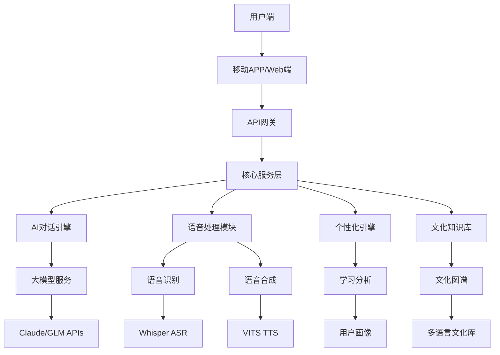

# 🌍 AI 沉浸式语言伙伴 - 详细PR文档

## 📋 项目概述

### 背景与痛点
- **传统语言学习痛点**：单词记忆枯燥、语法练习缺乏场景、社交恐惧阻碍进步
- **个性化指导缺失**：无法获得针对个人弱点的精准训练
- **发音纠正困难**：没有实时反馈，难以掌握地道发音
- **文化理解缺失**：语言与文化脱节，影响实际交流效果

### 解决方案
AI 沉浸式语言伙伴是一个基于大模型的多模态语言学习平台，通过：
- 智能对话伙伴：24/7 实时对话练习
- 个性化学习路径：根据学习目标、弱项、兴趣定制
- 语音识别与纠正：实时分析发音、语调、语速
- 文化场景模拟：模拟真实生活场景
- 情感支持系统：识别学习焦虑，提供鼓励

## 🏗️ 技术架构设计

### 系统架构


### 技术栈选择
- **前端**：React Native + TypeScript
- **后端**：Python FastAPI + Node.js微服务
- **AI服务**：
  - 语音识别：Whisper API
  - 语音合成：VITS
  - 对话引擎：Claude/GLM API
- **数据库**：PostgreSQL + Redis缓存
- **部署**：Docker + Kubernetes

### 核心模块设计

#### 1. 对话引擎模块
```python
class ConversationEngine:
    def __init__(self):
        self.model = load_language_model()
        self.cultural_context = CulturalKnowledgeBase()
        self.difficulty_adaptation = DifficultyAdaptor()
    
    def generate_response(self, user_input, user_profile, conversation_history):
        # 1. 上下文理解
        context = self._analyze_context(user_input, conversation_history)
        
        # 2. 文化适配
        culturally_appropriate = self.cultural_context.adapt_response(
            context, user_profile.target_culture
        )
        
        # 3. 难度调整
        adjusted_difficulty = self.difficulty_adaption.get_optimal_difficulty(
            user_profile.skill_level, user_profile.performance_history
        )
        
        # 4. 生成响应
        response = self.model.generate(
            culturally_appropriate,
            max_tokens=adjusted_difficulty.max_tokens,
            temperature=adjusted_difficulty.temperature
        )
        
        return response
```

#### 2. 语音处理模块
```python
class VoiceProcessor:
    def __init__(self):
        self.asr = WhisperASR()
        self.tts = VITSTTS()
        self.pronunciation_analyzer = PronunciationAnalyzer()
    
    def process_speech(self, audio_data, target_language):
        # 语音识别
        text = self.asr.transcribe(audio_data, language=target_language)
        
        # 发音分析
        pronunciation_score = self.pronunciation_analyzer.analyze(
            audio_data, text, target_language
        )
        
        # 生成反馈
        feedback = self._generate_pronunciation_feedback(pronunciation_score)
        
        # 语音合成反馈
        audio_feedback = self.tts.generate(feedback, voice="educator")
        
        return {
            "text": text,
            "pronunciation_score": pronunciation_score,
            "feedback": feedback,
            "audio_feedback": audio_feedback
        }
```

#### 3. 个性化引擎
```python
class PersonalizationEngine:
    def __init__(self):
        self.user_analyzer = UserProfileAnalyzer()
        self.content_generator = ContentGenerator()
        self.progress_tracker = ProgressTracker()
    
    def create_learning_plan(self, user_input, conversation_history):
        # 用户画像分析
        profile = self.user_analyzer.analyze(user_input, conversation_history)
        
        # 学习路径生成
        learning_path = self.content_generator.generate_path(
            profile.goals, profile.weaknesses, profile.preferred_style
        )
        
        # 进度追踪
        self.progress_tracker.update_progress(profile.user_id, learning_path)
        
        return {
            "user_profile": profile,
            "learning_path": learning_path,
            "recommendations": self._generate_recommendations(profile, learning_path)
        }
```

## 📅 实施路线图

### 第一阶段（3个月）- MVP版本
**目标**：验证核心价值，建立基础功能

#### 核心功能开发
- [ ] 基础对话功能
  - 英语对话支持
  - 简日常场景（问候、购物、餐厅）
  - 基础语音识别/合成

- [ ] 个性化引擎
  - 用户画像建立
  - 学习进度追踪
  - 简单难度调整

- [ ] 文化知识库
  - 基础文化差异（美式/英式英语）
  - 场景化文化知识
  - 礼貌用语库

#### 技术基础设施
- [ ] API架构搭建
- [ ] 数据库设计
- [ ] 用户管理系统
- [ ] 基础部署

#### 测试与验证
- [ ] 用户体验测试（100人）
- [ ] 对话质量评估
- [ ] 语音识别准确性测试
- [ ] 性能优化

### 第二阶段（6个月）- 功能完善
**目标**：提升用户体验，增加高级功能

#### 核心功能增强
- [ ] 多语言支持（日语、韩语、法语）
- [ ] 高级对话场景（商务、学术、旅游）
- [ ] 深度语音分析
  - 语调分析
  - 语速调节
  - 重音纠正

#### AI能力提升
- [ ] 自适应难度引擎
  - 基于用户表现的实时调整
  - 个性化纠错策略
  - 学习效果优化

#### 文化深度集成
- [ ] 多维度文化知识库
  - 地域文化差异
  - 时效性文化更新
  - 场景化文化训练

#### 商业功能
- [ ] 订阅管理系统
- [ ] 学习报告生成
- [ ] 社交分享功能

### 第三阶段（12个月）- 商业化
**目标**：实现商业化，建立用户粘性

#### 产品完善
- [ ] 移动端APP发布
- [ ] Web端功能完善
- [ ] 离线功能支持
- [ ] 多设备同步

#### 商业化准备
- [ ] 订阅套餐设计
- [ ] 支付系统集成
- [ ] 客服系统建设
- [ ] 分析系统完善

#### 市场推广
- [ ] 品牌建设
- [ ] 用户获取策略
- [ ] 合作伙伴拓展
- [ ] 内容营销

### 第四阶段（24个月）- 生态扩展
**目标**：建立语言学习生态系统

#### 产品矩阵
- [ ] 学校版产品
- [ ] 企业版产品
- [ ] 考试培训产品
- [ ] VR/AR沉浸式体验

#### 国际化扩展
- [ ] 多语言支持扩展
- [ ] 本地化运营
- [ ] 全球合作伙伴网络
- [ ] 跨文化交流项目

#### 技术创新
- [ ] AI模型自训练
- [ ] 个性化推荐升级
- [ ] 社交功能增强
- [ ] 新兴技术整合（元宇宙）

## 💰 商业分析

### 市场规模分析
- **全球语言学习市场**：2025年约500亿美元，年增长率12%
- **中国语言学习市场**：约3000亿人民币，付费用户超1亿
- **AI语言学习细分市场**：年增长率25%，预计2028年达100亿美元

### 目标用户画像
#### 主要用户群体
1. **学生群体（60%）**
   - 年龄：12-25岁
   - 需求：考试准备、口语提升、文化理解
   - 付费意愿：中等，家长决策

2. **职场人士（30%）**
   - 年龄：25-45岁
   - 需求：商务英语、职场沟通、国际交流
   - 付费意愿：高，企业报销

3. **语言爱好者（10%）**
   - 年龄：不限，主要是兴趣驱动
   - 需求：文化交流、个人提升
   - 付费意愿：中等，内容质量驱动

### 商业模式设计

#### 收入来源
1. **订阅服务（70%）**
   - 基础版：19.9元/月
   - 专业版：49.9元/月
   - 企业版：199元/月

2. **增值服务（20%）**
   - 一对一辅导：99元/小时
   - 专项课程：299元/课程
   - 文化体验：199元/次

3. **企业服务（10%）**
   - 企业培训套餐
   - 员工语言能力评估
   - 定制化解决方案

#### 成本结构
- **研发成本**：40%（AI模型训练、产品开发）
- **运营成本**：30%（云服务、客服、内容）
- **市场推广**：20%（营销、合作）
- **管理成本**：10%（团队、行政）

### 财务预测
#### 第一年（MVP阶段）
- **用户数**：10,000活跃用户
- **收入**：240万元（订阅为主）
- **成本**：180万元
- **净利**：60万元

#### 第二年（增长阶段）
- **用户数**：50,000活跃用户
- **收入**：1,200万元
- **成本**：800万元
- **净利**：400万元

#### 第三年（规模化阶段）
- **用户数**：200,000活跃用户
- **收入**：4,800万元
- **成本**：3,000万元
- **净利**：1,800万元

## 🚀 风险评估与应对

### 技术风险

#### 1. AI模型性能风险
**风险**：对话质量不稳定、语音识别准确率低
**应对**：
- 采用混合模型架构，结合多种AI服务
- 建立持续训练机制，不断优化模型
- 设计降级策略，确保基础功能可用

#### 2. 多语言支持复杂度
**风险**：不同语言的文化差异、技术实现难度不同
**应对**：
- 分阶段实施，先聚焦英语再扩展
- 建立语言适配框架，降低扩展成本
- 与本地语言专家合作，确保文化准确性

### 市场风险

#### 1. 竞争激烈
**风险**：Duolingo、HelloTalk等成熟竞争对手
**应对**：
- 差异化定位：专注AI深度对话和文化理解
- 技术壁垒：语音分析、个性化推荐等专利技术
- 用户体验：更自然、更智能的交互设计

#### 2. 用户留存挑战
**风险**：语言学习周期长，用户容易流失
**应对**：
- 游戏化设计：增加学习趣味性
- 社交功能：建立学习社区
- 成就系统：提供持续学习动力

### 商业风险

#### 1. 付费转化率低
**风险**：免费用户向付费用户转化困难
**应对**：
- 精细化分层：提供清晰的价值阶梯
- 试用策略：充分展示核心价值
- 社交证明：用户案例和推荐

#### 2. 内容更新成本
**风险**：文化知识、学习内容需要持续更新
**应对**：
- 众包机制：用户贡献内容
- 专业合作：与语言专家合作
- AI自动生成：利用AI生成部分内容

## 🌟 社会价值

### 教育价值
- **普惠教育**：让更多人获得高质量语言学习资源
- **个性化教育**：针对不同学习者的定制化方案
- **终身学习**：支持全年龄段的持续学习需求

### 文化价值
- **文化交流**：促进不同文化间的理解与交流
- **语言传承**：帮助学习者理解语言背后的文化内涵
- **全球化视野**：培养具有国际视野的人才

### 社会影响
- **减少语言障碍**：促进国际交流与合作
- **提升就业竞争力**：语言能力是重要的职场技能
- **促进文化自信**：通过了解他国文化增强自身文化认同

### 环境贡献
- **减少纸质教材**：数字化学习减少资源消耗
- **降低交通成本**：远程学习减少出行需求
- **知识共享**：促进教育资源的广泛传播

## 📊 成功指标

### 用户指标
- **日活跃用户**：第一年1,000，第二年10,000，第三年50,000
- **用户留存率**：30天后留存率>40%，90天后留存率>25%
- **付费转化率**：免费用户付费转化率>15%
- **用户满意度**：NPS>40，应用评分>4.5

### 技术指标
- **语音识别准确率**：英语>95%，其他语言>90%
- **对话响应时间**：<2秒
- **系统可用性**：99.9%
- **并发处理能力**：支持10,000+同时在线用户

### 商业指标
- **月经常性收入**：第一年20万，第二年200万，第三年800万
- **用户生命周期价值**：>500元
- **获客成本**：<100元
- **毛利率**：>70%

## 🔧 技术创新点

### 1. 混合AI架构
- **实时性**：Whisper + VITS确保低延迟语音交互
- **理解深度**：Claude/GLM处理复杂语义理解
- **文化适配**：专门的文化知识图谱确保语言准确性

### 2. 自适应学习引擎
- **动态难度调整**：基于用户表现实时调整对话复杂度
- **个性化纠错**：根据用户性格和学习风格采用不同纠错策略
- **记忆科学应用**：基于遗忘曲线优化复习时机

### 3. 多模态学习体验
- **视觉辅助**：结合图像、视频增强理解
- **触觉反馈**：可穿戴设备的触觉学习辅助
- **情景模拟**：VR/AR提供沉浸式学习场景

---

*这个AI语言伙伴项目不仅是一个语言学习工具，更是一个连接世界的桥梁。通过AI技术，我们让语言学习变得更加自然、高效、有趣，让每个人都能够自信地拥抱全球化时代。*