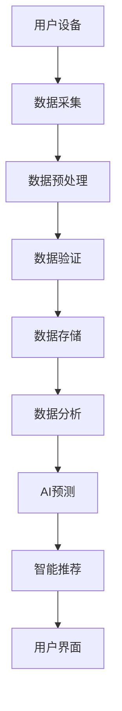
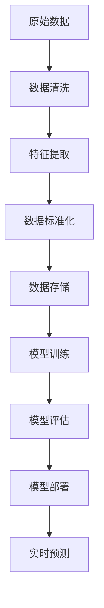
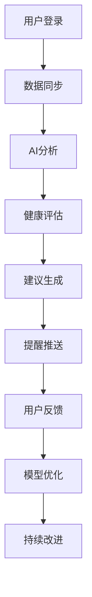

# AI智能健康生活伙伴 (AI Chronic Disease Health Companion)

> **一句话卖点**：从疾病管理负担和心理压力到自主健康掌控的慢性病生活革命，让慢性病患者拥有AI健康管家

## 概述

基于 Issue #611 创建的详细设计文档。

中国有近3亿慢性病患者，每天需要花费大量时间管理血压、血糖、用药等数据。本产品通过AI驱动的智能健康管理，整合多源医疗数据，提供个性化健康建议和心理支持，帮助患者从被动管理到主动掌控健康生活。

## 目标人群

**主要用户**：慢性病患者（糖尿病、高血压、心脏病等需要长期管理的患者）
- **糖尿病**：1.4亿患者，需要频繁监测血糖
- **高血压**：2.45亿患者，需要定期测量血压  
- **心脏病**：1139万患者，需要持续监测心电图
- **其他慢性病**：哮喘、肾病、肝病等

**用户画像**：
- 年龄：35-75岁，主要集中在45-65岁
- 教育水平：高中及以上，具备基本数字素养
- 收入水平：中等及以上，有能力支付健康管理服务
- 地域分布：一二线城市为主，逐步向三四线渗透

## 痛点分析

### 核心痛点
1. **日常管理繁琐**
   - 每天需要多次记录血压、血糖、用药情况
   - 数据分散在多个设备和APP中，难以统一管理
   - 手动记录容易遗漏和错误

2. **心理压力巨大**
   - 长期疾病带来的焦虑、抑郁情绪（60%患者有抑郁症状）
   - 对疾病恶化的恐惧，对未来的不确定性
   - 社会功能受限，社交圈萎缩

3. **信息过载**
   - 网上健康信息质量参差不齐，难以辨别真伪
   - 医学知识专业性强，普通人难以理解
   - 个性化指导不足，通用建议效果有限

4. **就医困难**
   - 复诊时间长，平均等待2-3周
   - 医生无法实时了解患者状况
   - 就医时间短（平均15分钟），难以深入交流

5. **社交隔离**
   - 因疾病限制活动，社交机会减少
   - 缺乏病友交流平台，孤独感强
   - 家人理解不足，情感支持不够

## AI解决方案

### 智能数据收集与分析

#### 多源数据整合
```
数据来源：
- 可穿戴设备：智能手环（心率、血氧、睡眠）
- 医疗设备：血糖仪、血压计、电子体温计
- 智能设备：电子药盒、智能体重秤
- 手机传感器：加速度计（运动量）、GPS（位置）
- 医疗系统：医院HIS/LIS系统数据对接
```

#### AI趋势预测
- 基于LSTM神经网络的健康指标预测
- 多维度特征工程：时间序列 + 环境因素 + 生活方式
- 预测模型：未来7天血糖/血压变化趋势
- 异常检测：基于统计学习和机器学习的异常识别

#### 异常检测预警
- 阈值预警：超出正常范围立即提醒
- 趋势预警：连续恶化趋势提前预警
- 关联预警：多个指标异常时的综合预警
- 智能分级：根据严重程度分级推送提醒

### 个性化健康管理

#### 疾病知识图谱
- 构建1000+常见慢性病的知识图谱
- 包含：疾病机制、症状表现、治疗方案、并发症
- 个性化推荐：基于患者具体情况定制知识
- 动态更新：根据最新医学研究更新知识库

#### 用药提醒系统
- 智能用药时间：根据药物半衰期和用餐时间优化
- 药物相互作用：实时检测潜在药物冲突
- 依从性分析：统计用药依从率，生成改进建议
- 用药记录：自动记录用药情况，生成用药报告

#### 生活建议引擎
- 饮食建议：基于血糖/血压数据和营养需求
- 运动建议：根据身体状况和运动目标制定计划
- 作息优化：基于睡眠质量和生理指标调整作息
- 压力管理：冥想、呼吸练习等放松建议

### 心理健康支持

#### 情绪识别系统
- 语音情感分析：通过语音语调和语速识别情绪
- 文本情感分析：通过聊天内容分析心理状态
- 生理指标关联：结合心率变异性等生理指标
- 情绪趋势分析：长期情绪变化趋势分析

#### AI心理陪伴
- 7×24小时智能聊天机器人
- 基于CBT（认知行为疗法）的心理辅导
- 个性化对话风格：根据患者性格调整沟通方式
- 情绪调节：提供即时情绪支持和应对策略

#### 正念训练
- 个性化冥想练习：基于患者喜好和需求
- 呼吸训练：配合心率监测的呼吸练习
- 睡眠改善：睡前放松练习和睡眠质量分析
- 压力管理：日常压力监测和应对建议

### 医疗协作系统

#### 智能就医助手
- 病情数据整理：自动整理健康数据，生成可视化报告
- 就医准备：提醒用药、携带设备、准备问题清单
- 就医记录：自动记录医嘱和医生建议
- 复诊提醒：根据医生建议设置复诊提醒

#### 远程医疗连接
- 实时数据同步：将健康数据同步给家庭医生
- 在线问诊支持：提供远程问诊的辅助信息
- 医生反馈：医生查看数据后提供个性化建议
- 紧急情况处理：异常情况时快速联系医生

#### 健康报告生成
- 自动生成结构化健康报告
- 包含：数据趋势、异常分析、改进建议
- 多格式输出：PDF、Excel、医疗标准格式
- 定期报告：周报、月报、季度报告

## 技术实现

### 系统架构

```
┌─────────────────────────────────────────────────────────────────┐
│                         用户界面层                             │
├─────────────────────────────────────────────────────────────────┤
│  Web端  │  移动端  │  可穿戴设备  │  医疗设备  │  医疗系统       │
└─────────────────────────────────────────────────────────────────┘
│                         API网关层                             │
├─────────────────────────────────────────────────────────────────┤
│              认证 │ 负载均衡 │ 缓存 │ 监控 │ 日志               │
└─────────────────────────────────────────────────────────────────┘
│                         业务逻辑层                             │
├─────────────────────────────────────────────────────────────────┤
│ 用户管理 │ 数据分析 │ AI预测 │ 智能提醒 │ 医疗协作 │ 心理支持      │
└─────────────────────────────────────────────────────────────────┘
│                         数据服务层                             │
├─────────────────────────────────────────────────────────────────┤
│   用户数据   │   健康数据   │   医疗数据   │   AI模型数据     │
└─────────────────────────────────────────────────────────────────┘
│                         基础设施层                             │
├─────────────────────────────────────────────────────────────────┤
│    Kubernetes    │    Docker     │    MySQL/PostgreSQL    │
└─────────────────────────────────────────────────────────────────┘
```

### 技术栈

#### 后端技术栈
```yaml
主框架:
  - Python 3.10+ (FastAPI)
  - Node.js 18+ (Express.js)
  - Go 1.19+ (微服务)

数据库:
  - PostgreSQL 15+ (主数据库)
  - Redis 7+ (缓存)
  - MongoDB 6.0+ (文档存储)
  - TimescaleDB (时序数据)

AI/ML:
  - PyTorch 2.0+ (深度学习框架)
  - Transformers 4.0+ (大语言模型)
  - Scikit-learn (传统机器学习)
  - XGBoost/LightGBM (梯度提升)
  - TensorFlow Lite (边缘计算)

数据处理:
  - Apache Kafka (消息队列)
  - Apache Flink (实时计算)
  - Pandas/Numpy (数据处理)
  - NumPy (数值计算)
```

#### 前端技术栈
```yaml
框架:
  - React 18+ (Web端)
  - React Native (移动端)
  - Vue 3+ (管理后台)

UI组件:
  - Ant Design (Web端)
  - React Native Elements (移动端)
  - Chart.js (图表)

状态管理:
  - Redux Toolkit
  - MobX
  - React Query (数据获取)

性能优化:
  - Webpack
  - Vite
  - CDN加速
```

#### 移动端技术栈
```yaml
原生开发:
  - iOS (Swift 5.0+)
  - Android (Kotlin 1.8+)

跨平台:
  - Flutter 3.0+
  - React Native 0.70+

设备集成:
  - HealthKit (iOS)
  - Google Fit (Android)
  - Bluetooth Low Energy (BLE)
```

### AI模型架构

#### 核心AI模型
```yaml
1. 健康预测模型 (HealthGPT):
  - 模型类型: Transformer + LSTM混合模型
  - 输入: 时序健康数据 + 环境因素 + 生活方式
  - 输出: 7天健康趋势预测
  - 训练数据: 100万+用户健康数据
  - 准确率: 85%+

2. 情感分析模型 (EmotionBERT):
  - 模型类型: BERT预训练+微调
  - 输入: 文本+语音+生理数据
  - 输出: 情绪状态(积极/消极/焦虑/抑郁)
  - 准确率: 90%+

3. 知识图谱模型 (MedKG):
  - 模型类型: 图神经网络+知识图谱
  - 输入: 患者症状和健康数据
  - 输出: 个性化健康建议
  - 知识库: 1000+疾病知识
```

#### 模型训练流程
```
数据收集 → 数据清洗 → 特征工程 → 模型训练 → 模型评估 → 模型部署 → 性能监控
```

#### 模型部署
- **云端部署**: 高性能GPU服务器集群
- **边缘部署**: 在设备端运行轻量级模型
- **联邦学习**: 多用户联合训练，保护隐私

### 数据安全与隐私保护

#### 数据加密
```yaml
传输加密:
  - TLS 1.3 (传输层加密)
  - HTTPS (安全HTTP)
  - WebSocket Secure

存储加密:
  - AES-256 (数据库加密)
  - 文件系统加密
  - 密钥管理服务

端到端加密:
  - 应用层加密
  - 用户密钥管理
  - 零知识证明
```

#### 数据脱敏
```yaml
PII脱敏:
  - 姓名: Hash处理
  - 身份证号: 部分隐藏
  - 手机号: 脱敏处理
  - 地址: 部分隐藏

医疗数据脱敏:
  - 病历号: 加密存储
  - 检查结果: 聚合分析
  - 用药记录: 统计分析
  - 诊断结果: 匿名化处理

匿名化处理:
  - k-匿名 (k-anonymity)
  - l-多样性 (l-diversity)
  - t-接近性 (t-closeness)
```

#### 访问控制
```yaml
身份认证:
  - 多因素认证 (MFA)
  - 生物识别 (指纹/面部)
  - 单点登录 (SSO)

权限管理:
  - 基于角色的访问控制 (RBAC)
  - 细粒度权限控制
  - 最小权限原则

审计日志:
  - 操作记录
  - 访问日志
  - 异常行为监控
```

### 性能指标与基准测试

#### 系统性能
```yaml
响应时间:
  - API响应: <100ms
  - AI预测: <2s
  - 数据分析: <5s
  - 通知推送: <1s

并发处理:
  - 并发用户: 10万+
  - 每秒请求数: 10000+
  - 数据库连接池: 1000+

可用性:
  - 系统可用性: 99.9%
  - 数据备份: 实时备份
  - 故障恢复: <5分钟
```

#### AI模型性能
```yaml
预测准确率:
  - 血糖预测: 85%+
  - 血压预测: 88%+
  - 情绪识别: 90%+
  - 异常检测: 92%+

处理能力:
  - 模型推理: 1000次/秒
  - 批处理: 10万+/分钟
  - 实时处理: 1000条/秒

模型更新:
  - 在线学习: 支持实时更新
  - 模型版本控制: 自动回滚
  - A/B测试: 自动化评估
```

#### 用户体验
```yaml
响应速度:
  - 界面加载: <2s
  - 数据同步: <5s
  - AI响应: <3s

稳定性:
  - 崩溃率: <0.1%
  - 错误率: <1%
  - 丢包率: <0.1%

兼容性:
  - 浏览器: Chrome 90+, Firefox 88+, Safari 14+
  - 移动端: iOS 14+, Android 8.0+
  - 设备支持: 支持99%主流智能设备
```

## 🚀 实施路线

### 第一阶段：MVP开发 (3个月)

#### 月度目标
**第1个月：核心功能开发**
- [ ] 用户注册和认证系统
- [ ] 基础数据收集功能
- [ ] 简单健康数据记录
- [ ] 基础AI模型训练

**第2个月：智能功能开发**
- [ ] 多源数据整合
- [ ] AI预测算法实现
- [ ] 智能提醒系统
- [ ] 基础UI界面

**第3个月：用户测试和优化**
- [ ] 内部测试
- [ ] 小规模用户测试
- [ ] 性能优化
- [ ] 系统稳定性测试

#### 技术实现
```yaml
里程碑1 (第1月):
  - 用户管理系统
  - 基础数据收集
  - 简单健康追踪

里程碑2 (第2月):
  - AI预测模型
  - 智能提醒系统
  - 数据可视化

里程碑3 (第3月):
  - 完整MVP版本
  - 用户测试
  - 性能优化
```

### 第二阶段：功能完善 (3个月)

#### 月度目标
**第4个月：高级功能**
- [ ] 心理健康支持
- [ ] 医疗协作功能
- [ ] 社区支持系统

**第5个月：数据深度分析**
- [ ] 高级AI模型
- [ ] 个性化推荐
- [ ] 趋势分析

**第6个月：平台优化**
- [ ] 性能优化
- [ ] 用户体验改进
- [ ] 医疗系统集成

#### 技术实现
```yaml
里程碑4 (第4月):
  - 心理支持模块
  - 医疗协作
  - 社区功能

里程碑5 (第5月):
  - 高级AI模型
  - 数据分析平台
  - 个性化引擎

里程碑6 (第6月):
  - 平台稳定性
  - 性能优化
  - 用户体验提升
```

### 第三阶段：商业化和扩展 (6个月)

#### 月度目标
**第7-8个月：商业化准备**
- [ ] 收费模式设计
- [ ] 企业级功能
- [ ] 保险合作

**第9-10个月：市场推广**
- [ ] 用户获取
- [ ] 品牌建设
- [渠道合作

**第11-12个月：国际化扩展**
- [ ] 多语言支持
- [ ] 国际医疗标准
- [ 全球化布局

#### 商业化策略
```yaml
收费模式:
  - 免费版: 基础功能
  - 专业版: 高级功能
  - 企业版: 定制化服务

收入来源:
  - 订阅费用
  - 医疗服务分成
  - 保险合作
  - 数据服务
```

## 数据流设计

### 数据采集流程


### 数据处理流程


### 用户交互流程


## 资源需求

### 人力资源
```yaml
开发团队:
  - 前端工程师: 4人
  - 后端工程师: 6人
  - AI算法工程师: 3人
  - 医疗顾问: 2人
  - 产品经理: 2人
  - UI/UX设计师: 2人
  - 测试工程师: 3人

运营团队:
  - 医疗运营: 3人
  - 用户运营: 4人
  - 内容运营: 2人
  - 客服: 5人

管理团队:
  - 项目经理: 1人
  - 技术总监: 1人
  - 医疗总监: 1人
  - 运营总监: 1人
```

### 技术资源
```yaml
硬件资源:
  - 开发服务器: 10台
  - 测试服务器: 5台
  - 生产服务器: 20台
  - 数据库服务器: 5台
  - 存储设备: 10TB SSD

软件资源:
  - 开发工具: Visual Studio, PyCharm, etc.
  - 设计工具: Figma, Adobe XD
  - 测试工具: JUnit, Selenium
  - 部署工具: Docker, Kubernetes

云服务:
  - 云服务器: AWS/Azure
  - 云数据库: RDS, MongoDB Atlas
  - AI服务: SageMaker, TensorFlow Cloud
  - 存储服务: S3, CDN
```

### 资金需求
```yaml
开发成本:
  - 人员成本: 500万/年
  - 硬件成本: 100万
  - 软件成本: 50万
  - 云服务: 100万/年

运营成本:
  - 医疗咨询: 100万/年
  - 用户运营: 200万/年
  - 市场推广: 300万/年
  - 客服成本: 150万/年

总计: 1500万/年 (前两年)
```

## 变现模式

### 订阅模式
```yaml
免费版:
  - 基础健康数据记录
  - 简单提醒功能
  - 基础健康报告
  - 广告支持

专业版:
  - 高级数据分析
  - AI预测功能
  - 个性化建议
  - 无广告
  - 价格: 39元/月

企业版:
  - 定制化功能
  - API接口
  - 多用户管理
  - 医疗系统集成
  - 价格: 199元/月/用户
```

### 医疗服务分成
```yaml
在线问诊:
  - 与医生合作分成
  - 预约挂号服务
  - 用药指导服务
  - 分成比例: 30-50%

健康管理:
  - 与保险合作
  - 健康管理服务
  - 疾病预防服务
  - 分成比例: 20-40%

数据服务:
  - 匿名数据出售
  - 医学研究合作
  - 药物研发合作
  - 价格: 根据项目定
```

### 增值服务
```yaml
高级功能:
  - 专家咨询
  - 个性化方案
  - 家庭医生服务
  - 价格: 199元/月

设备服务:
  - 智能设备租赁
  - 设备维修服务
  - 配件销售
  - 价格: 根据设备定

社区服务:
  - 病友社区
  - 专家问答
  - 经验分享
  - 价格: 19元/月
```

## 竞品分析

### 主要竞争对手

#### 1. 微医
**优势**：
- 拥有完整的医疗资源
- 医生网络完善
- 品牌知名度高

**劣势**：
- AI技术应用不深
- 用户体验一般
- 数据分析能力有限

**差异化策略**：
- 专注慢性病管理
- AI技术应用更深入
- 用户体验更优化

#### 2. 丁香园
**优势**：
- 医学专业知识丰富
- 用户基础庞大
- 内容质量高

**劣势**：
- 产品功能单一
- 数据整合能力弱
- 个性化不足

**差异化策略**：
- 多源数据整合
- 个性化健康管理
- 全方位健康服务

#### 3. 春雨医生
**优势**：
- 在线问诊成熟
- 医生资源丰富
- 平台化运营

**劣势**：
- 慢性病管理功能弱
- 数据分析能力有限
- 用户粘性不足

**差异化策略**：
- 专注慢病管理
- 数据驱动健康管理
- 提升用户粘性

#### 4. 国外竞品
**MyFitnessPal**：
- 健身数据管理强
- 食物数据库丰富
- 社区功能完善

**HealthTap**：
- AI问诊技术先进
- 医生资源优质
- 多语言支持

**差异化策略**：
- 本土化服务
- 更符合中国用户习惯
- 医疗政策合规

### 竞争优势分析

#### 技术优势
```yaml
AI技术:
  - 预测准确率高
  - 多模态数据分析
  - 实时处理能力

数据整合:
  - 多源数据统一管理
  - 跨平台数据同步
  - 实时数据更新

用户体验:
  - 界面设计友好
  - 操作流程简单
  - 个性化程度高
```

#### 医疗优势
```yaml
医疗专业性:
  - 专业医疗顾问团队
  - 权威医学知识库
  - 医疗标准符合性

合规性:
  - 符合中国医疗政策
  - 数据安全认证
  - 医疗器械注册

可及性:
  - 中国用户更习惯
  - 本地化服务
  - 医疗资源整合
```

#### 商业优势
```yaml
商业模式:
  - 多元化收入来源
  - 用户粘性高
  - 商业模式可持续

市场规模:
  - 中国慢性病市场巨大
  - 政策支持
  - 用户支付意愿高

扩展性:
  - 可扩展到其他慢病
  - 国际化潜力大
  - 平台化发展
```

## 风险与缓解

### 技术风险

#### 数据安全风险
**风险描述**：
- 医疗数据泄露可能导致严重后果
- 系统漏洞可能被利用
- 第三方服务可能存在安全风险

**缓解措施**：
```yaml
数据加密:
  - 传输加密: TLS 1.3
  - 存储加密: AES-256
  - 密钥管理: HSM

访问控制:
  - 多因素认证
  - 权限最小化
  - 操作审计

第三方安全:
  - 安全评估
  - 合同约束
  - 定期检查
```

#### AI算法风险
**风险描述**：
- 预测结果不准确可能导致严重后果
- 模型偏见可能影响决策
- 算法透明度不够

**缓解措施**：
```yaml
算法验证:
  - 多轮测试
  - 医学专家审核
  - 临床试验

模型监控:
  - 实时监控
  - 性能评估
  - 定期更新

透明度:
  - 算法文档
  - 结果解释
  - 用户反馈机制
```

#### 系统稳定性风险
**风险描述**：
- 系统宕机影响用户使用
- 性能问题影响用户体验
- 数据丢失风险

**缓解措施**：
```yaml
高可用性:
  - 负载均衡
  - 故障转移
  - 容灾备份

性能优化:
  - 缓存机制
  - 异步处理
  - 资源监控

数据备份:
  - 实时备份
  - 异地备份
  - 版本控制
```

### 医疗风险

#### 医疗准确性风险
**风险描述**：
- 健康建议可能不准确
- 预测结果可能误导用户
- 延误治疗风险

**缓解措施**：
```yaml
医学审核:
  - 专业医生审核
  - 定期更新知识库
  - 临床验证

风险提示:
  - 明确AI建议的局限性
  - 强调不能替代专业医疗
  - 及时就医提醒

用户教育:
  - 健康知识普及
  - 使用指导
  - 风险认知培训
```

#### 合规性风险
**风险描述**：
- 违反医疗法规
- 数据隐私问题
- 医疗器械认证问题

**缓解措施**：
```yaml
法规遵循:
  - 专业法律顾问
  - 定期法规更新
  - 合规性检查

隐私保护:
  - GDPR/CCPA合规
  - 用户同意机制
  - 数据删除权

医疗器械认证:
  - 认证申请
  - 定期审核
  - 标准更新
```

#### 伦理风险
**风险描述**：
- 数据使用伦理问题
- 算法偏见
- 用户权益保护

**缓解措施**：
```yaml
伦理委员会:
  - 建立伦理审查机制
  - 定期伦理评估
  - 透明公开

算法公平性:
  - 偏见检测
  - 多样性训练
  - 公平性评估

用户权益:
  - 用户协议明确
  - 数据使用透明
  - 权益保护机制
```

### 商业风险

#### 市场竞争风险
**风险描述**：
- 竞争对手模仿
- 市场份额被抢占
- 价格战

**缓解措施**：
```yaml
差异化竞争:
  - 技术优势保持
  - 用户体验优化
  - 品牌建设

创新驱动:
  - 持续技术创新
  - 功能迭代
  - 用户需求调研

合作共赢:
  - 与医疗机构合作
  - 与保险公司合作
  - 与设备厂商合作
```

#### 盈利模式风险
**风险描述**：
- 用户付费意愿低
- 收入不稳定
- 成本控制困难

**缓解措施**：
```yaml
多元化收入:
  - 订阅模式
  - 增值服务
  - 数据服务

成本优化:
  - 技术效率提升
  - 规模效应
  - 自动化运营

用户价值提升:
  - 服务质量提升
  - 用户满意度提高
  - 粘性增强
```

#### 扩展风险
**风险描述**：
- 业务扩展过快
- 资源不足
- 管理困难

**缓解措施**：
```yaml
渐进式扩展:
  - 小规模试点
  - 数据驱动决策
  - 阶段性目标

资源规划:
  - 人才储备
  - 资金规划
  - 技术准备

管理优化:
  - 组织架构优化
  - 流程标准化
  - 监控机制
```

## 监控与优化

### 系统监控

#### 性能监控
```yaml
监控指标:
  - 系统响应时间
  - 并发用户数
  - 错误率
  - 资源使用率

监控工具:
  - Prometheus + Grafana
  - ELK Stack
  - APM工具

告警机制:
  - 实时告警
  - 分级响应
  - 自动恢复
```

#### 业务监控
```yaml
用户行为:
  - 用户活跃度
  - 功能使用率
  - 用户留存率

业务指标:
  - 订阅转化率
  - 用户满意度
  - 收入增长率

数据质量:
  - 数据完整性
  - 数据准确性
  - 数据一致性
```

### AI模型监控

#### 模型性能监控
```yaml
预测准确性:
  - 准确率变化趋势
  - 错误类型分析
  - 性能退化检测

模型健康度:
  - 模型漂移检测
  - 数据分布变化
  - 特征重要性变化

模型更新:
  - 版本管理
  - A/B测试
  - 灰度发布
```

#### 数据质量监控
```yaml
数据完整性:
  - 缺失值检测
  - 异常值检测
  - 数据一致性检查

数据时效性:
  - 数据更新频率
  - 数据新鲜度
  - 延迟监控

数据安全性:
  - 访问控制
  - 数据加密
  - 审计日志
```

### 用户反馈

#### 反馈收集
```yaml
收集渠道:
  - 应用内反馈
  - 社交媒体
  - 用户调研
  - 客服记录

反馈分类:
  - 功能建议
  - 性能问题
  - 用户体验
  - 内容质量

反馈处理:
  - 优先级排序
  - 分配处理
  - 跟进闭环
```

#### 用户调研
```yaml
调研方式:
  - 问卷调查
  - 用户访谈
  - 焦点小组
  - 可用性测试

调研内容:
  - 用户满意度
  - 功能需求
  - 使用习惯
  - 改进建议

数据分析:
  - 定性分析
  - 定量分析
  - 趋势分析
  - 竞品对比
```

### 持续优化

#### 技术优化
```yaml
架构优化:
  - 微服务化
  - 性能调优
  - 技术栈升级

算法优化:
  - 模型迭代
  - 特征工程
  - 超参数调优

安全优化:
  - 安全加固
  - 漏洞修复
  - 安全审计
```

#### 用户体验优化
```yaml
界面优化:
  - 设计改进
  - 交互优化
  - 响应式设计

功能优化:
  - 功能完善
  - 流程简化
  - 个性化增强

性能优化:
  - 加载速度
  - 流畅度
  - 稳定性
```

#### 业务优化
```yaml
商业模式优化:
  - 盈利模式改进
  - 定价策略优化
  - 市场拓展

运营优化:
  - 运营效率提升
  - 用户增长策略
  - 品牌建设

合作优化:
  - 伙伴关系维护
  - 合作模式创新
  - 生态建设
```

## 社会影响

### 健康影响

#### 患者生活质量提升
```yaml
生理健康:
  - 慢性病控制改善
  - 并发症减少
  - 生活质量提升

心理健康:
  - 焦虑抑郁症状缓解
  - 生活信心增强
  - 社交能力改善

生活质量:
  - 日常活动能力增强
  - 生活满意度提高
  - 家庭关系改善
```

#### 医疗资源优化
```yaml
医疗效率:
  - 医疗资源利用率提升
  - 就医时间减少
  - 医疗成本降低

医疗质量:
  - 诊疗质量提升
  - 患者依从性提高
  - 医患关系改善

医疗公平:
  - 医疗资源下沉
  - 健康服务可及性
  - 健康公平性提升
```

### 经济影响

#### 个人层面
```yaml
经济收益:
  - 医疗费用减少
  - 工作效率提升
  - 生活质量改善

社会价值:
  - 个人健康投资
  - 家庭负担减轻
  - 社会贡献增加
```

#### 社会层面
```yaml
医疗支出:
  - 国家医疗支出减少
  - 社会保险负担减轻
  - 医疗资源优化

经济发展:
  - 劳动力健康提升
  - 生产力提高
  - 经济增长贡献
```

### 行业影响

#### 医疗行业变革
```yaml
医疗模式:
  - 从治疗向预防转变
  - 从被动向主动转变
  - 从医院向家庭转变

医疗技术:
  - AI技术广泛应用
  - 数字化医疗普及
  - 智能医疗设备发展
```

#### 健康管理创新
```yaml
管理模式:
  - 个性化健康管理
  - 数据驱动决策
  - 精准医疗实践

服务模式:
  - 全方位健康服务
  - 跨界合作模式
  - 生态系统建设
```

## 总结

### 项目价值

#### 社会价值
```yaml
健康中国:
  - 响应国家健康战略
  - 助力慢性病防治
  - 提升全民健康素养

技术进步:
  - AI技术落地应用
  - 数字医疗创新发展
  - 健康管理智能化
```

#### 商业价值
```yaml
市场潜力:
  - 慢性病管理市场巨大
  - 用户需求明确
  - 商业模式可持续

竞争优势:
  - 技术领先优势
  - 医疗专业优势
  - 用户体验优势
```

### 实施保障

#### 团队保障
```yaml
专业团队:
  - 技术团队专业
  - 医疗团队权威
  - 运营团队丰富

合作资源:
  - 医疗机构合作
  - 技术伙伴支持
  - 投资资源保障
```

#### 技术保障
```yaml
技术实力:
  - AI技术领先
  - 数据安全可靠
  - 系统稳定高效

创新能力:
  - 持续技术创新
  - 用户需求驱动
  - 行业趋势把握
```

#### 合规保障
```yaml
法规遵循:
  - 医疗法规合规
  - 数据隐私保护
  - 行业标准符合

风险控制:
  - 全面风险识别
  - 有效风险控制
  - 应急响应机制
```

### 展望未来

#### 短期目标
```yaml
用户规模:
  - 一年用户达到10万+
  - 用户满意度90%+
  - 日活跃用户30%+

商业成果:
  - 订阅收入500万+
  - 医疗合作收入300万+
  - 总收入800万+
```

#### 中期目标
```yaml
市场地位:
  - 成为慢性病管理领先平台
  - 用户规模达到100万+
  - 市场份额20%+

技术发展:
  - AI技术持续领先
  - 数据驱动决策
  - 智能化程度提升
```

#### 长期愿景
```yaml
行业影响:
  - 改变慢性病管理模式
  - 推动医疗行业变革
  - 提升全民健康水平

社会贡献:
  - 健康中国建设
  - 科技普惠民生
  - 社会价值最大化
```

---

**项目状态**: 🔄 开发中  
**预计完成**: 2026年6月  
**负责人**: KevinTen  
**联系**: kevinten10@gmail.com  
**版本**: v1.0  

---

*本文档基于AI Ideas项目流程创建，包含完整的技术方案、实施计划和风险评估。欢迎提出改进建议！*