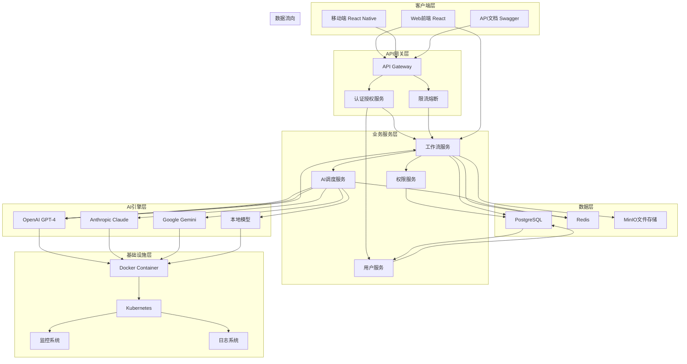

# AI Workspace Orchestrator 架构设计推演

## 项目概述

AI Workspace Orchestrator 是一个企业级AI工作流自动化平台，通过自然语言界面智能调度多个AI引擎，让非技术人员也能轻松管理和编排多个AI工具。

## 1. 技术选型

### 1.1 框架选型比较

**候选方案1：Python FastAPI + React**
- **优势**：FastAPI性能优异，自动API文档，Python生态丰富，AI库支持完善
- **劣势**：前端需要额外技术栈，开发效率相对较低
- **适用场景**：对API性能要求高，团队熟悉Python生态

**候选方案2：Node.js Express + Next.js**
- **优势**：全栈JavaScript，开发效率高，生态系统成熟，SSR支持良好
- **劣势**：AI库支持相对Python较弱，性能略低于FastAPI
- **适用场景**：注重开发效率，团队熟悉JavaScript生态

**候选方案3：Go Gin + Vue.js**
- **优势**：并发性能极强，编译型语言，资源占用少
- **劣势**：AI库生态不完善，开发曲线较陡峭
- **适用场景**：高并发、微服务架构，对性能要求极高

**推荐方案：Python FastAPI + React**
**推荐理由**：
1. AI集成优势：Python在AI/ML领域拥有最丰富的库和框架支持
2. 性能需求：FastAPI提供异步支持，满足高并发工作流执行需求
3. 自动化文档：FastAPI自动生成Swagger文档，便于API管理
4. 企业级支持：成熟的Python企业级解决方案

### 1.2 数据库选型

**候选方案1：PostgreSQL + Redis**
- **优势**：关系型数据完整性强，Redis缓存提升性能，ACID特性完善
- **劣势**：运维复杂度较高
- **适用场景**：企业级应用，需要数据一致性保障

**候选方案2：MongoDB + Redis**
- **优势**：灵活的文档存储，适合工作流动态特性
- **劣势**：数据一致性较弱，复杂查询性能较低
- **适用场景**：快速迭代开发，数据结构频繁变化

**推荐方案：PostgreSQL + Redis**
**推荐理由**：
1. 数据完整性：工作流执行状态、用户权限等需要强一致性
2. ACID支持：确保工作流执行的原子性和可靠性
3. 生态系统：成熟的ORM和迁移工具支持
4. 扩展性：支持水平分片和读写分离

### 1.3 AI模型集成

**候选方案1：直接集成各厂商API**
- **优势**：模型最新，功能完整，厂商支持好
- **劣势**：成本高，依赖性强，切换困难
- **适用场景**：追求最新功能，预算充足

**候选方案2：本地部署开源模型**
- **优势**：成本低可控，无依赖，可定制
- **劣势**：维护复杂，更新延迟，硬件要求高
- **适用场景**：数据敏感，注重隐私，长线规划

**推荐方案：混合模式 - API为主 + 本地为辅**
**推荐理由**：
1. 成本效益：主要使用API降低硬件成本，关键功能本地部署
2. 灵活性：厂商API可快速集成新模型，本地保证核心功能可用
3. 可靠性：多云架构避免单点故障
4. 可扩展性：支持未来模型无缝切换

### 1.4 部署方案

**候选方案1：Docker Compose + Kubernetes**
- **优势**：容器化部署，弹性扩展，标准化运维
- **劣势**：运维复杂度高，学习成本大
- **适用场景**：生产环境，大规模部署

**候选方案2：Serverless + Vercel/Railway**
- **优势**：免运维，自动扩缩容，快速部署
- **劣势**：状态管理复杂，成本控制较难
- **适用场景**：MVP阶段，快速验证

**推荐方案：Docker + Kubernetes**
**推荐理由**：
1. 企业级稳定：容器化确保环境一致性，K8s提供生产级管理
2. 弹性扩展：根据工作流负载自动扩缩容
3. 监控完善：完善的日志、监控和告警体系
4. 标准化：DevOps最佳实践，易于CI/CD集成

## 2. 系统架构图



## 3. 目录结构设计

```
ai-workspace-orchestrator/
├── backend/
│   ├── app/
│   │   ├── __init__.py
│   │   ├── main.py                 # FastAPI应用入口
│   │   ├── config.py               # 配置管理
│   │   ├── database.py            # 数据库连接
│   │   ├── security.py            # 安全相关
│   │   ├── middleware/            # 中间件
│   │   │   ├── __init__.py
│   │   │   ├── auth.py             # 认证中间件
│   │   │   ├── cors.py             # CORS中间件
│   │   │   └── rate_limit.py       # 限流中间件
│   │   ├── api/                    # API路由
│   │   │   ├── __init__.py
│   │   │   ├── v1/
│   │   │   │   ├── __init__.py
│   │   │   │   ├── auth.py         # 认证相关API
│   │   │   │   ├── users.py        # 用户管理API
│   │   │   │   ├── workflows.py   # 工作流API
│   │   │   │   ├── executions.py   # 执行记录API
│   │   │   │   ├── ai_engines.py   # AI引擎API
│   │   │   │   └── templates.py    # 模板API
│   │   │   └── v2/
│   │   │       └── __init__.py
│   │   ├── models/                 # 数据模型
│   │   │   ├── __init__.py
│   │   │   ├── base.py            # 基础模型
│   │   │   ├── user.py            # 用户模型
│   │   │   ├── workflow.py        # 工作流模型
│   │   │   ├── execution.py       # 执行记录模型
│   │   │   ├── template.py         # 模型板
│   │   │   └── audit.py           # 审计日志模型
│   │   ├── schemas/                # Pydantic模式
│   │   │   ├── __init__.py
│   │   │   ├── user.py
│   │   │   ├── workflow.py
│   │   │   ├── execution.py
│   │   │   └── template.py
│   │   ├── services/               # 业务逻辑服务
│   │   │   ├── __init__.py
│   │   │   ├── auth_service.py
│   │   │   ├── user_service.py
│   │   │   ├── workflow_service.py
│   │   │   ├── execution_service.py
│   │   │   ├── ai_service.py
│   │   │   ├── template_service.py
│   │   │   ├── notification_service.py
│   │   │   └── audit_service.py
│   │   ├── utils/                  # 工具函数
│   │   │   ├── __init__.py
│   │   │   ├── crypto.py          # 加密工具
│   │   │   ├── validation.py      # 验证工具
│   │   │   ├── decorators.py      # 装饰器
│   │   │   └── helpers.py          # 辅助函数
│   │   ├── core/                   # 核心组件
│   │   │   ├── __init__.py
│   │   │   ├── ai_scheduler.py    # AI调度器
│   │   │   ├── workflow_executor.py # 工作流执行器
│   │   │   ├── engine_factory.py # AI引擎工厂
│   │   │   ├── cache.py           # 缓存管理
│   │   │   └── events.py          # 事件处理
│   │   └── api_docs/              # API文档
│   │       ├── __init__.py
│   │       ├── auth.yaml
│   │       ├── workflows.yaml
│   │       └── executions.yaml
│   ├── migrations/                # 数据库迁移
│   ├── tests/                      # 测试文件
│   │   ├── __init__.py
│   │   ├── test_auth.py
│   │   ├── test_workflows.py
│   │   ├── test_ai_integration.py
│   │   └── utils/
│   ├── alembic.ini               # 数据库迁移配置
│   ├── requirements.txt          # Python依赖
│   └── .env.example              # 环境变量示例
├── frontend/
│   ├── src/
│   │   ├── components/           # 通用组件
│   │   │   ├── layout/            # 布局组件
│   │   │   │   ├── Header.jsx
│   │   │   │   ├── Sidebar.jsx
│   │   │   │   └── Footer.jsx
│   │   │   ├── forms/            # 表单组件
│   │   │   │   ├── WorkflowForm.jsx
│   │   │   │   ├── LoginForm.jsx
│   │   │   │   └── TemplateForm.jsx
│   │   │   ├── ui/               # 基础UI组件
│   │   │   │   ├── Button.jsx
│   │   │   │   ├── Input.jsx
│   │   │   │   ├── Modal.jsx
│   │   │   │   └── Table.jsx
│   │   │   ├── workflow/         # 工作流组件
│   │   │   │   ├── WorkflowDesigner.jsx
│   │   │   │   ├── WorkflowExecute.jsx
│   │   │   │   └── WorkflowResults.jsx
│   │   │   ├── auth/             # 认证组件
│   │   │   │   ├── Login.jsx
│   │   │   │   ├── Register.jsx
│   │   │   │   └── Profile.jsx
│   │   │   └── common/           # 通用组件
│   │   │       ├── Loading.jsx
│   │   │       ├── ErrorBoundary.jsx
│   │   │       └── Toast.jsx
│   │   ├── pages/                # 页面组件
│   │   │   ├── auth/             # 认证页面
│   │   │   │   ├── Login.jsx
│   │   │   │   └── Register.jsx
│   │   │   ├── dashboard/        # 仪表板页面
│   │   │   │   ├── Dashboard.jsx
│   │   │   │   ├── Workflows.jsx
│   │   │   │   ├── Executions.jsx
│   │   │   │   └ Templates.jsx
│   │   │   ├── workflow/         # 工作流页面
│   │   │   │   ├── List.jsx
│   │   │   │   ├── Create.jsx
│   │   │   │   ├── Edit.jsx
│   │   │   │   └── Execute.jsx
│   │   │   └── profile/          # 用户页面
│   │   │       ├── Profile.jsx
│   │   │       └── Settings.jsx
│   │   ├── services/             # API服务
│   │   │   ├── api.js            # API客户端
│   │   │   ├── auth.js           # 认证服务
│   │   │   ├── workflows.js      # 工作流服务
│   │   │   ├── executions.js     # 执行服务
│   │   │   └── templates.js      # 模板服务
│   │   ├── store/                # 状态管理
│   │   │   ├── authStore.js
│   │   │   ├── workflowStore.js
│   │   │   ├── executionStore.js
│   │   │   └── templateStore.js
│   │   ├── utils/                # 工具函数
│   │   │   ├── api.js
│   │   │   ├── validators.js
│   │   │   ├── formatters.js
│   │   │   └── constants.js
│   │   ├── hooks/                # 自定义钩子
│   │   │   ├── useAuth.js
│   │   │   ├── useWorkflows.js
│   │   │   ├── useExecutions.js
│   │   │   └── useTemplates.js
│   │   ├── styles/               # 样式文件
│   │   │   ├── index.css
│   │   │   ├── globals.css
│   │   │   └── theme.css
│   │   ├── App.jsx               # 应用入口
│   │   ├── index.js              # 渲染入口
│   │   └── setupTests.js        # 测试设置
│   ├── public/                   # 静态资源
│   ├── package.json              # 依赖包
│   ├── vite.config.js           # Vite配置
│   └── tailwind.config.js       # Tailwind配置
├── docker-compose.yml           # Docker Compose配置
├── k8s/                         # Kubernetes配置
│   ├── namespace.yaml
│   ├── deployment.yaml
│   ├── service.yaml
│   ├── ingress.yaml
│   └── configmap.yaml
├── .gitignore                   # Git忽略文件
├── README.md                    # 项目文档
├── SECURITY.md                  # 安全文档
├── CONTRIBUTING.md              # 贡献指南
└── LICENSE                      # 许可证
```

## 4. 核心API设计

### 4.1 RESTful API端点列表

#### 认证相关
```
POST   /api/v1/auth/register      # 用户注册
POST   /api/v1/auth/login         # 用户登录
POST   /api/v1/auth/logout        # 用户登出
GET    /api/v1/auth/refresh       # 刷新令牌
GET    /api/v1/auth/me           # 获取当前用户信息
POST   /api/v1/auth/forgot-password # 忘记密码
POST   /api/v1/auth/reset-password  # 重置密码
```

#### 用户管理
```
GET    /api/v1/users              # 获取用户列表
GET    /api/v1/users/{id}        # 获取用户详情
PUT    /api/v1/users/{id}        # 更新用户信息
DELETE /api/v1/users/{id}        # 删除用户
GET    /api/v1/users/{id}/profile # 获取用户资料
PUT    /api/v1/users/{id}/profile # 更新用户资料
```

#### 工作流管理
```
POST   /api/v1/workflows          # 创建工作流
GET    /api/v1/workflows          # 获取工作流列表
GET    /api/v1/workflows/{id}    # 获取工作流详情
PUT    /api/v1/workflows/{id}    # 更新工作流
DELETE /api/v1/workflows/{id}    # 删除工作流
POST   /api/v1/workflows/{id}/execute # 执行工作流
GET    /api/v1/workflows/{id}/executions # 获取执行历史
GET    /api/v1/workflows/{id}/status # 获取工作流状态
POST   /api/v1/workflows/{id}/duplicate # 复制工作流
POST   /api/v1/workflows/{id}/share # 分享工作流
```

#### 工作流模板
```
POST   /api/v1/templates         # 创建模板
GET    /api/v1/templates         # 获取模板列表
GET    /api/v1/templates/{id}   # 获取模板详情
PUT    /api/v1/templates/{id}   # 更新模板
DELETE /api/v1/templates/{id}   # 删除模板
GET    /api/v1/templates/search  # 搜索模板
POST   /api/v1/templates/{id}/use # 使用模板创建工作流
```

#### 执行记录
```
GET    /api/v1/executions         # 获取执行列表
GET    /api/v1/executions/{id}   # 获取执行详情
GET    /api/v1/executions/{id}/logs # 获取执行日志
GET    /api/v1/executions/{id}/status # 获取执行状态
DELETE /api/v1/executions/{id}   # 删除执行记录
GET    /api/v1/executions/{id}/results # 获取执行结果
POST   /api/v1/executions/{id}/stop # 停止执行
```

#### AI引擎管理
```
GET    /api/v1/ai-engines        # 获取AI引擎列表
GET    /api/v1/ai-engines/{id}  # 获取AI引擎详情
POST   /api/v1/ai-engines/test   # 测试AI引擎连接
GET    /api/v1/ai-engines/{id}/capabilities # 获取引擎能力
POST   /api/v1/ai-engines/{id}/configure # 配置AI引擎
```

#### 团队协作
```
GET    /api/v1/teams             # 获取团队列表
POST   /api/v1/teams             # 创建团队
GET    /api/v1/teams/{id}       # 获取团队详情
PUT    /api/v1/teams/{id}       # 更新团队
DELETE /api/v1/teams/{id}       # 删除团队
POST   /api/v1/teams/{id}/members # 添加团队成员
DELETE /api/v1/teams/{id}/members/{user_id} # 移除团队成员
```

#### 审计日志
```
GET    /api/v1/audit/logs        # 获取审计日志
GET    /api/v1/audit/logs/{id}   # 获取审计日志详情
GET    /api/v1/audit/logs/search # 搜索审计日志
```

### 4.2 WebSocket事件

```typescript
// 工作流执行事件
interface WorkflowEvents {
  'workflow:created': Workflow;
  'workflow:updated': Workflow;
  'workflow:deleted': { id: string };
  'workflow:started': { id: string; timestamp: Date };
  'workflow:progress': { id: string; step: string; progress: number };
  'workflow:completed': { id: string; result: any };
  'workflow:failed': { id: string; error: string };
}

// AI引擎事件
interface AIEngineEvents {
  'ai:engine:connected': { id: string; name: string };
  'ai:engine:disconnected': { id: string; name: string };
  'ai:engine:error': { id: string; error: string };
}

// 用户事件
interface UserEvents {
  'user:joined': { user: User; team: string };
  'user:left': { user: User; team: string };
  'user:typing': { userId: string; channelId: string };
}
```

## 5. 数据模型设计

### 5.1 Prisma Schema草案

```prisma
generator client {
  provider = "prisma-client-js"
}

datasource db {
  provider = "postgresql"
  url      = env("DATABASE_URL")
}

// 用户模型
model User {
  id        String   @id @default(cuid())
  email     String   @unique
  username  String   @unique
  password  String
  name      String?
  avatar    String?
  isActive  Boolean  @default(true)
  createdAt DateTime @default(now())
  updatedAt DateTime @updatedAt

  // 关联关系
  profiles       UserProfile[]
  teams          TeamMember[]
  workflows      Workflow[]
  executions     Execution[]
  templates      Template[]
  auditLogs      AuditLog[]
  
  @@map("users")
}

// 用户资料模型
model UserProfile {
  id        String @id @default(cuid())
  userId    String @unique
  user      User   @relation(fields: [userId], references: [id], onDelete: Cascade)
  
  bio       String?
  timezone  String @default("UTC")
  language  String @default("zh-CN")
  preferences Json?
  
  @@map("user_profiles")
}

// 团队模型
model Team {
  id          String   @id @default(cuid())
  name        String
  description String?
  ownerUserId String
  
  owner       User     @relation(fields: [ownerUserId], references: [id])
  members     TeamMember[]
  workflows   Workflow[]
  templates   Template[]
  
  createdAt   DateTime @default(now())
  updatedAt   DateTime @updatedAt
  
  @@map("teams")
}

// 团队成员模型
model TeamMember {
  id       String   @id @default(cuid())
  teamId   String
  userId   String
  role     TeamRole @default(MEMBER)
  joinedAt DateTime @default(now())
  
  team     Team     @relation(fields: [teamId], references: [id], onDelete: Cascade)
  user     User     @relation(fields: [userId], references: [id], onDelete: Cascade)
  
  @@unique([teamId, userId])
  @@map("team_members")
}

// 工作流模型
model Workflow {
  id            String      @id @default(cuid())
  title         String
  description   String?
  version       String      @default("1.0.0")
  status       WorkflowStatus @default(DRAFT)
  isPublic      Boolean     @default(false)
  isTemplate    Boolean     @default(false)
  tags         String[]
  config       Json        // 工作流配置
  
  // 关联关系
  userId       String
  user         User        @relation(fields: [userId], references: [id])
  teamId       String?
  team         Team?       @relation(fields: [teamId], references: [id])
  executions   Execution[]
  templates    Template[]
  
  createdAt     DateTime    @default(now())
  updatedAt     DateTime    @updatedAt
  lastExecutedAt DateTime?
  
  @@map("workflows")
}

// 工作流步骤模型
model WorkflowStep {
  id          String       @id @default(cuid())
  workflowId  String
  title       String
  description String?
  stepType    StepType
  order       Int
  config      Json        // 步骤配置
  aiEngineId  String?
  
  workflow    Workflow     @relation(fields: [workflowId], references: [id], onDelete: Cascade)
  aiEngine    AIEngine?    @relation(fields: [aiEngineId], references: [id])
  
  createdAt   DateTime     @default(now())
  updatedAt   DateTime     @updatedAt
  
  @@map("workflow_steps")
}

// AI引擎模型
model AIEngine {
  id               String   @id @default(cuid())
  name             String
  provider         AIProvider
  model            String
  apiKey           String
  baseUrl          String?
  config           Json    // 引擎配置
  isActive        Boolean  @default(true)
  capabilities     Json[]   // 支持的能力
  rateLimit        Json    // 速率限制配置
  
  // 关联关系
  steps            WorkflowStep[]
  
  createdAt        DateTime @default(now())
  updatedAt        DateTime @updatedAt
  
  @@map("ai_engines")
}

// 执行记录模型
model Execution {
  id           String           @id @default(cuid())
  workflowId   String
  workflow     Workflow         @relation(fields: [workflowId], references: [id])
  userId       String
  user         User             @relation(fields: [userId], references: [id])
  
  status       ExecutionStatus  @default(PENDING)
  input        Json?
  output       Json?
  error        String?
  duration     Int?            // 执行时长(毫秒)
  
  steps        ExecutionStep[]
  
  createdAt    DateTime         @default(now())
  completedAt  DateTime?
  
  @@map("executions")
}

// 执行步骤模型
model ExecutionStep {
  id           String              @id @default(cuid())
  executionId  String
  execution    Execution            @relation(fields: [executionId], references: [id], onDelete: Cascade)
  workflowStepId String
  workflowStep WorkflowStep       @relation(fields: [workflowStepId], references: [id])
  
  title        String
  stepType     StepType
  order        Int
  status       ExecutionStepStatus @default(PENDING)
  input        Json?
  output       Json?
  error        String?
  duration     Int?
  aiEngineId   String
  aiEngine     AIEngine            @relation(fields: [aiEngineId], references: [id])
  
  createdAt    DateTime            @default(now())
  completedAt  DateTime?
  
  @@map("execution_steps")
}

// 模板模型
model Template {
  id          String   @id @default(cuid())
  title       String
  description String?
  category    String
  tags        String[]
  isPublic    Boolean  @default(false)
  config      Json    // 模板配置
  usageCount  Int      @default(0)
  
  // 关联关系
  userId      String
  user        User     @relation(fields: [userId], references: [id])
  teamId      String?
  team        Team?    @relation(fields: [teamId], references: [id])
  workflows   Workflow[]
  
  createdAt   DateTime @default(now())
  updatedAt   DateTime @updatedAt
  
  @@map("templates")
}

// 审计日志模型
model AuditLog {
  id          String        @id @default(cuid())
  userId      String
  user        User          @relation(fields: [userId], references: [id])
  action      String        // 操作类型
  resource    String        // 操作资源
  resourceId  String?       // 资源ID
  details     Json?         // 操作详情
  ipAddress   String?       // IP地址
  userAgent   String?       // 用户代理
  
  createdAt   DateTime      @default(now())
  
  @@map("audit_logs")
}

// 枚举类型
enum TeamRole {
  OWNER
  ADMIN
  MEMBER
}

enum WorkflowStatus {
  DRAFT
  ACTIVE
  ARCHIVED
  DELETED
}

enum ExecutionStatus {
  PENDING
  RUNNING
  COMPLETED
  FAILED
  CANCELLED
  TIMEOUT
}

enum ExecutionStepStatus {
  PENDING
  RUNNING
  COMPLETED
  FAILED
  SKIPPED
  RETRYING
}

enum StepType {
  AI_GENERATION
  DATA_PROCESSING
  CONDITIONAL
  LOOP
  PARALLEL
  MERGE
  NOTIFICATION
  FILE_UPLOAD
  API_CALL
}

enum AIProvider {
  OPENAI
  ANTHROPIC
  GOOGLE
  COHERE
  LOCAL
}
```

## 6. 关键技术难点及解决方案

### 6.1 工作流引擎的复杂状态管理

**问题**：
- 工作流执行涉及多个步骤的并行、串行、条件执行
- 需要处理步骤失败、重试、回滚等异常情况
- 实时状态跟踪和更新

**解决方案**：
1. **状态机设计**：使用状态机模式管理每个步骤的状态转换
2. **事件驱动架构**：基于事件驱动的异步处理机制
3. **持久化状态**：关键状态实时写入数据库，支持断点续传
4. **幂等性设计**：确保重复执行不会产生副作用

```python
# 工作流状态管理示例
class WorkflowStateMachine:
    def __init__(self, workflow_id):
        self.workflow_id = workflow_id
        self.current_state = "PENDING"
        self.steps = {}
        
    async def transition(self, new_state, context=None):
        """状态转换"""
        if self.is_valid_transition(new_state):
            self.current_state = new_state
            await self.save_state()
            await self.emit_state_changed_event(new_state, context)
            
    async def handle_failure(self, step_id, error):
        """处理失败"""
        await self.transition("FAILED", {"step_id": step_id, "error": error})
        await self.retry_or_rollback(step_id)
```

### 6.2 多AI引擎的智能调度

**问题**：
- 不同AI引擎有不同的优势和适用场景
- 需要根据任务类型、成本、延迟等因素选择最佳引擎
- 负载均衡和故障转移

**解决方案**：
1. **策略模式**：实现多种调度策略（性能优先、成本优先、质量优先）
2. **健康检查**：实时监控各引擎状态和性能
3. **负载预测**：基于历史数据预测负载，提前调度
4. **降级机制**：主引擎故障时自动切换备用引擎

```python
# AI调度器示例
class AIScheduler:
    def __init__(self):
        self.engines = {}
        self.strategies = {
            'performance': PerformanceStrategy(),
            'cost': CostStrategy(),
            'quality': QualityStrategy()
        }
        
    async def schedule_engine(self, task):
        """智能调度AI引擎"""
        # 1. 获取候选引擎
        candidates = self.get_available_engines(task.type)
        
        # 2. 选择调度策略
        strategy = self.select_strategy(task)
        
        # 3. 选择最佳引擎
        best_engine = strategy.select(candidates, task)
        
        # 4. 执行任务
        return await best_engine.execute(task)
```

### 6.3 大规模工作流的数据一致性

**问题**：
- 分布式事务保证工作流的原子性
- 长时间运行的任务需要支持补偿机制
- 数据一致性和完整性的保证

**解决方案**：
1. **Saga模式**：使用Saga模式处理分布式事务
2. **补偿机制**：为每个步骤设计对应的补偿操作
3. **事务边界**：合理设计事务边界，避免过大或过小
4. **最终一致性**：通过异步消息队列保证最终一致性

```python
# 事务管理示例
class WorkflowTransactionManager:
    def __init__(self):
        self.saga = Saga()
        self.compensations = {}
        
    async def execute_workflow(self, workflow):
        """执行工作流事务"""
        try:
            for step in workflow.steps:
                # 执行步骤
                result = await step.execute()
                
                # 注册补偿操作
                self.compensations[step.id] = step.get_compensation()
                
            await self.commit()
        except Exception as e:
            await self.rollback()
```

### 6.4 实时协作和状态同步

**问题**：
- 多用户同时编辑工作流的并发控制
- 实时状态同步和冲突解决
- 离线支持和数据同步

**解决方案**：
1. **操作转换(OT)**：使用操作转换算法处理实时协作
2. **乐观锁**：使用版本号控制并发编辑
3. **WebSocket**：实时推送状态变更
4. **离线优先**：支持离线编辑，网络恢复后同步

```javascript
// 实时协作示例
class WorkflowCollaboration {
  constructor(workflowId) {
    this.workflowId = workflowId;
    this.operations = [];
    this.version = 0;
    
    // 初始化WebSocket连接
    this.socket = new WebSocket(`/collaborate/${workflowId}`);
    this.setupEventHandlers();
  }
  
  async updateWorkflow(operation) {
    // 应用操作转换
    const transformed = this.transform(operation, this.operations);
    
    // 发送到服务器
    await this.sendOperation(transformed);
    
    // 本地应用
    this.applyOperation(transformed);
  }
  
  transform(operation, existingOps) {
    // 操作转换算法
    return existingOps.reduce((transformed, existing) => {
      return transform(existing, operation);
    }, operation);
  }
}
```

### 6.5 AI模型的安全和隐私

**问题**：
- 敏感数据的安全性
- AI模型的输出过滤和内容安全
- 符合数据保护法规

**解决方案**：
1. **数据加密**：敏感数据端到端加密
2. **内容过滤**：集成内容安全API过滤不当内容
3. **访问控制**：细粒度的数据访问权限控制
4. **审计日志**：完整的数据访问和使用记录

```python
# 安全管理示例
class SecurityManager:
    def __init__(self):
        self.content_filter = ContentFilter()
        self.encryptor = DataEncryptor()
        self.audit_logger = AuditLogger()
        
    async def process_ai_request(self, request):
        """处理AI请求"""
        # 1. 数据加密
        encrypted_data = await self.encryptor.encrypt(request.data)
        
        # 2. 内容安全检查
        safety_result = await self.content_filter.check(encrypted_data)
        if not safety_result.safe:
            raise ContentSafetyError("内容不安全")
            
        # 3. 执行AI处理
        result = await self.execute_ai(encrypted_data)
        
        # 4. 审计记录
        await self.audit_logger.log(request, result)
        
        return result
```

### 6.6 性能优化和可扩展性

**问题**：
- 高并发场景下的性能瓶颈
- 大规模工作流的执行效率
- 系统的可扩展性

**解决方案**：
1. **异步处理**：使用异步IO提高并发性能
2. **缓存机制**：多级缓存减少重复计算
3. **负载均衡**：智能负载均衡分配任务
4. **水平扩展**：支持横向扩展和弹性伸缩

```python
# 性能优化示例
class PerformanceOptimizer:
    def __init__(self):
        self.cache = RedisCache()
        self.load_balancer = LoadBalancer()
        self.executor = AsyncExecutor()
        
    async def execute_workflow(self, workflow):
        """优化后的工作流执行"""
        # 1. 缓存检查
        cache_key = f"workflow:{workflow.id}"
        cached_result = await self.cache.get(cache_key)
        if cached_result:
            return cached_result
            
        # 2. 负载均衡
        executor = self.load_balancer.select_executor(workflow)
        
        # 3. 异步执行
        result = await executor.execute_async(workflow)
        
        # 4. 缓存结果
        await self.cache.set(cache_key, result, ttl=3600)
        
        return result
```

## 7. 实施计划

### 7.1 开发阶段

1. **第一阶段（1-2个月）**：核心功能开发
   - 用户认证和权限管理
   - 基础工作流引擎
   - AI引擎集成框架
   - 数据库设计和实现

2. **第二阶段（3-4个月）**：功能完善
   - 高级工作流功能
   - 实时协作功能
   - AI调度优化
   - 前端界面开发

3. **第三阶段（5-6个月）**：优化和部署
   - 性能优化
   - 安全加固
   - 测试和调试
   - 生产环境部署

### 7.2 风险控制

1. **技术风险**：AI API稳定性、数据一致性
2. **市场风险**：用户接受度、竞争环境
3. **团队风险**：技术栈学习曲线、人员流动

### 7.3 成功指标

1. **技术指标**：系统可用性>99.9%，响应时间<500ms
2. **业务指标**：用户增长率、工作流执行成功率
3. **用户指标**：用户满意度、功能使用频率

## 8. 总结

AI Workspace Orchestrator的架构设计基于现代企业级应用的最佳实践，采用了微服务架构、事件驱动、异步处理等技术，确保了系统的可扩展性、可靠性和安全性。核心创新点在于：

1. **多AI引擎智能调度**：根据任务类型和需求选择最佳AI引擎
2. **自然语言工作流设计**：降低使用门槛，提升用户体验
3. **实时协作机制**：支持团队高效协作
4. **企业级安全**：完善的数据保护和权限管理

通过这个架构设计，我们可以构建一个功能强大、易于使用、安全可靠的企业级AI工作流自动化平台。