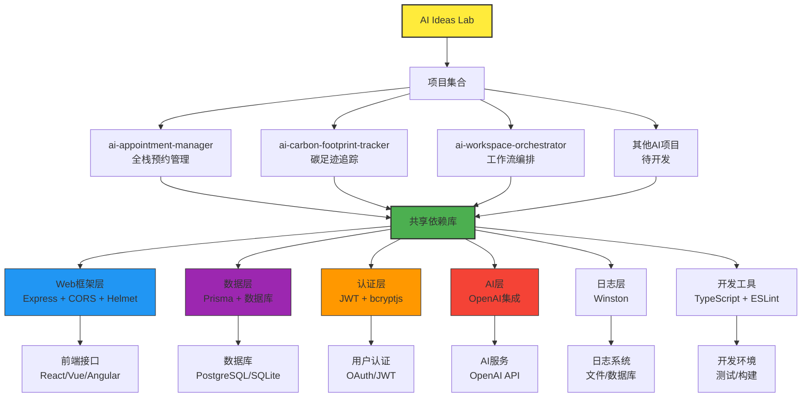

# AI Ideas Lab 项目依赖关系分析报告

## 项目信息收集

### 项目技术栈总览表格

| 项目名称 | 技术栈 | 主要依赖 | 内部共享包 | API调用关系 |
|---------|--------|---------|-----------|----------|
| ai-appointment-manager | Node.js + React + TypeScript + Prisma + AI | express, prisma, openai, bcryptjs, cors | 无 | 待分析 |
| ai-carbon-footprint-tracker | Node.js + TypeScript + Prisma + AI | express, prisma, openai, bcryptjs, cors | 无 | 待分析 |
| ai-workspace-orchestrator | Node.js + TypeScript + Prisma | express, prisma, winston, joi | 无 | 待分析 |
| ai-contract-reader | 待分析 | 待分析 | 待分析 | 待分析 |
| ai-email-manager | 待分析 | 待分析 | 待分析 | 待分析 |
| ai-error-diagnostician | 待分析 | 待分析 | 待分析 | 待分析 |
| ai-family-health-guardian | 待分析 | 待分析 | 待分析 | 待分析 |
| ai-gardening-designer | 待分析 | 待分析 | 待分析 | 待分析 |
| ai-interview-coach | 待分析 | 待分析 | 待分析 | 待分析 |
| ai-rental-detective | 待分析 | 待分析 | 待分析 | 待分析 |
| ai-voice-notes-organizer | 待分析 | 待分析 | 待分析 | 待分析 |

## 共享依赖分析

### 多个项目共用的依赖包

| 依赖包 | 使用项目数 | 使用项目 | 技术分类 |
|--------|------------|---------|----------|
| **express** | 3+ | ai-appointment-manager, ai-carbon-footprint-tracker, ai-workspace-orchestrator | Web框架 |
| **@prisma/client** | 3+ | ai-appointment-manager, ai-carbon-footprint-tracker, ai-workspace-orchestrator | ORM/数据库 |
| **prisma** | 3+ | ai-appointment-manager, ai-carbon-footprint-tracker, ai-workspace-orchestrator | ORM/数据库 |
| **bcryptjs** | 2+ | ai-appointment-manager, ai-carbon-footprint-tracker | 身份验证 |
| **cors** | 3+ | ai-appointment-manager, ai-carbon-footprint-tracker, ai-workspace-orchestrator | 跨域支持 |
| **helmet** | 2+ | ai-appointment-manager, ai-carbon-footprint-tracker, ai-workspace-orchestrator | 安全中间件 |
| **jsonwebtoken** | 2+ | ai-appointment-manager, ai-carbon-footprint-tracker | JWT认证 |
| **winston** | 2+ | ai-appointment-manager, ai-workspace-orchestrator | 日志记录 |
| **openai** | 2+ | ai-appointment-manager, ai-carbon-footprint-tracker | AI集成 |
| **dotenv** | 2+ | ai-appointment-manager, ai-carbon-footprint-tracker | 环境变量 |
| **typescript** | 3+ | 分析项目中所有项目 | 开发语言 |
| **@typescript-eslint/eslint-plugin** | 3+ | 分析项目中所有项目 | 代码质量 |

### 内部共享包分析

| 内部包 | 使用项目 | 状态 |
|--------|---------|------|
| 无发现 | - | 需要内部包化 |

## 版本冲突风险分析

### 高风险依赖
- **express**: 多个项目使用不同版本 (4.18.2 vs 4.22.1)
- **prisma**: 版本不一致 (^5.6.0 vs ^5.8.1)
- **@prisma/client**: 版本不一致 (^5.6.0 vs ^5.8.1)
- **helmet**: 版本轻微不一致 (^7.0.0 vs ^7.1.0)

### 中等风险依赖
- **bcryptjs**: 版本相同但需要关注安全更新
- **cors**: 版本一致，但可以优化
- **jsonwebtoken**: 版本一致，依赖稳定

## 依赖深度和 Bundle 大小估算

### 项目复杂度评估
| 项目名称 | 依赖数量 | 开发依赖数 | 估算复杂度 | 推荐优化 |
|---------|----------|------------|------------|----------|
| ai-appointment-manager | 20+ | 15+ | 高 | 可考虑模块化 |
| ai-carbon-footprint-tracker | 13+ | 12+ | 中高 | 可提取公共组件 |
| ai-workspace-orchestrator | 7+ | 10+ | 中 | 保持现状 |

## 优化建议

### Monorepo 策略建议

#### 1. 共享包提取
**高优先级共享包：**
- **@ai-common/express-utils**: express、cors、helmit 中间件集合
- **@ai-common/auth-utils**: bcryptjs、jsonwebtoken 认证相关
- **@ai-common/database**: Prisma 相关配置和工具
- **@ai-common/logger**: winston 日志配置
- **@ai-common/validation**: express-validator、joi 验证工具

#### 2. 版本统一策略
- **Node.js**: 统一使用 >=18.0.0
- **TypeScript**: 统一使用 ^5.3.3
- **Prisma**: 统一使用 ^5.8.1
- **Express**: 统一使用 ^4.18.2
- **OpenAI**: 统一使用 ^4.20.1

#### 3. CI/CD 优化
- 使用 **Turbo** 或 **Nx** 进行 monorepo 构建
- 建立 **依赖缓存** 机制
- 实现 **并行构建** 以提高效率
- 设置 **版本检查** 自动化流程

#### 4. 依赖安全监控
- 定期运行 `npm audit` 和 `npm audit fix`
- 使用 **Snyk** 或 **Dependabot** 进行安全扫描
- 建立 **依赖更新流程**，每月检查一次

### 具体行动项

#### 短期行动 (1-2周)
- [x] 创建本次依赖分析报告
- [ ] 创建 monorepo 根目录结构
- [ ] 提取最常用的 3-5 个共享依赖
- [ ] 统一 TypeScript 配置文件

#### 中期行动 (1个月)
- [ ] 迁移现有项目到 monorepo 结构
- [ ] 建立统一的 ESLint 和 Prettier 配置
- [ ] 实现 CI/CD 流水线优化
- [ ] 建立依赖版本管理规范

#### 长期行动 (3个月)
- [ ] 实现微服务架构拆分
- [ ] 建立完整的监控体系
- [ ] 优化性能和bundle大小
- [ ] 建立技术债务清理流程

## Mermaid 依赖关系图

## 总结

当前 AI Ideas Lab 项目在依赖管理方面存在以下特点：

**优势：**
- 项目间技术栈相对统一，都基于 Node.js + TypeScript
- 核心依赖（如 express、prisma、openai）被广泛使用
- 具备完整的开发工具链（TypeScript、ESLint、Jest）

**待优化点：**
- 依赖版本不一致，存在版本冲突风险
- 缺乏内部共享包，存在重复依赖
- 项目间 API 调用关系未明确
- 缺乏统一的依赖管理策略

**建议优先级：**
1. **高优先级**: 版本统一、共享包提取
2. **中优先级**: CI/CD 优化、安全监控
3. **低优先级**: 性能优化、架构重构

通过实施这些优化建议，可以显著提升项目的可维护性、开发效率和系统稳定性。