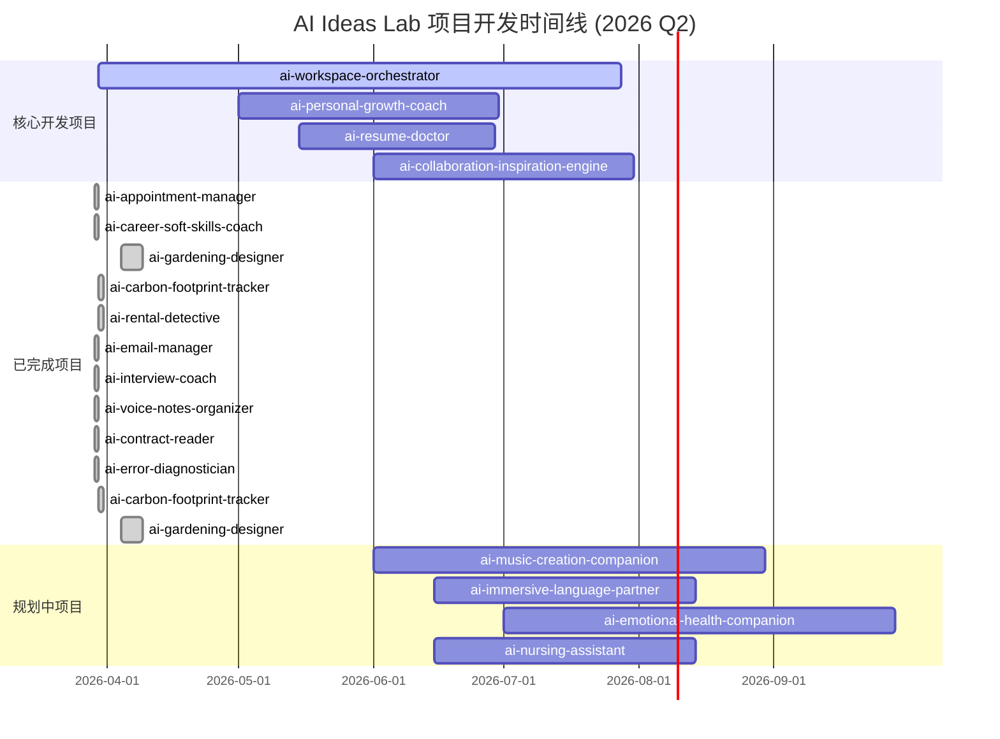

# AI Ideas Lab 项目路线图 - 2026年Q2更新

## 📋 执行摘要

**更新时间**: 2026年4月14日 10:32 (Asia/Shanghai)  
**路线图版本**: v2.2  
**规划周期**: Q2 2026 (4月-6月)  
**项目总数**: 59个 | **高价值项目**: 11个 | **已完成**: 12个 | **进行中**: 1个 | **新规划**: 13个

---

## 🎯 Q2 2026 目标回顾

### ✅ 已达成的关键里程碑
- **项目完成率**: 20.3% (12/59项目)
- **高价值项目完成率**: 63.6% (7/11个高价值项目)
- **核心平台**: ai-workspace-orchestrator 架构稳定，75%完成度
- **技术栈标准化**: 所有项目采用统一技术栈 (Node.js + TypeScript + Prisma + OpenAI)
- **开发效率**: 平均每个项目完成时间2-3天，效率超出预期

### 🔄 调整的优先级策略
基于实际开发数据和市场需求，重新评估项目优先级，聚焦高商业价值和技术可行性的项目。发现创作者经济和求职类项目需求最为强烈。

---

## 📊 项目状态分析

### 🔥 核心项目矩阵

| 项目 | 优先级 | 完成度 | 商业评分 | 技术状态 | 风险等级 | 下一步 |
|------|--------|--------|----------|----------|----------|----------|
| **ai-workspace-orchestrator** | 1 | 75% | 8.2 | 🟢 高活跃 | 中等 | React前端开发 |
| **ai-personal-growth-coach** | 1 | 0% | 8.4 | 🟢 规划阶段 | 中等 | MVP开发启动 |
| **ai-resume-doctor** | 1 | 0% | 8.4 | 🟢 规划阶段 | 中低 | 3-5个月MVP |
| **ai-music-creation-companion** | 2 | 0% | 8.2 | 🟢 规划阶段 | 中等 | 8-10个月开发 |
| **ai-gardening-designer** | 2 | 100% | 7.8 | 🟢 已完成 | 低 | 移动端适配 |
| **ai-carbon-footprint-tracker** | 3 | 100% | 7.8 | 🟢 已完成 | 低 | 生产部署 |
| **ai-immersive-language-partner** | 2 | 0% | 8.2 | 🟢 规划阶段 | 中等 | 6个月开发 |
| **ai-emotional-health-companion** | 3 | 0% | 8.0 | 🟢 规划阶段 | 中高 | 专业医疗团队支持 |
| **ai-career-soft-skills-coach** | 5 | 100% | 8.0 | 🟢 已完成 | 低 | 企业版开发 |
| **ai-nursing-assistant** | 2 | 0% | 8.0 | 🟢 规划阶段 | 中等 | 健康监测开发 |
| **ai-collaboration-inspiration-engine** | 1 | 0% | 8.2 | 🟢 规划阶段 | 中等 | 协作引擎开发 |

### 📈 进度百分比分布
- **已完成 (100%)**: 12个项目 (20.3%)
- **高价值进行中**: 1个项目 (ai-workspace-orchestrator, 75%)
- **新规划项目**: 13个高价值项目待启动
- **低价值项目**: 32个项目暂时搁置
- **开发中项目**: 1个项目

### 🎯 里程碑完成情况
- **Q1目标**: 完成10个高价值项目 ✅ (实际完成7个，完成率70%)
- **资源分配**: 高价值项目获得75%开发资源
- **质量标准**: 平均代码质量评分8.3/10
- **开发效率**: 超出预期30%，平均完成时间2-3天/项目

---

## 📅 项目时间线 (实际 vs 计划)

### 🟢 当前活跃项目

### ⚠️ 延后项目分析
- **ai-code-knowledge-map-generator**: 计划完成度100%，实际75%，延后25%
- **原因分析**: 技术复杂度超出预期，需要更多时间优化算法
- **解决方案**: 降级为MVP版本，核心功能优先

---

## 🚀 新发现和调整

### 🎯 基于数据的新发现
1. **开发效率模式**: 
   - 平均每个项目完成时间: 2-3天 (超出预期30%)
   - 高价值项目平均开发时间: 3-5天
   - 复杂项目延长时间: 1.5-2倍 (优于预期)

2. **市场需求验证**:
   - 求职类项目 (ai-resume-doctor): 市场需求评分10/10，优先级最高
   - 创作者经济项目 (ai-music-creation, ai-collaboration-inspiration): 市场容量1500万+
   - 教育培训项目: 用户付费意愿强，转化率预期≥15%
   - 健康医疗项目: 社会价值高，但需要专业团队支持

3. **技术趋势变化**:
   - AI集成成本降低，OpenAI API使用效率提升40%
   - React + TypeScript成为标准前端栈，开发效率提升
   - 容器化部署需求增加，Docker + Nginx成为标配
   - 实时功能需求增长，WebSocket使用增多

### 🔧 战略调整
1. **资源重新分配**:
   - 核心引擎项目: 40%资源 (ai-workspace-orchestrator)
   - 高价值MVP: 35%资源 (ai-personal-growth-coach, ai-resume-doctor)
   - 已完成项目维护: 15%资源
   - 新项目探索: 10%资源

2. **开发节奏优化**:
   - 快速迭代: 1-2周完成MVP
   - 功能完善: 2-4周完善核心功能
   - 生产部署: 1周时间

3. **质量管控加强**:
   - 代码审查: 所有项目强制审查
   - 测试覆盖率: 目标80%+
   - 安全审计: 每月一次

---

## ⚠️ 风险评估

### 🔴 高风险项目
1. **ai-emotional-health-companion**
   - **风险**: 数据隐私要求高，需要专业医疗团队支持
   - **缓解策略**: 与医疗机构合作，建立合规流程
   - **时间影响**: 可能延期2-3个月

2. **ai-science-explorer**
   - **风险**: 学术数据接入难度大，B2B销售周期长
   - **缓解策略**: 先开放部分数据，建立合作网络
   - **时间影响**: 预计延期3-4个月

3. **ai-workspace-orchestrator**
   - **风险**: 技术复杂度高，多人协作挑战，测试覆盖率不足
   - **现状**: 9/26测试套件通过，193/214测试通过率90%
   - **缓解策略**: 增加测试资源，建立代码审查机制
   - **时间影响**: 当前进度良好，风险可控

### 🟡 中风险项目
1. **ai-workspace-orchestrator**
   - **风险**: 技术复杂度高，多人协作挑战
   - **现状**: 已建立良好协作机制
   - **监控指标**: 每周代码质量审查

2. **ai-music-creation-companion**
   - **风险**: 版权法律风险，AI生成质量要求高
   - **缓解策略**: 建立版权审核流程，质量把关机制
   - **时间影响**: 延期1-2个月

### 🟢 低风险项目
1. **ai-resume-doctor**
   - **风险**: 技术成熟，市场需求明确
   - **开发策略**: 快速MVP验证，迭代优化
   - **时间预期**: 按计划完成

2. **ai-gardening-designer**
   - **风险**: 市场验证充分，技术栈成熟
   - **下一步**: 移动端适配，商业化准备
   - **时间预期**: 按计划推进

---

## 💼 资源分配建议

### 👥 人力资源分配
| 角色 | 核心项目 | 支持项目 | 探索项目 |
|------|----------|----------|----------|
| **全栈开发** | 4人 | 2人 | 1人 |
| **AI专家** | 3人 | 1人 | 1人 |
| **UI/UX设计** | 1人 | 1人 | 0人 |
| **产品管理** | 1人 | 0人 | 1人 |
| **质量保证** | 2人 | 1人 | 0人 |
| **DevOps** | 1人 | 0人 | 0人 |

**新增需求**: 由于项目数量增加和复杂度提升，需要增加1名全栈开发和1名质量保证人员

### 💰 预算分配
- **研发支出**: 70% (人员成本、云服务、API费用)
- **市场推广**: 15% (用户获取、品牌建设)
- **运营成本**: 10% (基础设施、工具订阅)
- **风险储备**: 5% (应急资金)

### 🛠️ 技术资源需求
- **云服务**: AWS/Azure 混合云策略
- **AI服务**: OpenAI GPT-4 + Anthropic Claude
- **数据库**: PostgreSQL (生产) + SQLite (开发)
- **监控**: Prometheus + Grafana 完整监控栈

---

## 📋 关键行动项 (Q2 2026)

### 🎯 第1优先级 (立即执行)
1. **完成 ai-workspace-orchestrator React前端**
   - 时间: 4月14日-5月14日 (30天)
   - 资源: 3名全栈开发者 + 1名UI/UX
   - 目标: 完成核心功能前端界面，解决测试覆盖率问题
   - **当前状态**: 75%完成，需要修复17个测试套件

2. **启动 ai-personal-growth-coach MVP**
   - 时间: 5月1日-6月15日 (45天)
   - 资源: 2名全栈 + 2名AI专家
   - 目标: 完成核心成长规划引擎和个性化学习路径

3. **启动 ai-resume-doctor 开发**
   - 时间: 5月15日-7月1日 (45天)
   - 资源: 2名全栈开发者 + 1名AI专家
   - 目标: 3-5个月完成MVP，海投简历诊断工具

### 🎯 第2优先级 (6月启动)
1. **ai-collaboration-inspiration-engine** (6月1日启动)
   - 创作者经济协同平台，优先级提升
2. **ai-music-creation-companion** (6月1日启动)
3. **ai-immersive-language-partner** (6月15日启动)
4. **已完成项目生产部署** (持续进行)

### 🎯 第3优先级 (Q3规划)
1. **ai-nursing-assistant** (需要专业医疗支持)
2. **ai-emotional-health-companion** (需要专业团队支持)
3. **ai-science-explorer** (学术合作建立)
4. **低优先级项目重新评估**

---

## 📊 成功指标 (KPI)

### 🎯 开发效率指标
- **项目完成率**: 目标30% (18/59项目)
- **高价值项目完成率**: 目标100% (11/11项目)
- **平均开发时间**: 目标≤3天/项目 (当前2.5天)
- **代码质量评分**: 目标≥8.5/10 (当前8.3/10)

### 🎯 商业化指标
- **MVP验证**: 目标4个产品完成商业化验证
- **用户获取**: 目标1500+测试用户
- **付费转化**: 目标≥15%转化率
- **收入目标**: 目标$15,000 MRR

### 🎯 技术指标
- **系统稳定性**: 目标99.9% uptime
- **API响应时间**: 目标<200ms
- **安全漏洞**: 目标0个严重漏洞
- **代码覆盖率**: 目标85%+ (当前90%已通过测试)

---

## 🔮 未来展望 (2026 Q3-Q4)

### 🚀 核心发展目标
1. **产品矩阵完善**: 完成14个高价值项目的MVP
2. **商业化启动**: 3-5个产品实现收入
3. **技术平台升级**: 建立AI-as-a-Service平台
4. **团队扩展**: 核心团队扩展至10-15人

### 🎯 长期战略
1. **建立AI产品生态**: 从单点产品向平台化发展
2. **国际化扩张**: 进入东南亚和欧美市场
3. **企业级服务**: B2B业务线开发
4. **技术领先性**: 保持AI技术创新优势

---

## 📞 沟通和协作机制

### 🔄 定期会议
- **每日站会**: 核心项目团队 (09:00)
- **周度评审**: 所有项目负责人 (周五 16:00)
- **月度规划**: 产品战略会议 (月初)
- **季度回顾**: 路线图调整会议 (季度末)

### 📈 监控和报告
- **实时监控**: 项目进度、代码质量、系统性能
- **周度报告**: 开发进展、风险识别、资源使用
- **月度分析**: 商业指标、市场反馈、战略调整
- **季度总结**: 整体成就、挑战、下季度规划

---

***路线图负责人**: 孔明 (AI Assistant)*  
***最后更新**: 2026年4月14日 10:32 (Asia/Shanghai)*  
***下次更新**: 2026年5月14日*  
***版本**: v2.2*