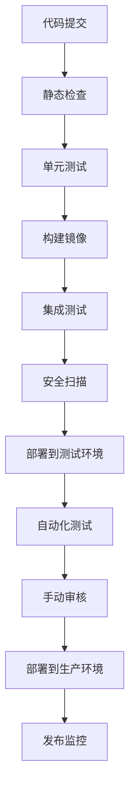

# PR-826 技术架构设计文档

## 📋 概述

本文档详细描述AI智能传统工艺守护与现代化赋能平台的完整技术架构设计，包括系统架构、技术选型、数据流设计、安全策略等关键技术细节。

## 🏗️ 系统架构

### 整体架构设计

采用微服务架构，分为以下核心层：

```
┌─────────────────────────────────────────────────────────────┐
│                    表现层 (Presentation Layer)              │
├─────────────────────────────────────────────────────────────┤
│  Web前端 (React + TypeScript) │  移动端 (React Native)  │
│  管理后台 (Vue.js)           │  3D/VR展示 (Three.js)   │
└─────────────────────────────────────────────────────────────┘
                              │
┌─────────────────────────────────────────────────────────────┐
│                    应用层 (Application Layer)                │
├─────────────────────────────────────────────────────────────┤
│  用户管理服务   │  工艺记录服务   │  推荐引擎服务   │
│  认证服务       │  匹配服务       │  支付交易服务   │
│  内容管理服务   │  社区互动服务   │  数据分析服务   │
└─────────────────────────────────────────────────────────────┘
                              │
┌─────────────────────────────────────────────────────────────┐
│                    业务层 (Business Layer)                   │
├─────────────────────────────────────────────────────────────┤
│  工艺管理模块   │  用户管理模块   │  内容管理模块   │
│  匹配算法模块   │  认证评估模块   │  商业服务模块   │
└─────────────────────────────────────────────────────────────┘
                              │
┌─────────────────────────────────────────────────────────────┐
│                    数据层 (Data Layer)                      │
├─────────────────────────────────────────────────────────────┤
│  关系型数据库   │  图数据库       │  文档数据库     │
│  (PostgreSQL)   │  (Neo4j)       │  (MongoDB)     │
│  缓存系统       │  消息队列       │  对象存储       │
│  (Redis)       │  (Kafka)       │  (MinIO)       │
└─────────────────────────────────────────────────────────────┘
                              │
┌─────────────────────────────────────────────────────────────┐
│                    AI层 (AI Layer)                          │
├─────────────────────────────────────────────────────────────┤
│  模型训练服务   │  推理服务       │  特征工程服务   │
│  (PyTorch)     │  (TensorFlow)   │  (Scikit-learn)│
│  数据预处理     │  模型部署       │  模型监控       │
└─────────────────────────────────────────────────────────────┘
```

### 微服务拆分

#### 核心微服务

| 服务名称 | 功能描述 | 技术栈 | 数据依赖 |
|---------|---------|--------|---------|
| **用户服务** | 用户注册、登录、 profile管理 | Node.js + Express | PostgreSQL + Redis |
| **工艺服务** | 工艺记录、3D模型管理、知识图谱 | Python + FastAPI | PostgreSQL + Neo4j + MinIO |
| **推荐服务** | 个性化推荐、智能匹配 | Python + TensorFlow | Redis + PostgreSQL |
| **认证服务** | 技能认证、信用评价 | Node.js + Express | PostgreSQL |
| **支付服务** | 订阅管理、交易处理 | Node.js + Express | PostgreSQL + 第三方API |
| **通知服务** | 消息推送、邮件通知 | Python + Celery | Redis + SMTP API |
| **分析服务** | 数据分析、用户行为分析 | Python + Pandas | PostgreSQL + ClickHouse |

## 🔧 技术选型详细说明

### 前端技术栈

| 技术 | 版本 | 用途 | 优势 |
|------|------|------|------|
| **React** | 18.x | 主要UI框架 | 组件化、生态成熟、性能优秀 |
| **TypeScript** | 5.x | 类型安全 | 静态类型、IDE支持、开发体验 |
| **Ant Design** | 5.x | UI组件库 | 企业级、设计系统、组件丰富 |
| **Three.js** | r152 | 3D渲染 | WebGL封装、3D展示、交互性强 |
| **React Query** | 4.x | 数据获取 | 缓存管理、状态同步、错误处理 |
| **Zustand** | 4.x | 状态管理 | 轻量级、简洁、性能好 |

### 后端技术栈

| 技术 | 版本 | 用途 | 优势 |
|------|------|------|------|
| **Node.js** | 18.x | 主运行时 | JavaScript全栈、性能好、生态成熟 |
| **Express** | 4.x | Web框架 | 轻量级、灵活、中间件丰富 |
| **Python** | 3.9 | AI服务 | 机器学习生态、科学计算、开发效率 |
| **FastAPI** | 0.95 | Python Web框架 | 高性能、自动文档、异步支持 |
| **PostgreSQL** | 15.x | 主数据库 | 功能强大、扩展性好、JSON支持 |
| **Neo4j** | 5.x | 图数据库 | 图查询、知识图谱、关系分析 |
| **Redis** | 7.x | 缓存/消息 | 内存数据库、高性能、数据结构丰富 |
| **MinIO** | latest | 对象存储 | S3兼容、自托管、高性能 |

### AI/ML技术栈

| 技术 | 版本 | 用途 | 优势 |
|------|------|------|------|
| **PyTorch** | 2.0 | 深度学习框架 | 研发友好、动态图、社区活跃 |
| **Transformers** | 4.30 | NLP模型库 | 预训练模型、易用、模型丰富 |
| **Hugging Face** | latest | 模型管理 | 模型仓库、Hub、API服务 |
| **OpenCV** | 4.8 | 图像处理 | 计算机视觉、成熟稳定 |
| **FFmpeg** | latest | 多媒体处理 | 视频音频处理、格式支持全 |
| **Scikit-learn** | 1.3 | 机器学习 | 经典算法、易用、文档完善 |

### 基础设施技术栈

| 技术 | 用途 | 优势 |
|------|------|------|
| **Docker** | 容器化 | 环境一致性、部署简单 |
| **Kubernetes** | 容器编排 | 自动扩缩容、服务发现 |
| **Nginx** | 反向代理 | 负载均衡、静态资源服务 |
| **Let's Encrypt** | SSL证书 | 免费HTTPS、自动化 |
| **Prometheus** | 监控指标 | 时间序列数据、告警 |
| **Grafana** | 监控面板 | 可视化、仪表板 |
| **ELK Stack** | 日志管理 | 日志收集、搜索、分析 |

## 🔄 数据流设计

### 工艺数据流

```
3D扫描设备 → 数据上传 → 数据预处理 → AI分析 → 模型存储 → 展示服务
    ↓           ↓          ↓          ↓         ↓          ↓
质量控制   格式转换   特征提取   质量评估   版本管理   3D渲染
    ↓           ↓          ↓          ↓         ↓          ↓
专家审核   数据存储   知识图谱   缓存优化   API服务   用户界面
```

### 用户行为数据流

```
用户操作 → 前端捕获 → API接收 → 业务处理 → 数据存储 → 推荐算法 → 结果反馈
    ↓         ↓          ↓         ↓          ↓          ↓         ↓
事件记录   实时传输   权限验证   状态更新   数据持久   特征计算   界面更新
    ↓         ↓          ↓         ↓          ↓          ↓         ↓
统计分析   消息队列   日志记录   缓存更新   数据备份   模型推理   通知推送
```

### 推荐算法数据流

```
用户数据 → 特征提取 → 向量化表示 → 相似度计算 → 推荐生成 → 结果排序 → 展示推荐
    ↓         ↓          ↓           ↓           ↓          ↓         ↓
数据清洗   特征工程   向量化模型   距离计算   推荐策略   评分模型   A/B测试
    ↓         ↓          ↓           ↓           ↓          ↓         ↓
质量评估   数据存储   模型训练   性能优化   效果监控   反馈收集   算法优化
```

## 💾 数据库设计

### 核心数据表结构

#### 用户相关表
```sql
-- 用户基本信息
CREATE TABLE users (
    id UUID PRIMARY KEY DEFAULT gen_random_uuid(),
    username VARCHAR(50) UNIQUE NOT NULL,
    email VARCHAR(255) UNIQUE NOT NULL,
    password_hash VARCHAR(255) NOT NULL,
    avatar_url VARCHAR(500),
    bio TEXT,
    created_at TIMESTAMP DEFAULT CURRENT_TIMESTAMP,
    updated_at TIMESTAMP DEFAULT CURRENT_TIMESTAMP,
    last_login TIMESTAMP,
    status VARCHAR(20) DEFAULT 'active'
);

-- 用户技能认证
CREATE TABLE user_certifications (
    id UUID PRIMARY KEY DEFAULT gen_random_uuid(),
    user_id UUID REFERENCES users(id),
    skill_type VARCHAR(100) NOT NULL,
    level VARCHAR(20) NOT NULL,
    issued_date DATE NOT NULL,
    expiry_date DATE,
    certification_url VARCHAR(500),
    status VARCHAR(20) DEFAULT 'active'
);
```

#### 工艺相关表
```sql
-- 工艺基本信息
CREATE TABLE crafts (
    id UUID PRIMARY KEY DEFAULT gen_random_uuid(),
    name VARCHAR(200) NOT NULL,
    description TEXT,
    category VARCHAR(100),
    region VARCHAR(100),
    difficulty_level INTEGER,
    cultural_significance TEXT,
    status VARCHAR(20) DEFAULT 'active',
    created_at TIMESTAMP DEFAULT CURRENT_TIMESTAMP,
    updated_at TIMESTAMP DEFAULT CURRENT_TIMESTAMP
);

-- 工艺3D模型
CREATE TABLE craft_models (
    id UUID PRIMARY KEY DEFAULT gen_random_uuid(),
    craft_id UUID REFERENCES crafts(id),
    model_type VARCHAR(50) NOT NULL,
    file_path VARCHAR(500) NOT NULL,
    file_size BIGINT,
    model_quality_score DECIMAL(3,2),
    processing_status VARCHAR(20) DEFAULT 'pending',
    ai_processed BOOLEAN DEFAULT FALSE,
    created_at TIMESTAMP DEFAULT CURRENT_TIMESTAMP
);

-- 工艺步骤
CREATE TABLE craft_steps (
    id UUID PRIMARY KEY DEFAULT gen_random_uuid(),
    craft_id UUID REFERENCES crafts(id),
    step_number INTEGER NOT NULL,
    title VARCHAR(200) NOT NULL,
    description TEXT,
    duration INTEGER,
    difficulty INTEGER,
    required_materials TEXT[],
    tools_needed TEXT[],
    safety_notes TEXT,
    image_url VARCHAR(500),
    video_url VARCHAR(500)
);
```

#### 知识图谱表
```sql
-- 知识图谱节点
CREATE TABLE knowledge_nodes (
    id UUID PRIMARY KEY DEFAULT gen_random_uuid(),
    node_type VARCHAR(50) NOT NULL,
    node_name VARCHAR(200) NOT NULL,
    description TEXT,
    properties JSONB,
    created_at TIMESTAMP DEFAULT CURRENT_TIMESTAMP
);

-- 知识图谱边
CREATE TABLE knowledge_edges (
    id UUID PRIMARY KEY DEFAULT gen_random_uuid(),
    source_node_id UUID REFERENCES knowledge_nodes(id),
    target_node_id UUID REFERENCES knowledge_nodes(id),
    relationship_type VARCHAR(50) NOT NULL,
    weight DECIMAL(3,2),
    properties JSONB,
    created_at TIMESTAMP DEFAULT CURRENT_TIMESTAMP
);
```

### 图数据库设计（Neo4j）

#### 节点类型
- **Craft**: 工艺节点
- **Material**: 材料节点
- **Tool**: 工具节点
- **Technique**: 技法节点
- **Region**: 地区节点
- **User**: 用户节点
- **Certification**: 认证节点

#### 关系类型
- `Craft-[:USES]->Material`: 工艺使用材料
- `Craft-[:REQUIRES]->Tool`: 工艺需要工具
- `Craft-[:EMPLOYS]->Technique`: 工艺采用技法
- `Craft-[:ORIGINATED_IN]->Region`: 工艺起源于地区
- `User-[:LEARNED]->Craft`: 用户学习工艺
- `User-[:CERTIFIED_IN]->Certification`: 用户获得认证

## 🔒 安全设计

### 认证与授权

#### JWT Token 设计
```typescript
interface JWTPayload {
  sub: string;  // 用户ID
  username: string;
  email: string;
  roles: string[];
  permissions: string[];
  iat: number;  // 签发时间
  exp: number;  // 过期时间
  type: 'access' | 'refresh';
}
```

#### 权限控制矩阵
| 角色 | 用户管理 | 工艺管理 | 认证审核 | 系统配置 | 数据分析 |
|------|---------|---------|---------|---------|---------|
| **超级管理员** | ✅ | ✅ | ✅ | ✅ | ✅ |
| **工艺专家** | ❌ | ✅ | ✅ | ❌ | ✅ |
| **普通用户** | ❌ | ❌ | ❌ | ❌ | ❌ |
| **访客** | ❌ | ❌ | ❌ | ❌ | ❌ |

### 数据安全

#### 数据加密
- **传输层**: TLS 1.3
- **存储层**: 
  - 敏感数据: AES-256
  - 密码: bcrypt + salt
  - 数据库: 字段级加密
- **备份**: 加密备份 + 多地存储

#### 访问控制
- **IP白名单**: 管理后台访问限制
- **API限流**: 防止DDoS攻击
- **权限最小化**: 基于角色的访问控制
- **审计日志**: 所有关键操作记录

### 内容安全

#### 内容审核流程
1. **自动检测**: AI算法自动识别违规内容
2. **人工审核**: 专家团队进行人工审核
3. **分级处理**: 根据严重程度分级处理
4. **反馈机制**: 用户申诉和处理结果通知

#### 版权保护
- **数字水印**: 3D模型和图片自动添加水印
- **区块链存证**: 重要作品区块链存证
- **版权信息**: 完整的版权归属和使用记录
- **侵权检测**: 自动化侵权检测和处理

## 📊 监控与运维

### 监控指标

#### 系统指标
- **CPU使用率**: < 80%
- **内存使用率**: < 85%
- **磁盘使用率**: < 90%
- **网络延迟**: < 100ms
- **API响应时间**: < 500ms

#### 业务指标
- **日活跃用户**: 目标 5,000+
- **工艺记录数量**: 目标 200+
- **3D模型质量达标率**: > 80%
- **用户满意度**: > 4.0/5.0
- **系统稳定性**: > 98%

#### AI指标
- **模型准确率**: > 80%
- **推荐点击率**: > 25%
- **识别准确率**: > 85%
- **处理时间**: < 2s

### 日志管理

#### 日志收集
- **应用日志**: 结构化日志输出
- **系统日志**: 系统级日志收集
- **AI日志**: 模型推理日志
- **用户行为日志**: 用户操作日志

#### 日志处理
- **Logstash**: 日志收集和解析
- **Elasticsearch**: 日志存储和搜索
- **Kibana**: 日志可视化
- **Alerting**: 告警规则配置

### 告警机制

#### 告警级别
- **紧急**: 系统宕机、严重安全事件
- **重要**: 性能下降、业务异常
- **一般**: 资源使用率高、常规事件

#### 告警渠道
- **邮件**: 管理员通知
- **短信**: 关键事件通知
- **钉钉/企业微信**: 团队协作通知
- **电话**: 紧急事件通知

## 🚀 部署架构

### 环境设计

#### 开发环境
- **Docker Compose**: 本地开发环境
- **Hot Reload**: 代码热重载
- **Mock Data**: 模拟数据支持
- **Debug Tools**: 调试工具支持

#### 测试环境
- **独立集群**: 完整功能测试
- **性能测试**: 负载和压力测试
- **安全测试**: 渗透测试
- **用户验收测试**: UAT测试

#### 生产环境
- **高可用集群**: 多节点部署
- **负载均衡**: 流量分发
- **自动扩缩容**: 基于负载的扩缩容
- **多地部署**: 灾备和延迟优化

### CI/CD 流程

#### 代码提交


#### 发布策略
- **蓝绿部署**: 零停机发布
- **滚动更新**: 逐步更新服务
- **灰度发布**: 小范围验证
- **回滚机制**: 快速回滚能力

## 🔄 灾备与恢复

### 备份策略

#### 数据备份
- **实时备份**: 数据库实时同步
- **每日备份**: 完整数据备份
- **增量备份**: 增量数据备份
- **异地备份**: 跨地域数据备份

#### 备份验证
- **自动验证**: 备份完整性检查
- **恢复演练**: 定期恢复演练
- **监控告警**: 备份失败告警

### 灾备方案

#### 故障转移
- **主从切换**: 数据库主从切换
- **服务降级**: 非核心功能降级
- **流量切换**: 流量切换到备用服务
- **快速恢复**: RTO < 30分钟

#### 应急响应
- **应急小组**: 7x24小时响应团队
- **应急预案**: 详细应急处理流程
- **故障复盘**: 故障后分析和改进

---

*技术架构文档 - 支撑AI传统工艺守护平台的技术实现基础*