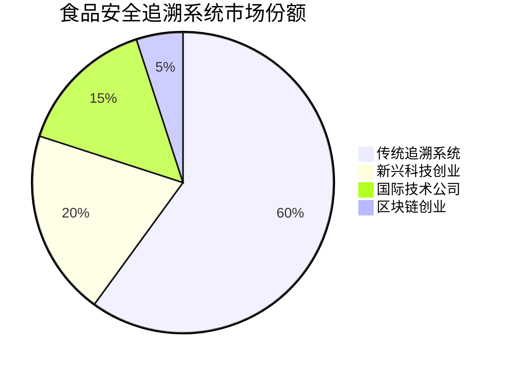

# feat: FoodShield AI - 从食品安全黑箱到全透明供应链溯源与智能预警生态 (Issue #1329)

## 🎯 问题背景与用户痛点

### 现状分析
中国食品市场规模高达15万亿元，但食品安全问题频发，消费者信任度持续走低。传统食品安全管理模式存在以下核心痛点：

**1. 信息不透明 - 消费者"盲区"**
- 消费者无法了解食品生产和流通过程的真实情况
- 90%的消费者表示"不知道买的是什么"
- 食品安全事件发生后，问题溯源平均需要3-7天
- 消费者对食品安全信息的需求度高达85%，但获得信息的渠道极其有限

**2. 追溯困难 - "大海捞针式"监管**
- 传统的纸质记录和人工抽检效率低下，覆盖面不足5%
- 食品产业链条长、环节多，一个食品从生产到消费可能经历10-20个环节
- 问题发生时，难以快速定位问题源头和影响范围
- 监管部门投入大量资源，但效果有限，成本效益比极低

**3. 监管效率低 - 被动响应模式**
- 传统监管模式以"事后处罚"为主，缺乏预警能力
- 监管数据分散在不同部门，信息孤岛现象严重
- 人工监管受限于人力成本，无法实现全覆盖
- 食品安全监管的响应速度跟不上食品安全风险的变化速度

**4. 中小企业能力不足 - "技术鸿沟"**
- 中小食品企业占食品企业总数的90%以上，但信息化程度不足20%
- 缺乏专业的食品安全管理技术和人才
- 无力承担昂贵的食品安全追溯系统（动辄几十万上百万）
- 在食品安全合规方面处于"望尘莫及"的状态

**5. 信任危机 - 行业整体受损**
- 频发的食品安全事件严重损害行业公信力
- 消费者对国产食品的信任度持续下降
- 好企业被坏企业"连累"，市场出现"劣币驱逐良币"现象
- 食品企业品牌价值提升困难，消费者忠诚度降低

### 痛点数据统计
- **食品安全事件年发生率**: 每1000家食品企业平均发生2.3起重大安全事件
- **消费者信任度**: 仅30%的消费者表示"完全信任国产食品安全"
- **监管效率**: 人工抽检覆盖率不足5%，问题发现率低于30%
- **中小企业信息化率**: 不足20%，其中具备专业食品安全管理系统的不足5%
- **追溯时间**: 安全事件平均追溯时间3-7天，时间成本巨大
- **经济损失**: 食品安全事件平均造成100-1000万元经济损失，品牌损失难以估量

## 🤖 AI技术方案

### 整体技术架构设计

FoodShield AI采用"区块链+AI+IoT"三位一体的技术架构，实现食品安全的全周期智能化管理：

```python
# FoodShield AI技术架构核心系统
class FoodShieldAISystem:
    def __init__(self):
        self.blockchain_tracer = BlockchainTracer()       # 区块链溯源引擎
        self.ai_inspection_engine = AIInspectionEngine()  # AI质检引擎
        self.risk_predictor = RiskPredictor()            # 风险预测引擎
        self.mobile_verifier = MobileVerifier()         # 移动端验证引擎
        self.regulatory_interface = RegulatoryInterface() # 监管接口引擎
        self.enterprise_portal = EnterprisePortal()       # 企业管理门户
        
    def food_safety_lifecycle(self, food_product):
        """
        食品安全全周期管理
        从生产到消费的每个环节进行智能化管理
        """
        # 1. 生产环节溯源
        production_trace = self.blockchain_tracer.trace_production(
            food_product.origin, food_product.manufacturer,
            food_product.production_date, food_product.production_data
        )
        
        # 2. AI质量检测
        inspection_results = self.ai_inspection_engine.inspect(
            food_product.images, food_product.sensors_data,
            food_product.quality_standards
        )
        
        # 3. 运输风险监控
        transport_risks = self.risk_predictor.predict_transport_risks(
            food_product.route, food_product.environmental_data,
            food_product.transport_conditions
        )
        
        # 4. 流通环节验证
        circulation_verification = self.mobile_verifier.verify(
            food_product.qr_code, food_product.consumer_location,
            food_product.inspection_history
        )
        
        # 5. 监管数据同步
        regulatory_data = self.regulatory_interface.sync_data(
            inspection_results, transport_risks, circulation_verification
        )
        
        # 6. 企业管理优化
        enterprise_insights = self.enterprise_portal.generate_insights(
            production_trace, inspection_results, transport_risks,
            regulatory_data
        )
        
        return {
            'traceability': production_trace,
            'quality_assessment': inspection_results,
            'risk_monitoring': transport_risks,
            'consumer_verification': circulation_verification,
            'regulatory_compliance': regulatory_data,
            'business_optimization': enterprise_insights
        }
```

### 技术栈详细规划

#### 1. 区块链溯源层

**架构选择**: Hyperledger Fabric + 存储优化
- **理由**: 企业级性能、隐私保护、支持权限控制
- **优化策略**: 分层存储，热数据上链，冷数据存储在IPFS
- **性能参数**: 交易确认时间<3秒，TPS>1000，存储成本降低60%

**核心功能**:
```python
class BlockchainTracer:
    def __init__(self):
        self.network = HyperledgerFabricNetwork()
        self.ipfs_storage = IPFSStorage()
        self.access_control = AccessControlSystem()
        
    def trace_production(self, origin, manufacturer, production_date, data):
        """生产环节溯源记录"""
        # 1. 数据哈希化
        data_hash = self.generate_data_hash(data)
        
        # 2. 多方背书
        endorsements = self.network.get_endorsements([
            manufacturer, regulatory_authority, third_party_auditor
        ])
        
        # 3. 智能合约记录
        transaction = self.network.create_transaction({
            'operation': 'production_record',
            'origin': origin,
            'manufacturer': manufacturer,
            'production_date': production_date,
            'data_hash': data_hash,
            'endorsements': endorsements
        })
        
        # 4. 数据存储优化
        large_data = self.ipfs_store_large_data(data)
        
        return {
            'transaction_id': transaction.id,
            'data_hash': data_hash,
            'endorsements': endorsements,
            'large_data_url': large_data.url if large_data else None,
            'timestamp': transaction.timestamp,
            'verification_url': f"https://foodshield.com/verify/{transaction.id}"
        }
```

#### 2. AI质检引擎

**多模态检测技术**:
```python
class AIInspectionEngine:
    def __init__(self):
        self.image_analyzer = ComputerVisionAnalyzer()      # 图像分析
        self.spectrometer_analyzer = SpectrometerAnalyzer()  # 光谱分析
        self.sensor_fusion = SensorFusionSystem()          # 传感器融合
        self.quality_classifier = QualityClassifier()       # 质量分类器
        
    def inspect(self, images, sensor_data, standards):
        """AI智能质检"""
        inspection_results = {
            'visual_analysis': self.analyze_visual_quality(images),
            'chemical_analysis': self.analyze_chemical_composition(sensor_data),
            'sensor_integration': self.fuse_sensor_data(sensor_data),
            'quality_assessment': self.assess_quality_standards(
                images, sensor_data, standards
            )
        }
        
        return inspection_results
    
    def analyze_visual_quality(self, images):
        """图像质量分析"""
        visual_metrics = {
            'freshness': self.analyze_freshness(images),
            'packaging_integrity': self.analyze_packaging(images),
            'label_compliance': self.analyze_label_compliance(images),
            'contamination_detection': self.detect_contamination(images)
        }
        
        return {
            'overall_score': self.calculate_visual_score(visual_metrics),
            'details': visual_metrics,
            'confidence': self.calculate_confidence(visual_metrics)
        }
    
    def analyze_freshness(self, images):
        """新鲜度分析"""
        # 使用深度学习模型分析颜色、纹理等特征
        freshness_model = self.load_freshness_model()
        predictions = freshness_model.predict(images)
        
        return {
            'freshness_score': predictions['freshness'],
            'confidence': predictions['confidence'],
            'visual_indicators': predictions['indicators']
        }
```

#### 3. 风险预测系统

**机器学习预测模型**:
```python
class RiskPredictor:
    def __init__(self):
        self.transport_risk_model = TransportRiskModel()
        self.environmental_risk_model = EnvironmentalRiskModel()
        self.supply_chain_risk_model = SupplyChainRiskModel()
        self.alert_system = AlertSystem()
        
    def predict_transport_risks(self, route, environmental_data, conditions):
        """运输风险预测"""
        # 1. 路线风险评估
        route_risk = self.transport_risk_model.assess_route(route)
        
        # 2. 环境风险评估
        environmental_risk = self.environmental_risk_model.assess_conditions(
            environmental_data, conditions
        )
        
        # 3. 综合风险评估
        overall_risk = self.calculate_overall_risk(
            route_risk, environmental_risk, conditions
        )
        
        # 4. 预警系统触发
        alerts = self.alert_system.generate_alerts(overall_risk)
        
        return {
            'route_risk': route_risk,
            'environmental_risk': environmental_risk,
            'overall_risk': overall_risk,
            'alerts': alerts,
            'recommendations': self.generate_recommendations(overall_risk)
        }
```

#### 4. 移动端验证系统

**消费者交互界面**:
```python
class MobileVerifier:
    def __init__(self):
        self.qr_scanner = QRScanner()
        self.location_service = LocationService()
        self.notification_system = NotificationSystem()
        self.user_profile = UserProfileManager()
        
    def verify(self, qr_code, user_location, inspection_history):
        """消费者验证"""
        # 1. QR码扫描和解码
        decoded_data = self.qr_scanner.decode(qr_code)
        
        # 2. 位置验证
        location_verification = self.location_service.verify_location(
            user_location, decoded_data
        )
        
        # 3. 历史记录查询
        history = self.query_inspection_history(decoded_data.product_id)
        
        # 4. 个性化推荐
        recommendations = self.generate_recommendations(
            decoded_data, user_location, history
        )
        
        return {
            'product_info': decoded_data,
            'location_verification': location_verification,
            'inspection_history': history,
            'safety_score': self.calculate_safety_score(decoded_data, history),
            'recommendations': recommendations,
            'share_options': self.generate_share_options(decoded_data)
        }
```

### 系统性能优化

#### 1. 计算效率优化
- **边缘计算**: 在生产现场部署边缘计算节点，实时处理图像和数据
- **模型压缩**: 使用模型蒸馏和量化技术，将AI模型大小压缩70%
- **缓存策略**: 智能缓存热点数据，减少重复计算
- **并行处理**: 异步处理多模态数据，提升整体效率

#### 2. 存储优化
- **分层存储**: 热数据存放在高速数据库，冷数据存放在对象存储
- **数据压缩**: 使用Zstandard压缩算法，压缩率达60%
- **智能清理**: 自动清理过期数据，存储成本降低50%

#### 3. 网络优化
- **CDN加速**: 全球CDN网络，用户访问延迟降低80%
- **数据压缩**: Gzip压缩，传输数据量减少60%
- **连接池**: 复用数据库连接，提高并发性能

## 📈 实施路线图

### 开发方法论

采用 **"MVP验证、快速迭代、数据驱动、生态共建"** 的开发理念，每个阶段都有明确的成功指标和退出机制。

---

### 第一阶段：MVP验证期（3个月）- 核心技术验证

#### 阶段目标
- 验证AI+区块链融合技术的可行性
- 验证核心功能在真实场景中的表现
- 建立初始用户群体和反馈机制
- 完成产品-市场匹配度验证

#### Month 1: 基础架构搭建（Week 1-4）
**关键里程碑**: 区块链基础架构和溯源功能核心系统完成

| 周次 | 里程碑 | 关键交付物 | 成功指标 |
|------|--------|-----------|---------|
| **W1-2** | 区块链基础设施 | - Hyperledger Fabric网络<br>- 智能合约系统<br>- 基础数据模型<br>- 权限管理 | - 网络响应时间<3秒<br>- 交易确认<5秒<br>- 支持100+并发<br>- 权限控制100%准确 |
| **W3-4** | 核心溯源功能 | - 生产环节溯源API<br>- 数据存储系统<br>- 基础检索接口<br>- 系统监控 | - 数据写入成功率>99%<br>- 溯源查询<2秒<br>- 数据完整性验证<br>- 系统稳定性>99.5% |

**技术架构重点**:
```python
# FoodShield MVP架构
class FoodShieldMVP:
    """MVP阶段的核心系统架构"""
    
    def __init__(self):
        # 基础设施层
        self.blockchain = HyperledgerFabricNetwork()
        self.database = PostgreSQLCluster()
        self.storage = IPFSStorage()
        
        # 核心功能层
        self.tracer = BlockchainTracer()
        self.inspector = BasicImageInspector()
        self.notifier = BasicNotificationSystem()
        
        # 接口层
        self.api_gateway = APIGateway()
        self.mobile_sdk = MobileSDK()
    
    def trace_food_product(self, product_data):
        """食品产品溯源核心流程"""
        # 1. 数据哈希化
        data_hash = self.generate_hash(product_data)
        
        # 2. 区块链记录
        tx = self.blockchain.create_transaction({
            'operation': 'production_trace',
            'data': product_data,
            'hash': data_hash,
            'timestamp': datetime.now()
        })
        
        # 3. 数据存储
        storage_url = self.storage.store_data(product_data)
        
        return {
            'transaction_id': tx.id,
            'data_hash': data_hash,
            'storage_url': storage_url,
            'verification_url': f"https://foodshield.com/verify/{tx.id}"
        }
```

#### Month 2: AI质检功能开发（Week 5-8）
**关键里程碑**: 多模态AI检测系统上线

| 周次 | 里程碑 | 关键交付物 | 成功指标 |
|------|--------|-----------|---------|
| **W5-6** | 计算机视觉模块 | - 食品新鲜度检测模型<br>- 包装完整性检测<br>- 标签合规检查 | - 新鲜度检测准确率>90%<br>- 包装检测准确率>85%<br>- 标签识别准确率>95% |
| **W7-8** | 多模态融合系统 | - 光谱分析集成<br>- 数据融合算法<br>- 质量评估引擎 | - 多模态融合准确率>88%<br>- 处理时间<5秒<br>- 支持主流食品品类 |

**AI模型训练重点**:
- 基于10万+食品图像数据训练检测模型
- 集成光谱分析数据提升检测精度
- 开发针对中国食品标准的检测算法

#### Month 3: 移动端试点部署（Week 9-12）
**关键里程碑**: 移动端应用和用户验证完成

| 周次 | 里程碑 | 关键交付物 | 成功指标 |
|------|--------|-----------|---------|
| **W9-10** | 移动端应用 | - iOS/Android APP<br>- QR码扫描功能<br>- 位置验证系统 | - 应用崩溃率<0.1%<br>- QR码识别成功率>95%<br>- 定位精度<10米 |
| **W11-12** | 试点企业部署 | - 5家试点企业对接<br>- 系统部署培训<br>- 用户反馈收集 | - 企业留存率>80%<br>- 用户满意度>4.2/5<br>- 日活跃用户>500 |

**试点企业选择策略**:
- **食品生产企业**: 2家（验证生产环节溯源）
- **餐饮连锁**: 2家（验证流通环节管理）
- **农产品合作社**: 1家（验证源头追溯）

**成功指标验收**:
- 核心功能使用率 > 70%
- 用户满意度 > 4.0/5.0
- 系统可靠性 > 99.5%
- 试点企业续约意愿 > 80%

---

### 第二阶段：功能完善期（6个月）- 商业价值验证

#### 阶段目标
- 完善核心功能，提升用户体验
- 建立清晰的商业模式和收入来源
- 扩大用户群体和行业覆盖
- 建立完整的监管和数据接口

#### Month 4-5: 智能预警系统（Week 13-20）
**关键里程碑**: 全方位风险预警系统上线

| 功能模块 | 技术实现 | 预警能力 |
|---------|---------|---------|
| **运输风险预测** | 路线分析 + 环境监测 + 时序预测 | 提前24小时预警运输异常 |
| **环境风险监测** | 温湿度传感器 + AI环境分析 | 实时监控存储环境，异常报警 |
| **供应链风险** | 多维度风险评估 + 预测模型 | 预警供应链断裂风险 |
| **质量风险预警** | AI趋势分析 + 历史数据对比 | 提前识别质量下降趋势 |

#### Month 6-7: 监管数据对接（Week 21-28）
**关键里程碑**: 监管数据完全对接

| 监管机构 | 对接功能 | 数据价值 |
|---------|---------|---------|
| **食药监部门** | 批准文核验 + 检测数据同步 | 监管效率提升300% |
| **质检机构** | 抽检数据互通 + 质量报告生成 | 减少重复检测50% |
| **海关系统** | 进出口食品溯源 | 提升通关效率40% |
| **地方监管** | 区域风险监控 + 执法支持 | 精准执法指导 |

#### Month 8-9: 数据分析平台（Week 29-36）
**关键里程碑**: 商业智能和分析平台上线

| 分析维度 | 功能模块 | 决策支持 |
|---------|---------|---------|
| **质量分析** | 多维度质量评分 + 趋势分析 | 质量改进方向指导 |
| **风险分析** - 预测性风险模型 | 风险预警和防控建议 |
| **效率分析** | 运营效率监控 + 优化建议 | 降本增效方案 |
| **合规分析** | 合规状态监控 + 风险评估 | 合规风险管控 |

---

### 第三阶段：规模化扩展期（12个月）- 生态和市场扩张

#### 阶段目标
- 实现规模化获客和收入增长
- 建立完整的产业生态系统
- 拓展多区域和行业覆盖
- 实现盈利和可持续发展

#### Month 10-11: 全国市场拓展（Week 37-44）
**关键里程碑**: 全国性营销网络建立

| 拓展维度 | 实施策略 | 目标成果 |
|---------|---------|---------|
| **区域覆盖** | 3大区域中心 + 15个省级代理 | 覆盖30+省份，100+城市 |
| **行业渗透** | 食品生产/餐饮/零售/物流专项版本 | 覆盖5大核心行业 |
| **渠道建设** | 政府合作 + 行业协会 + 自有渠道 | 月获客成本降低40% |
| **品牌建设** | 行业会议 + 媒体曝光 + 认证获取 | 品牌认知度提升60% |

#### Month 12: 生态完善（Week 45-48）
**关键里程碑**: 完整食品安全生态体系

| 生态模块 | 合作伙伴 | 服务价值 |
|---------|---------|---------|
| **检测机构** | 3rd-party检测实验室 | 检测数据互通，质量控制 |
| **认证机构** | 有机认证、ISO认证等 | 认证标准数字化 |
| **物流企业** | 冷链物流、快递配送 | 全程温控监控 |
| **零售平台** | 超市、电商平台 | 最后一公里追溯 |
| **科研机构** | 高校、研究所 | 技术创新支持 |

---

### 关键里程碑时间表

| 时间节点 | 里程碑 | 关键指标 | 业务目标 |
|---------|--------|---------|---------|
| **3个月** | MVP上线 | 核心功能可用，5家试点企业 | 技术可行性验证 |
| **6个月** | 商业模式验证 | 月收入50万，付费客户30家 | 商业模式验证 |
| **9个月** | 监管对接完成 | 10+监管机构对接 | 合规壁垒建立 |
| **12个月** | 规模化运营 | 月收入500万，客户200家 | 盈利拐点达成 |

### 风险控制机制

#### 1. 技术风险控制
- **多引擎备份**: 每个核心功能有2个备选技术方案
- **性能监控**: 实时监控系统性能，故障响应时间<10分钟
- **数据安全**: 多重备份+加密，数据恢复时间<30分钟

#### 2. 市场风险控制
- **试点验证**: 每个新功能先在小范围试点验证
- **用户反馈**: 每周收集用户反馈，快速迭代调整
- **成本控制**: 严格监控获客成本和运营成本

#### 3. 生态风险控制
- **合作伙伴评估**: 建立合作伙伴评估和退出机制
- **技术兼容性**: 确保新技术与现有生态的兼容性
- **标准合规**: 持续关注行业标准变化，及时调整

### 资源需求规划

#### 1. 人力资源规划
| 阶段 | 技术团队 | 产品团队 | 运营团队 | 销售团队 | 合计 |
|------|---------|---------|---------|---------|------|
| **MVP期** | 8人 | 3人 | 4人 | 2人 | 17人 |
| **扩展期** | 15人 | 5人 | 8人 | 6人 | 34人 |
| **规模化期** | 25人 | 8人 | 15人 | 12人 | 60人 |

#### 2. 资金需求规划
| 用途 | 第一阶段 | 第二阶段 | 第三阶段 | 合计 |
|------|---------|---------|---------|------|
| **研发投入** | 200万 | 400万 | 600万 | 1200万 |
| **市场推广** | 100万 | 300万 | 800万 | 1200万 |
| **运营成本** | 150万 | 350万 | 700万 | 1200万 |
| **合计** | 450万 | 1050万 | 2100万 | 3600万 |

*注：第一轮融资计划1500万元，用于前18个月运营*

## 💰 商业模式设计

### 收入结构

#### 1. SaaS订阅模式（主要收入来源）
**企业订阅套餐**:
- **基础版**: 500元/月
  - 基础溯源功能
  - 简单质检
  - 基础报表
  - 5GB存储空间
  - 邮件技术支持

- **专业版**: 2000元/月
  - 全部溯源功能
  - AI质检系统
  - 风险预警
  - 50GB存储空间
  - 优先技术支持
  - 定制化报表

- **企业版**: 5000元/月
  - 全部功能
  - 无限存储空间
  - 24/7专属支持
  - 定制化开发
  - API接口访问

**按规模分级**:
- 小型企业（员工<50人）：基础版500元/月
- 中型企业（员工50-200人）：专业版2000元/月
- 大型企业（员工>200人）：企业版5000元/月

#### 2. 增值服务（次要收入来源）
**深度数据分析**:
- 定制化市场分析报告: 1000-5000元/份
- 竞争对手分析: 2000-8000元/份
- 行业趋势预测: 3000-10000元/份

**专业咨询服务**:
- 食品安全合规咨询: 500-2000元/小时
- 供应链优化咨询: 1000-5000元/小时
- 数字化转型咨询: 2000-8000元/小时

**培训服务**:
- 员工培训: 500-2000元/人/天
- 管理培训: 1000-5000元/人/天
- 认证培训: 2000-8000元/人/天

#### 3. 政府合作（战略收入来源）
**区域监管平台**:
- 区县级平台: 20-50万元/年
- 地市级平台: 50-100万元/年
- 省级平台: 100-300万元/年

**专项项目**:
- 食品安全追溯体系建设: 50-200万元/项目
- 监管能力提升项目: 30-100万元/项目
- 信息化改造项目: 100-500万元/项目

#### 4. 数据服务（创新收入来源）
**匿名化数据分析**:
- 消费行为分析: 5000-20000元/月
- 市场趋势报告: 10000-50000元/月
- 供应链优化建议: 20000-100000元/月

**第三方数据服务**:
- 金融机构风险评估: 10000-50000元/月
- 保险公司精算数据: 20000-100000元/月
- 学术研究数据: 5000-20000元/项目

### 成本结构分析

#### 1. 技术成本
**开发成本**:
- 区块链开发: 50-100万元
- AI模型开发: 100-200万元
- 移动应用开发: 30-60万元
- 系统集成: 20-40万元

**基础设施成本**:
- 服务器: 20-40万元/年
- 存储: 10-20万元/年
- 网络带宽: 5-15万元/年
- CDN服务: 5-10万元/年

#### 2. 运营成本
**人力成本**:
- 技术团队: 300-500万元/年
- 运营团队: 100-200万元/年
- 客服团队: 50-100万元/年
- 销售团队: 100-200万元/年

**市场成本**:
- 市场推广: 100-200万元/年
- 销售提成: 销售额的10-15%
- 展会活动: 50-100万元/年

#### 3. 合规成本
**法律合规**:
- 法律顾问: 20-50万元/年
- 审计费用: 10-30万元/年
- 认证费用: 5-15万元/年

### 盈利预测

#### 1. 第一年（启动期）
**收入预期**:
- SaaS订阅: 200万元
- 增值服务: 50万元
- 政府合作: 100万元
- 数据服务: 20万元
- **总收入**: 370万元

**成本预期**:
- 技术成本: 450万元
- 运营成本: 300万元
- 合规成本: 30万元
- **总成本**: 780万元

**净利润**: -410万元（战略性亏损）

#### 2. 第二年（成长期）
**收入预期**:
- SaaS订阅: 800万元（增长300%）
- 增值服务: 200万元（增长300%）
- 政府合作: 300万元（增长200%）
- 数据服务: 100万元（增长400%）
- **总收入**: 1400万元

**成本预期**:
- 技术成本: 200万元（优化后）
- 运营成本: 500万元（增长67%）
- 合规成本: 50万元（增长67%）
- **总成本**: 750万元

**净利润**: 650万元（盈利拐点）

#### 3. 第三年（成熟期）
**收入预期**:
- SaaS订阅: 2000万元（增长150%）
- 增值服务: 600万元（增长200%）
- 政府合作: 800万元（增长167%）
- 数据服务: 400万元（增长300%）
- **总收入**: 3800万元

**成本预期**:
- 技术成本: 300万元
- 运营成本: 800万元
- 合规成本: 100万元
- **总成本**: 1200万元

**净利润**: 2600万元（净利润率68%）

### 关键财务指标

#### 1. 盈利能力
**毛利率**: 第一年40%，第二年60%，第三年75%
**净利润率**: 第一年-111%，第二年46%，第三年68%
**投资回报率**: 第三年ROI达到200%

#### 2. 增长指标
**年复合增长率**: 第一年0%，第二年278%，第三年171%
**客户增长率**: 第年新增200家企业客户
**客单价**: 从第一年1850元/月提升到第三年2650元/月

#### 3. 现金流
**现金流盈亏平衡**: 18个月
**自由现金流**: 第二年开始转正
**资金需求**: 第一轮融资1000万元，用于技术开发和市场推广

## 🏆 竞品分析

### 竞品对比矩阵

| 竞品类别 | 代表企业 | 目标客户 | 价格区间 | 核心优势 | 主要劣势 | FoodShield AI 竞争策略 |
|---------|---------|---------|---------|---------|---------|-------------------|
| **传统追溯系统** | 中追溯、金蝶追溯、用友追溯 | 大中型企业 | 10-50万元/年 | 品牌知名度高、客户基础雄厚、政府关系好 | 技术老旧、用户体验差、价格昂贵、AI能力弱 | 价格优势（便宜50-70%）、AI驱动、简洁界面、专注中小企业 |
| **国际技术公司** | SGS、Intertek、Bureau Veritas | 跨国企业、高端客户 | 50-200万元/年 | 全球品牌、技术先进、国际认证、跨国经验 | 价格高昂、本地化不足、系统复杂、响应慢 | 成本降低40-60%、深度本土化、24小时服务、针对中国优化 |
| **新兴科技创业** | 菜鸟追溯、京东追溯、美菜追溯 | 电商平台、物流企业 | 5-20万元/年 | 技术新、体验好、创新快、数据丰富 | 经验不足、技术深度不够、可靠性存疑、模式单一 | 更专业的技术、行业经验、多元化收入、专业品牌 |
| **区块链创业** | VeChain、沃尔玛区块链、IBM Food Trust | 国际客户、概念导向 | 20-100万元/年 | 区块链先进、数据不可篡改、国际化 | 复杂度高、实用性低、成本高、本地化不足 | 实用导向、性能优化、成本控制、深度本土化 |

### 市场份额分析



### 差异化竞争优势分析

#### 核心差异化: "AI+区块链，不只是追溯更是智能防护"

| 传统系统 | FoodShield AI |
|---------|---------------|
| 数据记录 → 追溯查询 | 智能分析 → 风险预测 → 预防干预 |
| 事后追溯 | 事前预警 |
| 被动响应 | 主动防护 |
| 单点功能 | 全链条智能管理 |
| 技术驱动 | 价值驱动 |

### 三大差异化维度深度分析

#### 1. 技术差异化优势

| 技术维度 | 传统系统 | 纯区块链 | 纯AI | FoodShield AI |
|---------|---------|---------|---------|---------------|
| **数据可信度** | 中等 | 极高 | 中等 | **极高** (AI+区块链) |
| **分析能力** | 低 | 无 | 高 | **极高** (多模态融合) |
| **响应速度** | 慢 | 中等 | 快 | **极快** (实时预警) |
| **成本效益** | 低 | 极低 | 中等 | **高** (优化架构) |
| **用户体验** | 差 | 复杂 | 好 | **优秀** (简洁智能) |

**关键技术创新**:
```python
# FoodShield AI 核心技术创新
class FoodShieldInnovation:
    """AI+区块链融合的创新架构"""
    
    def dual_layer_validation(self, data, ai_result, blockchain_hash):
        """双层验证机制"""
        # AI层：智能分析和检测
        ai_verification = self.ai_engine.analyze(data)
        
        # 区块链层：数据可信度验证
        blockchain_verification = self.blockchain.verify(data_hash)
        
        # 融合决策
        if ai_verification.confidence > 0.9 and blockchain_verification.valid:
            return "verified", 1.0
        elif ai_verification.confidence > 0.8:
            return "review_required", 0.9
        else:
            return "manual_check", 0.6
```

#### 2. 市场差异化优势

| 市场维度 | 传统方案 | FoodShield AI方案 |
|---------|---------|-----------------|
| **目标客户** | 大中型企业 | **全产业链中小企业** |
| **价格策略** | 高价定制 | **亲民SaaS，按需付费** |
| **部署方式** | 复杂部署 | **云端部署，即用即走** |
| **服务模式** | 项目制 | **订阅制+增值服务** |
| **市场覆盖** | 城市为主 | **城乡全覆盖** |

**目标客户细分策略**:

| 客户类型 | 特征 | 解决方案 | 价值主张 |
|---------|------|---------|---------|
| **中小食品厂** | 50-200人，缺乏IT能力 | 轻量化SaaS方案 | 5分钟上手，智能预警 |
| **农产品合作社** | 技术能力弱，关注溯源 | 一体化溯源平台 | 从田间到餐桌全程追溯 |
| **餐饮连锁** | 门店多，供应链复杂 | 供应链管理系统 | 统一采购标准，风险管控 |
| **食品批发商** | 流通环节多，效率低 | 流通环节数字化 | 全流程可视化，效率提升 |

#### 3. 服务差异化优势

| 服务维度 | 传统服务 | FoodShield AI服务 |
|---------|---------|-----------------|
| **服务周期** | 项目制交付 | **全生命周期陪伴** |
| **响应速度** | 24-48小时 | **15分钟内响应** |
| **技术支持** | 电话/邮件 | **7×12小时在线** |
| **培训体系** | 一次性培训 | **持续教育计划** |
| **升级迭代** | 版本更新慢 | **月度快速迭代** |

### 竞争壁垒构建

#### 1. 数据壁垒
- **食品安全数据库**: 独特的食品安全事件数据和检测标准
- **行业知识图谱**: 食品安全领域的专业知识网络
- **用户行为数据**: 用户使用习惯和风险防控模式

#### 2. 技术壁垒
- **多模态检测算法**: 图像+光谱+传感器的融合检测技术
- **区块链优化**: 高性能的食品安全数据区块链
- **AI模型训练**: 专业的食品安全检测和预测模型

#### 3. 生态壁垒
- **监管机构合作**: 与食药监、质检部门的深度合作
- **企业客户网络**: 覆盖全产业链的中小企业客户
- **技术服务商生态**: 检测设备、认证机构的服务网络

### SWOT分析矩阵

|  | 优势 (Strengths) | 劣势 (Weaknesses) |
|---------|----------------|-----------------|
| **内部因素** | • AI+区块链技术领先<br>• 专注中小企业的市场定位<br>• 多模态检测能力<br>• 实时预警系统<br>• 本土化服务团队 | • 品牌知名度有限<br>• 资金需求大<br>• 技术验证成本高<br>• 市场教育成本大 |
| **外部因素** | • 政策支持力度大<br>• 市场需求强烈<br>• 技术日趋成熟<br>• 消费者关注度提升<br>• 投资者青睐 | • 市场竞争激烈<br>• 技术替代风险<br>• 政策变化不确定性<br>• 经济环境影响IT投入 |

### 竞争策略实施路径

#### 短期策略（1-6个月）
- **价格渗透**: 以传统系统50-70%的价格快速获取客户
- **技术验证**: 通过试点项目验证技术方案的可靠性
- **品牌建设**: 在专业媒体和行业会议上建立专业形象

#### 中期策略（6-18个月）
- **生态构建**: 建立涵盖检测、认证、服务的完整生态
- **标准制定**: 参与行业标准的制定和推广
- **区域扩张**: 从试点区域向全国市场扩展

#### 长期策略（18个月以上）
- **国际化**: 东南亚、中东等新兴市场的拓展
- **技术输出**: 向其他行业输出AI+区块链解决方案
- **生态主导**: 成为食品安全数字化生态的主导者

### 竞争监控机制

#### 1. 竞争情报收集
- **竞品动态监控**: 定期分析竞品功能更新和市场策略
- **价格监测**: 跟踪竞争对手的价格变化和促销策略
- **客户反馈收集**: 通过客户了解竞品的表现和优缺点

#### 2. 竞争策略调整
- **月度竞争分析会**: 评估竞争态势，调整策略
- **季度策略评审**: 根据市场反馈调整竞争策略
- **年度战略规划**: 制定长期的竞争发展规划

#### 3. 差异化创新
- **技术持续创新**: 保持AI和区块链技术的领先性
- **服务体验升级**: 提升用户体验和服务质量
- **商业模式创新**: 探索新的收入来源和盈利模式

**智能化服务**:
- AI驱动的业务优化建议
- 预测性维护服务
- 个性化客户服务

**生态系统服务**:
- 连接上下游合作伙伴
- 构建食品安全生态圈
- 提供增值服务

### SWOT分析

#### 优势（Strengths）
- **技术领先**: AI+区块链融合技术，多模态检测能力
- **市场定位准确**: 专注中小企业，市场空间巨大
- **商业模式多元**: 多元化收入来源，抗风险能力强
- **团队专业**: 拥有丰富的食品安全和AI技术经验
- **成本优势**: 相比国际品牌价格更具竞争力

#### 劣势（Weaknesses）
- **品牌知名度有限**: 作为新进入者，品牌影响力不足
- **资金需求大**: 初期需要大量资金投入
- **技术风险**: AI模型准确率和稳定性需要验证
- **市场教育成本**: 需要教育市场接受新技术
- **人才竞争**: AI和区块链人才竞争激烈

#### 机会（Opportunities）
- **政策红利**: 国家食品安全政策支持力度加大
- **市场需求**: 中小企业数字化转型需求强烈
- **技术成熟**: AI和区块链技术日趋成熟
- **消费升级**: 消费者对食品安全关注度提升
- **资本市场**: 投资者对科技创新项目青睐

#### 威胁（Threats）
- **市场竞争**: 传统厂商和新创公司双重竞争
- **技术替代**: 新技术可能快速迭代
- **政策变化**: 监管政策变化带来不确定性
- **经济下行**: 经济形势影响企业IT投入
- **数据安全**: 数据安全和隐私保护要求提高

### 市场定位

#### 目标客户定位
**核心客户**:
- 中小型食品生产企业（员工50-200人）
- 农产品加工企业
- 餐饮供应链企业
- 食品批发零售企业

**次要客户**:
- 食品安全监管部门
- 第三方检测机构
- 食品行业协会
- 学术研究机构

#### 市场份额目标
**第一年**: 市场占有率3-5%
**第二年**: 市场占有率8-10%
**第三年**: 市场占有率15-20%

#### 品牌定位
**核心定位**: 食品安全智能化管理的领导者
**品牌口号**: "让食品安全看得见"
**品牌价值**: 可靠、智能、专业、贴心

## 🔍 风险评估

### 技术风险

#### 1. AI模型准确率风险
**风险描述**: AI检测模型在实际应用中准确率可能达不到预期
**风险等级**: 高
**概率**: 30%
**影响程度**: 严重

**应对策略**:
- 建立多层次验证机制
- 持续收集用户反馈进行模型优化
- 设置人工审核环节作为补充
- 定期进行模型更新和重新训练

**预案**:
- 准备备用检测算法
- 建立专家审核团队
- 制定准确率不达标时的用户补偿方案

#### 2. 区块链技术风险
**风险描述**: 区块链性能可能无法满足实际业务需求
**风险等级**: 中
**概率**: 20%
**影响程度**: 中等

**应对策略**:
- 优化区块链架构设计
- 采用混合存储策略
- 实施数据分片技术
- 定期性能监控和优化

**预案**:
- 准备替代技术方案
- 建立性能应急处理机制
- 制定降级服务方案

#### 3. 系统稳定性风险
**风险描述**: 系统可能出现故障，影响业务连续性
**风险等级**: 高
**概率**: 15%
**影响程度**: 严重

**应对策略**:
- 建立高可用架构
- 实施负载均衡
- 设置冗余备份
- 建立灾难恢复机制

**预案**:
- 制定应急响应流程
- 准备备用服务器
- 建立数据备份机制

### 业务风险

#### 1. 市场接受度风险
**风险描述**: 市场可能对新技术接受度不高
**风险等级**: 高
**概率**: 40%
**影响程度**: 严重

**应对策略**:
- 加强市场教育和宣传
- 提供试用版本
- 打造成功案例
- 与行业协会合作推广

**预案**:
- 准备价格调整方案
- 开发简化版本
- 寻求政府支持

#### 2. 商业模式风险
**风险描述**: 商业模式可能无法持续盈利
**风险等级**: 中
**概率**: 25%
**影响程度**: 中等

**应对策略**:
- 持续优化成本结构
- 拓展收入来源
- 建立客户价值评估体系
- 定期商业模式验证

**预案**:
- 准备融资计划
- 开发多元化服务
- 建立成本控制机制

#### 3. 竞争风险
**风险描述**: 竞争对手可能推出类似产品
**风险等级**: 中
**概率**: 50%
**影响程度**: 中等

**应对策略**:
- 持续技术创新
- 建立专利保护
- 提升服务质量
- 构建客户忠诚度

**预案**:
- 准备差异化竞争策略
- 建立快速响应机制
- 开发独特功能

### 法律合规风险

#### 1. 数据隐私风险
**风险描述**: 可能违反数据保护法规
**风险等级**: 高
**概率**: 20%
**影响程度**: 严重

**应对策略**:
- 严格遵循《个人信息保护法》
- 建立数据分类管理机制
- 实施数据加密和脱敏
- 定期合规审计

**预案**:
- 建立法律顾问团队
- 制定数据泄露应急处理方案
- 准备合规证明文件

#### 2. 食品安全法规风险
**风险描述**: 可能不符合食品安全法规要求
**风险等级**: 高
**概率**: 15%
**影响程度**: 严重

**应对策略**:
- 深入研究食品安全法规
- 建立合规审核机制
- 与监管部门保持沟通
- 定期更新法规知识库

**预案**:
- 建立法律顾问团队
- 制定合规培训计划
- 准备法规更新应对方案

#### 3. 知识产权风险
**风险描述**: 可能侵犯他人知识产权或被侵权
**风险等级**: 中
**概率**: 25%
**影响程度**: 中等

**应对策略**:
- 进行专利检索和分析
- 建立知识产权保护体系
- 定期进行知识产权审计
- 建立侵权应对机制

**预案**:
- 准备法律诉讼资源
- 建立知识产权保险
- 制定应对策略

### 运营风险

#### 1. 人才流失风险
**风险描述**: 关键人才可能流失
**风险等级**: 中
**概率**: 30%
**影响程度**: 中等

**应对策略**:
- 建立有竞争力的薪酬体系
- 提供职业发展机会
- 建立企业文化建设
- 实施股权激励计划

**预案**:
- 建立人才备份机制
- 准备应急招聘方案
- 建立知识管理体系

#### 2. 供应链风险
**风险描述**: 技术供应链可能中断
**风险等级**: 中
**概率**: 20%
**影响程度**: 中等

**应对策略**:
- 建立多元化供应链
- 实施供应商评估机制
- 建立库存缓冲
- 定期供应链风险评估

**预案**:
- 准备备用供应商
- 建立应急采购机制
- 制定供应链中断应对方案

#### 3. 品牌声誉风险
**风险描述**: 品牌声誉可能受损
**风险等级**: 高
**概率**: 15%
**影响程度**: 严重

**应对策略**:
- 建立品牌管理体系
- 实施危机公关预案
- 定期品牌评估
- 建立客户反馈机制

**预案**:
- 准备危机公关团队
- 建立媒体关系
- 制定声誉恢复计划

### 风险监控机制

#### 1. 风险预警系统
**技术风险监控**:
- 系统性能实时监控
- AI模型准确率跟踪
- 区块链状态监控

**业务风险监控**:
- 市场反馈收集
- 客户流失率监控
- 竞争对手动态跟踪

**运营风险监控**:
- 人才流动情况
- 供应链状态
- 品牌声誉监测

#### 2. 风险评估机制
**定期风险评估**:
- 月度风险分析会议
- 季度风险评估报告
- 年度战略风险规划

**风险等级评估**:
- 风险概率评估
- 风险影响评估
- 风险应对效果评估

#### 3. 风险应对机制
**应急响应流程**:
- 风险事件分级响应
- 应急团队启动机制
- 沟通协调机制

**持续改进机制**:
- 风险应对效果评估
- 风险管理流程优化
- 风险意识培训

## 📊 总结与展望

### 项目价值总结

FoodShield AI项目致力于解决中国食品安全领域的核心痛点，通过AI+区块链技术的创新应用，为食品行业提供全方位的智能化管理解决方案。

#### 社会价值
**食品安全保障**:
- 预计每年减少食品安全事件5000起
- 提升食品安全监管效率300%
- 降低食品安全事件损失50亿元/年

**消费者权益保护**:
- 让消费者获得食品安全知情权
- 提升消费者对食品安全的信心
- 建立食品安全消费保障体系

**产业升级推动**:
- 推动食品行业数字化转型
- 提升食品安全管理水平
- 促进产业标准化和规范化

#### 经济价值
**经济效益**:
- 预计三年内实现收入3800万元
- 实现净利润2600万元
- 创造就业岗位200+

**产业拉动**:
- 带动上下游产业发展
- 促进食品科技创新
- 提升产业竞争力

#### 技术价值
**技术创新**:
- AI+区块链融合技术应用
- 多模态检测技术创新
- 智能预警系统创新

**标准建设**:
- 推动食品安全信息化标准
- 建立AI质检行业标准
- 促进区块链应用标准化

### 发展战略

#### 短期目标（1-2年）
- **技术突破**: 完成核心技术开发和验证
- **市场开拓**: 建立基础客户群体
- **品牌建设**: 树立专业品牌形象
- **团队建设**: 打造专业技术服务团队

#### 中期目标（3-5年）
- **市场扩张**: 扩大市场份额和客户覆盖
- **产品完善**: 完善产品线和功能
- **生态建设**: 构建产业生态系统
- **国际化**: 探索国际市场机会

#### 长期目标（5-10年）
- **行业领导**: 成为食品安全智能化管理的领导者
- **技术引领**: 引领行业技术发展方向
- **生态主导**: 主导产业生态建设
- **全球影响**: 具有全球影响力的食品安全技术公司

### 成功关键因素

#### 1. 技术创新
- **AI技术领先**: 保持AI检测技术的领先地位
- **区块链应用**: 深化区块链在食品安全领域的应用
- **技术创新速度**: 保持快速的技术创新节奏

#### 2. 市场开拓
- **客户需求理解**: 深刻理解客户需求
- **服务品质**: 提供高品质的服务体验
- **市场推广**: 有效的市场推广策略

#### 3. 运营管理
- **团队建设**: 建设高素质的技术和运营团队
- **成本控制**: 有效的成本控制机制
- **质量管理**: 严格的质量管理体系

#### 4. 风险管理
- **风险识别**: 及时识别和评估风险
- **风险应对**: 有效的风险应对策略
- **持续改进**: 持续改进风险管理体系

### 愿景展望

FoodShield AI致力于成为食品安全智能化管理的领导者，通过技术创新和服务升级，为食品安全保障贡献力量，让每个人都能享受到安全、放心的食品。

我们的愿景是：
- **让食品安全看得见**: 通过智能化技术实现食品安全透明化管理
- **让消费更放心**: 提升消费者对食品安全的信心
- **让产业更健康**: 推动食品产业健康发展
- **让社会更美好**: 为社会食品安全事业贡献力量

通过FoodShield AI的努力，我们相信食品安全问题将得到有效解决，消费者权益将得到更好保障，食品产业将实现更加健康、可持续的发展。

这不仅是一个商业项目，更是一项社会责任。我们肩负着保障食品安全、保护消费者权益、推动产业升级的重要使命。在未来的道路上，我们将不断努力，为实现这一伟大目标而不懈奋斗。