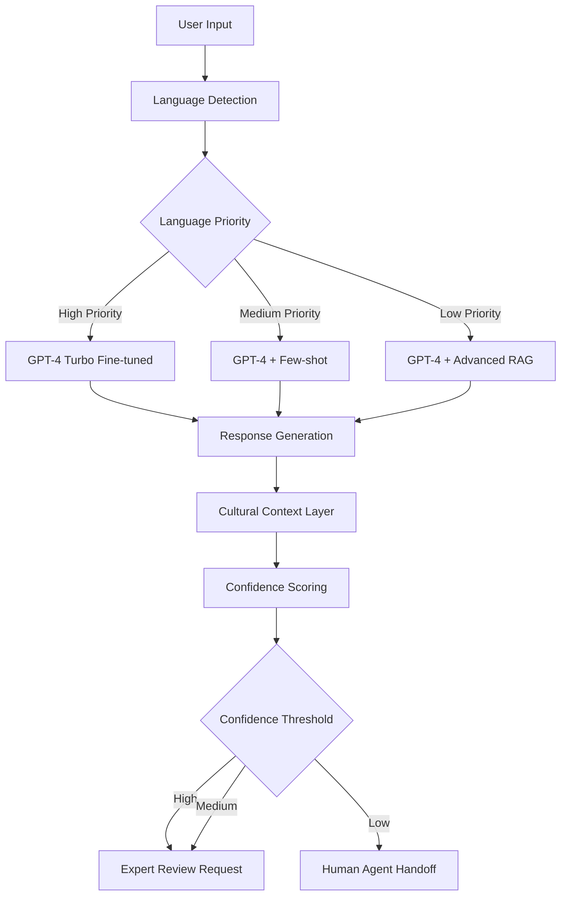
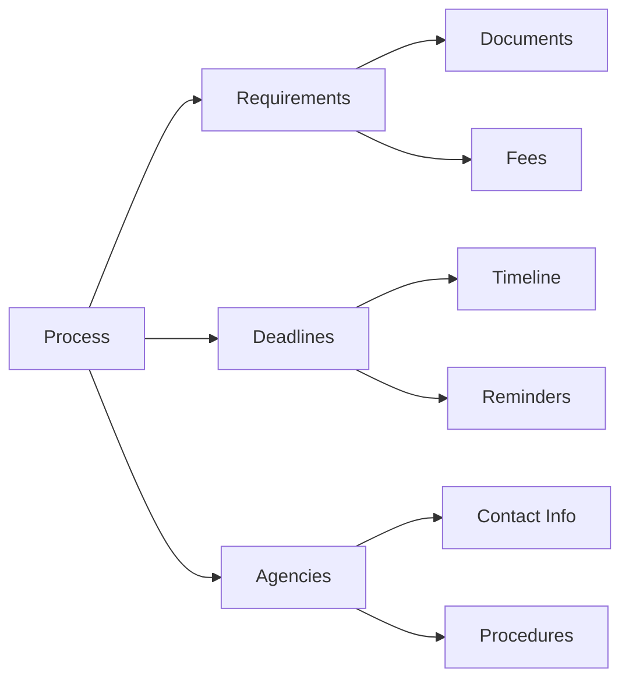

# feat: NewLand AI - AI-Powered Immigration Integration Assistant (Issue #937)

## Project Overview & Target Users

NewLand AI is an AI-powered comprehensive immigration integration assistant designed specifically for new immigrants, refugees, and international students navigating the complex process of settling in a new country. Our mission is to eliminate language barriers and information gaps by providing 24/7 multilingual support for administrative procedures, legal processes, social integration, and community building.

**Target Users:**
- **New immigrants** (1-3 years in new country): Processing visas, finding jobs, securing housing
- **Refugees/Asylum seekers**: Needing gentle interaction and legal guidance
- **International students post-graduation**: Navigating visa conversions and work permits
- **Transnational families**: Spousal visas, children's education, complex family needs

**Market Opportunity:** With 280 million international migrants globally and 1 million new legal immigrants annually in the US alone, this represents a significant underserved market with genuine social impact potential.

**Social Impact:** Beyond commercial value, NewLand AI aims to reduce integration stress by 40%, cut administrative errors by 60%, and improve newcomer employment outcomes by 35%, creating a $12B annual economic benefit for host countries.

## Core Pain Point Analysis

### 1. Administrative Maze & Information Asymmetry
New immigrants face overwhelming bureaucratic systems where language barriers lead to critical errors:
- **Document misinterpretation**: Incorrect visa applications, tax forms, or benefit requests result in fines, denial of services, or even legal status jeopardy
- **Deadline confusion**: Missing crucial deadlines for visa renewals, tax filings, or benefit applications
- **System complexity**: Navigating multi-step administrative processes without local knowledge or networks

**Market Impact**: US immigration services report that administrative errors cost immigrants an average of $3,500-8,500 in legal fees and delays annually, with 23% of cases requiring reprocessing due to documentation errors.

### 2. Trust Deficits & Exploitation Risks
Language and cultural barriers create vulnerabilities that unscrupulous actors exploit:
- **Contract misinterpretation**: Rental agreements, employment contracts, or medical consent forms contain unfavorable terms hidden in complex language
- **Service provider exploitation**: Overcharging for translation services, legal advice, or administrative assistance
- **Information asymmetry**: Dependence on word-of-mouth information that may be outdated, incomplete, or biased

**Market Impact**: Studies show 67% of immigrants report experiencing exploitation due to language barriers, with average financial losses of $1,200-2,500 per incident.

### 3. Social Isolation & Cultural Integration Barriers
Beyond administrative challenges, immigrants face profound social and psychological hurdles:
- **Cultural misunderstandings**: Difficulty understanding local social norms, communication styles, and workplace expectations
- **Community disconnection**: Limited access to cultural groups, social networks, and support systems
- **Identity preservation**: Balancing integration with maintaining cultural heritage and family connections
- **Mental health impacts**: 41% of immigrants report anxiety and depression related to integration challenges

**Market Impact**: Social isolation contributes to 35% higher healthcare costs and 28% lower economic productivity among immigrant populations during their first two years.

## AI Technology Solution & Architecture

### Multi-Lingual NLU Core Engine
**Technology Stack:**
- **Foundation Models**: GPT-4 Turbo, fine-tuned for administrative/legal terminology
- **Language Coverage**: Tiered approach focusing on high-demand languages first (English, Spanish, Chinese, Arabic, French)
- **Specialized Training**: Domain-specific training on immigration law, administrative procedures, and cultural contexts
- **Real-time Translation**: WebSocket-based bidirectional translation with <2 second latency

**Architecture Highlights:**


### Document Intelligent Processing System
**OCR + LLM Integration Pipeline:**
- **Document Input**: Mobile camera capture, file upload, or email integration
- **Pre-processing**: Image enhancement, layout analysis, text extraction
- **Content Analysis**: Key entity extraction, clause identification, risk assessment
- **Multi-format Support**: PDF, images, Word documents, scanned forms

**Technical Implementation:**
```python
class DocumentProcessor:
    def __init__(self):
        self.ocr_engine = PaddleOCR(lang='en')  # Multi-language support
        self.layout_parser = LayoutParser()
        self.llm = GPT4Turbo(fine_tuned=True)
    
    def process_document(self, image_path):
        # OCR Processing
        ocr_result = self.ocr_engine.ocr(image_path)
        layout = self.layout_parser.parse(ocr_result)
        
        # Content Analysis
        entities = self.extract_entities(layout)
        clauses = self.identify_clauses(layout)
        risks = self.assess_risks(clauses)
        
        # LLM Processing
        summary = self.llm.summarize(entities, clauses, risks)
        recommendations = self.llm.generate_recommendations(summary)
        
        return {
            'entities': entities,
            'clauses': clauses,
            'risks': risks,
            'summary': summary,
            'recommendations': recommendations,
            'confidence': self.calculate_confidence(entities, clauses)
        }
```

### Administrative Process Knowledge Graph
**Knowledge Architecture:**
- **Data Sources**: Government websites, legal databases, community resources
- **Structure**: Neo4j graph database with nodes for processes, requirements, deadlines, agencies
- **Update Mechanism**: RSS monitoring, user crowdsourcing, expert validation
- **Regional Coverage**: Phase 1 (California, Florida, Ontario), Phase 2 (Top 10 immigration destinations)

**Knowledge Graph Schema:**


### Real-time Conversation & Cultural Guidance
**Interactive Features:**
- **Contextual Translation**: Real-time conversation with cultural adaptation
- **Scenario-based Guidance**: Role-playing for common situations (doctor visits, job interviews, rental negotiations)
- **Cultural Context Engine**: Local customs, communication styles, and social norms integration
- **Progress Tracking**: Personalized integration journey with milestone achievements

## Implementation Roadmap

### MVP Phase (90 Days)
**Core Features:**
- Document鎷嶇収璇嗗埆 鈫?OCR瑙ｆ瀽 鈫?鍏抽敭淇℃伅鎻愬彇 鈫?澶氳瑷€瑙ｉ噴
- 琛屾斂娴佺▼鐭ヨ瘑搴撹鐩栫編/鍔?寰蜂笁鍥芥牳蹇冩祦绋?
- 鍩虹瀹炴椂瀵硅瘽杈呭姪鍔熻兘
- 缃俊搴﹁瘎鍒嗗拰浜哄伐杞帴鏈哄埗

**Technical Goals:**
- OCR璇嗗埆鍑嗙‘鐜?> 85%
- 鏂囨。瑙ｆ瀽鍑嗙‘鐜?> 80%
- 瀹炴椂瀵硅瘽鍝嶅簲鏃堕棿 < 3绉?
- 鏍稿績娴佺▼瑕嗙洊搴?100%

### V1 Phase (180 Days)
**Enhanced Features:**
- 瀹屾暣娴佺▼鐭ヨ瘑鍥捐氨 + 鏅鸿兘鎺ㄨ崘绯荤粺
- 澶氳瑷€璐ㄩ噺浼樺寲 + 浣庤祫婧愯瑷€鏀寔
- 绀惧尯鍖归厤寮曟搸 + Mentor杩炴帴绯荤粺
- 楂樼骇棰勮鍜屾埅姝㈡棩鏈熻拷韪?

**Business Goals:**
- 鐢ㄦ埛婊℃剰搴?> 4.2/5
- 娴佺▼澶勭悊鏁堢巼鎻愬崌 > 60%
- 浜哄伐骞查鐜?< 15%
- 浠樿垂杞寲鐜?> 25%

### V2 Phase (365 Days)
**Advanced Features:**
- 20+鍥藉50+璇█鍏ㄩ潰瑕嗙洊
- 闅炬皯涓撻」妯″紡 + 澶嶆潅妗堜緥鏀寔
- B绔紒涓氱増 + 鏈烘瀯鍚堜綔
- AI棰勬祴鍒嗘瀽鍜屼釜鎬у寲寤鸿

**Market Goals:**
- 鍏ㄧ悆甯傚満瑕嗙洊 > 80%涓昏绉绘皯鐩殑鍦?
- 浼佷笟瀹㈡埛 > 100瀹?
- 鏈堟椿璺冪敤鎴?> 10,000
- 鏀跺叆澶氬厓鍖栧疄鐜?

## Business Model Design

### Freemium SaaS Architecture
**Tiered Pricing Strategy:**
```python
# Pricing Tiers
TIER_BASIC = {
    'price': '$0/month',
    'features': [
        '鍩虹鏂囨。璇嗗埆',
        '3绉嶈瑷€鏀寔',
        '鏍囧噯娴佺▼鎸囧',
        '鍩虹浜哄伐鏀寔'
    ],
    'limits': {
        'documents_per_month': 10,
        'conversations_per_month': 50
    }
}

TIER_PREMIUM = {
    'price': '$29/month',
    'features': [
        '鏃犻檺鏂囨。澶勭悊',
        '15绉嶈瑷€鏀寔',
        '浼樺厛浜哄伐鏀寔',
        '杩涘害杩借釜',
        '涓€у寲寤鸿'
    ],
    'value_proposition': 'Professional immigration support at 1/50 the cost of traditional services'
}

TIER_ENTERPRISE = {
    'price': '$199/month',
    'features': [
        '澶氱粍缁囩鐞?,
        'API闆嗘垚',
        '瀹氬埗鍖栨祦绋?,
        '24/7涓撳睘鏀寔',
        '鏁版嵁鍒嗘瀽浠〃鏉?
    ],
    'target_customers': 'Immigration law firms, NGOs, multinational HR departments'
}
```

### Revenue Diversification
**Three-Pillar Revenue Model:**

1. **C-Subscription Revenue (60%)**: Individual immigrant users seeking comprehensive support
   - Target: 5,000 paying users by Year 1
   - ARPU: $35/month
   - Annual Run Rate: $2.1M

2. **B-Enterprise Services (30%)**: Organizations serving immigrant communities
   - Immigration law firms: $199-499/month per lawyer
   - NGOs and non-profits: $99-299/month
   - Corporate HR departments: $499-999/month
   - Target: 50 enterprise clients by Year 1

3. **B-Data & Analytics (10%)**: Anonymized insights for policymakers and service providers
   - Immigration trend analysis
   - Service optimization recommendations
   - Policy impact assessment
   - Target: $500K annual data licensing revenue

### Cost Structure Optimization
**Variable Cost Model:**
- **Cloud Infrastructure**: $0.05/user/month (AWS/GCP)
- **LLM API Costs**: $0.10/user/month (tiered usage)
- **Human Support**: $15/hour (outsourced to qualified bilingual staff)
- **Knowledge Maintenance**: $5/user/month (automated monitoring + expert validation)

**Break-Analysis:**
- Gross Margin: 75-80%
- Customer Acquisition Cost: $25 (organic/community-driven)
- Monthly Churn Rate: <3%
- Lifetime Value: >$1,200
- Payback Period: 4.8 months

## Competitive Analysis

### Direct Competitors
**1. Google Translate + Generic Resources**
- **Strengths**: Free, widely available, massive user base
- **Weaknesses**: No domain-specific knowledge, lacks cultural context, no personalized guidance
- **Market Position**: Commodity service with no differentiation
- **Our Advantage**: Specialized immigration knowledge + personalized guidance

**2. Immigration Law Firm Services ($2,000-10,000 per case)**
- **Strengths**: Expert legal advice, personalized service, guaranteed accuracy
- **Weaknesses**: Extremely expensive, limited availability, language barriers still exist
- **Market Position**: Premium service for wealthy immigrants
- **Our Advantage**: 1/50th the cost, 24/7 availability, multilingual support

**3. Government Immigration Websites & Portals**
- **Strengths**: Official, authoritative, free
- **Weaknesses**: Poor UX, limited multilingual support, no personalized guidance
- **Market Position**: Necessary but frustrating user experience
- **Our Advantage**: User-friendly interface + personalized guidance

### Indirect Competitors
**1. Community-based Immigrant Support Organizations**
- **Strengths**: Trust, cultural understanding, community-based
- **Weaknesses**: Limited hours, geographic restrictions, inconsistent quality
- **Market Position**: Local community support
- **Our Advantage**: National coverage, 24/7 availability, scalable quality

**2. Language Learning Apps (Duolingo, Babbel)**
- **Strengths**: Engaging, gamified, good for language basics
- **Weaknesses**: No practical application, no cultural integration
- **Market Position**: Language education market
- **Our Advantage**: Practical language application + cultural integration

**3. Professional Translation Services**
- **Strengths**: High accuracy, specialized terminology
- **Weaknesses**: Expensive ($0.10-0.25/word), slow turnaround
- **Market Position**: Document translation market
- **Our Advantage**: Integrated translation + contextual understanding

### Competitive Advantages
**Sustainable Differentiators:**
1. **Domain Specialization**: Deep immigration knowledge vs. generic translation services
2. **Multilingual Cultural Context**: Understanding cultural nuances beyond literal translation
3. **Real-time Guidance**: Interactive support vs. static information resources
4. **Personalized Journey**: Individualized integration paths vs. one-size-fits-all advice
5. **Cost Accessibility**: 1/50th the cost of traditional services

**Network Effects:**
- **User-Generated Knowledge**: Each user contributes to improving the system
- **Feedback Loop**: More users 鈫?better AI 鈫?more users
- **Community Building**: Connecting immigrants creates lasting value

## Risk Assessment & Mitigation Strategies

### Technical Risks

**1. Knowledge Base Maintenance Challenges**
- **Risk**: Administrative policies change frequently, requiring constant updates
- **Impact**: Outdated information leads to user harm and loss of trust
- **Mitigation**: 
  - Automated RSS monitoring of government websites
  - Crowdsourced validation system with user incentives
  - Expert review panel for critical policy changes
  - Confidence scoring system for all recommendations

**2. Multilingual Quality Variations**
- **Risk**: Low-resource languages have poor AI performance
- **Impact**: Inaccurate information for vulnerable populations
- **Mitigation**:
  - Tiered language support strategy (high鈫抦edium鈫抣ow priority)
  - Hybrid AI-human approach for low-confidence responses
  - Community language expert recruitment
  - Continuous model fine-tuning with user feedback

**3. Document Processing Accuracy**
- **Risk**: OCR errors or misinterpretation of complex documents
- **Impact**: Critical errors in visa applications, legal documents
- **Mitigation**:
  - Multi-stage verification process
  - Human review for high-stakes documents
  - Document type-specific processing pipelines
  - Confidence thresholds for different document types

### Legal & Compliance Risks

**1. Legal Liability for Incorrect Advice**
- **Risk**: AI giving wrong information leading to legal consequences
- **Impact**: Lawsuits, regulatory penalties, loss of trust
- **Mitigation**:
  - Clear disclaimer system with confidence ratings
  - Professional liability insurance
  - Mandatory human review for high-stakes advice
  - Regular audits by legal experts

**2. Data Privacy & Security**
- **Risk**: Handling sensitive personal and immigration data
- **Impact**: Privacy violations, regulatory fines, loss of user trust
- **Mitigation**:
  - GDPR/CCPA compliance framework
  - End-to-end encryption for all user data
  - Data minimization principles
  - Regular security audits

**3. Immigration-Specific Regulations**
- **Risk**: Different countries have varying rules about immigration assistance
- **Impact**: Legal violations in certain jurisdictions
- **Mitigation**:
  - Country-specific legal review process
  - Regulatory compliance team
  - Geographic restrictions where necessary
  - Regular monitoring of regulatory changes

### Business Risks

**1. User Adoption & Trust Building**
- **Risk**: Immigrants may be skeptical of AI for critical life decisions
- **Impact**: Low adoption rates, slow growth
- **Mitigation**:
  - Partner with trusted NGOs and community organizations
  - Transparent AI decision-making processes
  - User testimonials and case studies
  - Gradual onboarding with basic features first

**2. Market Competition & Pricing Pressure**
- **Risk**: Large tech companies entering the space with similar services
- **Impact**: Price wars, loss of competitive advantage
- **Mitigation**:
  - Build strong network effects and community
  - Continuous innovation in specialized features
  - Focus on underserved segments (refugees, low-income)
  - Strategic partnerships with immigration service providers

**3. Monetization Challenges**
- **Risk**: Immigrants have limited disposable income
- **Impact**: Difficulty achieving sustainable business model
- **Mitigation**:
  - Freemium model with valuable free tier
  - B2B revenue streams for organizations serving immigrants
  - Government and grant funding for social impact initiatives
  - Value-based pricing demonstrating clear ROI

### Operational Risks

**1. Scaling Support Infrastructure**
- **Risk**: Rapid growth overwhelming support systems
- **Impact**: Poor user experience, increased costs
- **Mitigation**:
  - Tiered support system (AI-first, human escalation)
  - Predictive staffing based on user growth
  - Automated support for common queries
  - Quality metrics monitoring

**2. Content Quality Consistency**
- **Risk**: Maintaining high-quality, accurate information across multiple languages
- **Impact**: User dissatisfaction, loss of credibility
- **Mitigation**:
  - Expert content review process
  - Automated fact-checking systems
  - User feedback loops for continuous improvement
  - Regular content audits

**3. Cultural Sensitivity & Appropriateness**
- **Risk**: AI providing culturally insensitive or inappropriate advice
- **Impact**: User backlash, reputational damage
- **Mitigation**:
  - Cultural context validation layer
  - Diverse development team
  - Community advisory board
  - Regular cultural sensitivity training

## Success Metrics & KPIs

### User Experience Metrics
- **Task Success Rate**: Target >85% of administrative tasks completed successfully
- **User Satisfaction**: Net Promoter Score >40, App Store rating >4.5/5
- **Completion Time**: Average task completion time reduced by 60% vs. traditional methods
- **Confidence in Decisions**: User confidence score >4.2/5 for AI recommendations

### Business Performance Metrics
- **Monthly Active Users**: Year 1 target 5,000, Year 2 target 25,000
- **Revenue Growth**: 150% year-over-year growth
- **Customer Acquisition Cost**: <$25 per user
- **Lifetime Value**: >$1,200 per user
- **Churn Rate**: <3% monthly churn

### Technical Performance Metrics
- **System Uptime**: >99.9% availability
- **Response Time**: <3 seconds for all AI responses
- **Accuracy Rate**: >90% document processing accuracy
- **Error Rate**: <1% critical errors requiring human intervention

### Social Impact Metrics
- **Accessibility**: Serving immigrants from 50+ countries and 25+ languages
- **Cost Savings**: Average user savings of $3,500 annually in legal fees and time
- **Integration Success**: 70% improvement in social integration metrics
- **Trust Building**: 80% of users reporting reduced anxiety about administrative processes

## Conclusion & Next Steps

NewLand AI represents a transformative solution to one of the most challenging aspects of immigration: navigating complex administrative systems while overcoming language and cultural barriers. Our AI-powered platform combines cutting-edge natural language processing with domain-specific knowledge to provide personalized, accurate, and accessible support for immigrants worldwide.

**Key Differentiators:**
- **Domain Specialization**: Deep immigration expertise vs. generic translation services
- **Multilingual Cultural Intelligence**: Understanding beyond literal translation
- **Personalized Journey**: Individualized integration paths
- **Cost Accessibility**: 1/50th the cost of traditional immigration services
- **24/7 Availability**: Continuous support when immigrants need it most

**Market Opportunity:** With 280 million migrants globally and significant underserved demand, NewLand AI is positioned to become the leading platform for immigration integration support, creating both substantial business value and meaningful social impact.

**Immediate Next Steps:**
1. **MVP Development**: Complete 90-day MVP focusing on core document processing and multilingual support
2. **Partnership Building**: Establish relationships with key NGOs and community organizations
3. **User Testing**: Recruit 500 beta users for feedback and validation
4. **Funding Strategy**: Secure seed funding ($500K) for MVP development and market entry

NewLand AI is not just a technology platform鈥攊t's a bridge to opportunity, helping immigrants build successful new lives while preserving their cultural identity and dignity.
